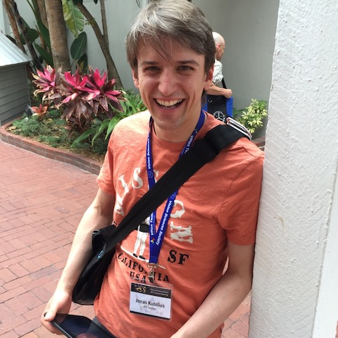

<figure>
    
    <figcaption style="text-align:right; width:480px; font-style:italic">credit: Irving Biederman</figcaption>
</figure>

Basic info
----------

-   *email:* <jonas.kubilius@ppw.kuleuven.be>
-   *twitter:* [@qbilius](https://twitter.com/qbilius)
-   *ORCID*: [0000-0002-8843-3147](http://orcid.org/0000-0002-8843-3147)
-   [Google Scholar profile](http://scholar.google.com/citations?user=g7c_OQMAAAAJ)

Education
---------

-   **[KU Leuven](http://www.kuleuven.be)** (Belgium) and **[Massachusetts Institute of Technology](http://web.mit.edu/)** (USA) *2016-2019*
    -   Postdoctoctoral fellow, supervisors: **[Hans P. Op de Beeck](http://ppw.kuleuven.be/~odbeeckh/)** and **[James J. DiCarlo](http://dicarlolab.mit.edu/node/1)**
    -   Marie Curie Global Fellowship awarded by the European Commission
-   **[KU Leuven](http://www.kuleuven.be)** (Belgium) and **[Massachusetts Institute of Technology](http://web.mit.edu/)** (USA) *2015-2016*
    -   Postdoctoctoral fellow, supervisors: **[Hans P. Op de Beeck](http://ppw.kuleuven.be/~odbeeckh/)** and **[James J. DiCarlo](http://dicarlolab.mit.edu/node/1)**
    -   Postdoctoral fellowship (PDM) awarded by KU Leuven
    -   Long-stay abroad grant awarded by [Research Foundation-Flanders (FWO)](http://www.fwo.be) and KU Leuven (JuMo)
-   **[KU Leuven](http://www.kuleuven.be)** (Belgium) *2010-2015*
    -   [PhD in psychology](http://ppw.kuleuven.be/home/english), promotor: **[Hans P. Op de Beeck](http://ppw.kuleuven.be/~odbeeckh/)**, co-promotor: **[Johan Wagemans](http://ppw.kuleuven.be/labexppsy/lepSite/groepen/index.php?group=1)**
    -   Fellowship from the [Research Foundation-Flanders (FWO)](http://www.fwo.be), 2010-2015
-   **[KU Leuven](http://www.kuleuven.be)** (Belgium) *2009-2010*
    -   [master in Artificial Intelligence](http://www.mai.kuleuven.be/)
    -   completed with *magna cum laude*
-   **[Massachusetts Institute of Technology](http://web.mit.edu/)** (USA) *2004-2008*
    -   majored in mathematics and physics
    -   minored in theater arts
    -   undergraduate research assistant (2005-2008) and technical assistant (2008-2009) at **[Nancy Kanwisher](http://web.mit.edu/bcs/nklab/)**’s lab under supervision of **[Daniel D. Dilks](http://www.psychology.emory.edu/cognition/dilks/)**
    -   recipient of the [Kelly-Douglas Travelling Fellowship](http://newsoffice.mit.edu/2007/awards-arts-tt0606) and the [Joseph D. Everingham Award](http://theaterarts.mit.edu/awards.html)
-   **[Vilnius Lyceum](http://licejus.lt/)** (Lithuania) *1999-2003*
    -   focus on biochemical sciences
    -   won in national and/or international mathematics, physics, chemistry, and biology olympiads

Awards
------

-   *2011* **Best Student Poster Award** in the 34th European Conference on Visual Perception, Toulouse, France, 2011 (6 awards in total)
-   *2008* **Elsevier/Vision Research Travel Award** for the 2008 annual Vision Sciences Society meeting in Naples, FL