class: center, middle

# Open up for Open Science
*Jonas Kubilius*

Brain & Cognition / KU Leuven / LIPS / 2015-03-13

.license[

.logo[]
.logo-name[[klab.lt](http://klab.lt)]
]

???
Conducting research in psychology and science in general are undergoing vast changes. Web-based technologies enabled acquisition of massive datasets with thousands of participants. The data, code, and any other research output can also be shared easily online. These advances are breaking the traditional publication model and this lecture will bring you to the forefront of this revolution. We will describe available technologies, discuss their advantages and weaknesses, and try to understand how to proceed in practice.

---
class: middle

# Introduction
.subtitle[in which everything goes wrong]

---
class: center, middle

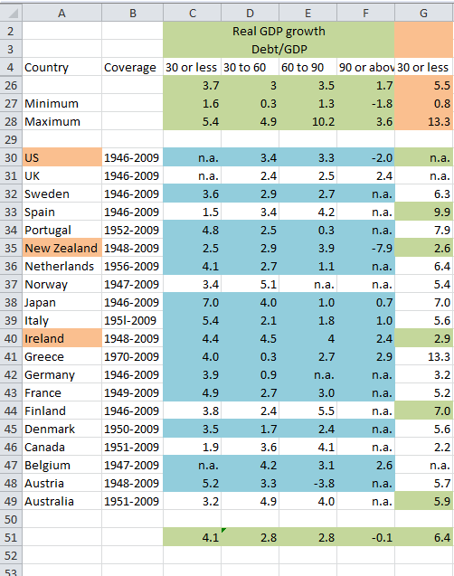

.source[recreated from [Researchers Finally Replicated Reinhart-Rogoff, and There Are Serious Problems. | Mike Konczal / Next New Deal](http://www.nextnewdeal.net/rortybomb/researchers-finally-replicated-reinhart-rogoff-and-there-are-serious-problems)]

???
This may well be the most famous Excel spreadsheet in the world. Now, it doesn't look any special, does it? On the left column, you see country names, and on the next four columns you see the growth of their GDP listed, depending on the amount of debt that the country has. So, if the country has little debt, maybe up to 30% of its GDP, the growth is roughly 4%, as you can see listed in the bottom. Now if the country has a massive debt, perhaps over 90% already, the growth tendencies seem much grimmer. In fact, if you look at the average down at the bottom, you'll see that after 90% debt, GDP starts shrinking. So next Thursday while drinking cheap beer with your friends, you could put forth an argument here that hey, we ought to never save as spending helps the economy. Cool.

Wait, but why are we talking about economics here? Am I at a wrong department?

What else? Oh, look at this – somebody forgot to change the range in this cell when computing the means. That will put somebody in problem with their boss, ha!

Well, well, the boss in this case was the Government of the United States of America. The spreadsheet was actually compiled by two famous Harvard professors, Kenneth Rogoff and Carmen Reihart, and used to put forth an argument that when the debt reaches 90% of GDP, the growth stops.  Their paper had a massive impact, leading many governments to enforce austery measures during the 2008 financial crisis.

---
class: center, middle

.source[recreated from [Researchers Finally Replicated Reinhart-Rogoff, and There Are Serious Problems. | Mike Konczal / Next New Deal](http://www.nextnewdeal.net/rortybomb/researchers-finally-replicated-reinhart-rogoff-and-there-are-serious-problems)]

???
[Interview with Herndon](http://therealnews.com/t2/index.php?option=com_content&task=view&id=31&Itemid=74&jumival=10099)

---
## The mistake(s)
[Herndon et al. (2014)](http://dx.doi.org/10.1093/cje/bet075) ([pdf here](http://www.peri.umass.edu/236/hash/31e2ff374b6377b2ddec04deaa6388b1/publication/566/)):
- Positive growth actually (corrected from -0.1% to 0.3%)
- Unconventional analysis methods, some countries omitted (GDP growth up to 2.2%)
- Correlation does not imply causation

A perfect example because it exposes problems plaguing the traditional way of doing science:
- Serious analysis done by poor tools and not validated
- [No peer review](http://www.businessinsider.com/editor-talks-reinhart-rogoff-excel-error-2013-4?IR=T) -- example of elitism and reputation-based science
- Not sharing analyses
- [Not accepting mistakes](http://www.bloomberg.com/bw/articles/2013-04-18/faq-reinhart-rogoff-and-the-excel-error-that-changed-history)
- Scientific claims exaggerated by politicians

???
This story would make a great Hollywood movie, wouldn't it? It has all the right Hollywood ingredients: two vile Harvard professors and a poor grad student from a no-name university who spots a critical mistake in their work and save humanity from daunting austerity measures. So when you finally realize that psychology is not for you and start looking for your real passion in life, this may be something for your first big movie script. You can thank me later. (My bank account details are at the end of this presentation.)

You know this guy Christopher Nolan who made the movies *Inception* and *Interstellar*? Maybe some of you also saw *Memento* about a guy who losses memory. Apparently, his brother who pitched the idea for the movie was inspired by [a general psychology class he was taking at Georgetown University](https://en.wikipedia.org/wiki/Memento_Mori_(short_story)#Background).

So the fact that you're studying psychology here doesn't necessarily mean you're screwed for life, guys :P

---
class: middle

#	Chapter 1
.subtitle[where somebody is in a much too comfortable position]

---
## The role of a journal
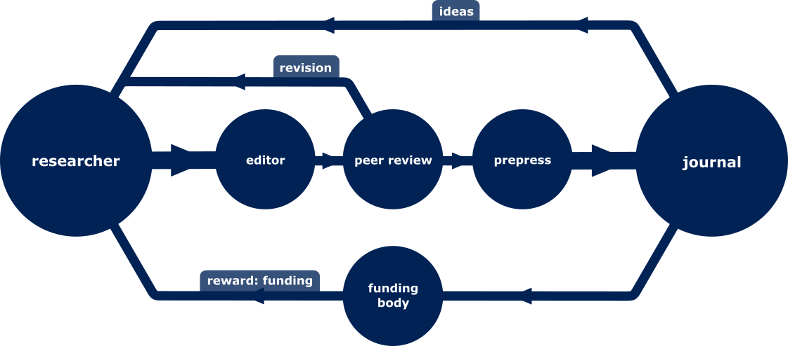

Establishing the quality of research:
- Tool for disseminating research
- Quality control
- Researcher reputation based in impact factor
- Formatting (prepress services)

Impact Factor:
- Average number of citations per article in two years.
- Often used to distribute funding.

???
What does a researcher want? He wants to EAT. So he needs to publish.
Also wants access to the newest research.

---
class: middle, center

## A neat business model
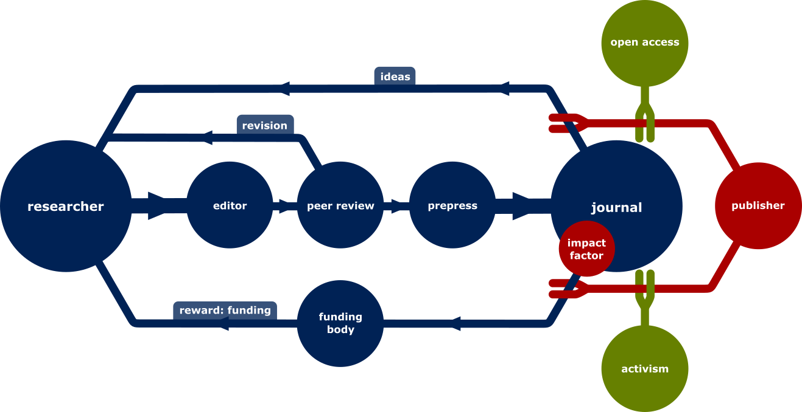

???
1. Pay to publish
2. Pay to access

---
class: middle, center

## Academic publishing in practice

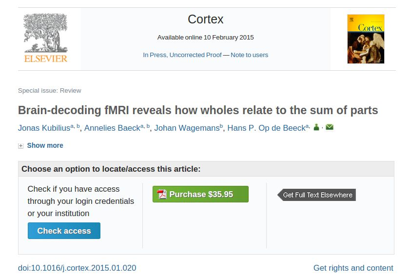

???
Do you care about this?

You should:
- Keep up with literature in your professional life
- Research is paid for by taxpayers

---
## Profits
How much do universities pay for it?
- Cambridge (*Elsevier* alone): [£1,161,571](https://gowers.wordpress.com/2014/04/24/elsevier-journals-some-facts/)
- Harvard (total budget): [$3.75m](http://isites.harvard.edu/icb/icb.do?keyword=k77982&tabgroupid=icb.tabgroup143448)

--

[Profit margins](https://alexholcombe.wordpress.com/2013/01/09/scholarly-publishers-and-their-high-profits/):
- Springer: 34%
- Elsevier: 36%
- Wiley: 40%

--

<blockquote class="twitter-tweet" lang="en">
Roses are red&#10;Violets are blue&#10;The rest of this poem&#10;Will cost $31.52&#10;&#10;<a href="https://twitter.com/hashtag/ElsevierValentines?src=hash">#ElsevierValentines</a>
&mdash; David Hughes (@usernameerror) <a href="https://twitter.com/usernameerror/status/565127138802954240">February 10, 2015</a></blockquote>

???
Why do you think college costs so much? Why are there so few professor positions? Where does the money go?

---
class: middle, center

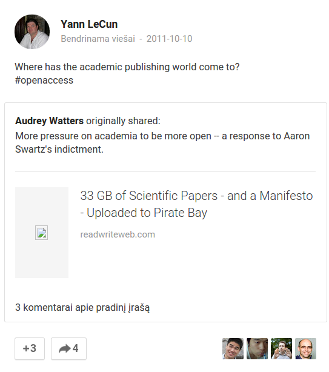

---
## Open Access
So let's have it open.

KU Leuven takes Open Access seriously:
- [Lirias](https://lirias.kuleuven.be/)
- [Resources](http://bib.kuleuven.be/english/ub/target-group-research/open-access)

### Doesn't work well yet
- Green open access: self-archiving of preprint or postprint (free)
- Gold open access: publisher's version freely available (€€€)

Check conditions at the [SHERPA RoMEO website](http://www.sherpa.ac.uk/romeo/).

**Meaning:** pay twice (once for publishing, once for subscription)

---
class: middle

#	Chapter 2
.subtitle[where you learn how to turn on a computer]

---
## Reproducibility crisis
- [Ionidis (2005)](http://dx.doi.org/10.1371/journal.pmed.0020124): *"Why Most Published Research Findings Are False.”*
- Reproducibility rates in drug development:
	- 6% ([Amgen / Begley & Ellis, *Nature*, 2012](http://dx.doi.org/10.1038/483531a))
	- 20-25% ([Bayer HealtCare / Prinz et al., *Nature Rewievs Drug Discovery*, 2011](http://dx.doi.org/10.1038/nrd3439-c1))
- *"Many Labs" Replication Project:* 10 out of 13 Social Psychology studies replicated successfully ([Klein et al., 2012](http://dx.doi.org/10.1027/1864-9335/a000178))
-  *Reproducibility Project: Psychology:* [11 out of 29 Experimental Psychology studies replicated successfully](https://osf.io/qjab5)

*(See more at [Nature's Special on Challenges in Irreproducible Research](http://www.nature.com/nature/focus/reproducibility/) and [Science's Special Section on Data Replication & Reproducibility](http://www.sciencemag.org/content/334/6060/1225.full))*

---
class: center, middle

## Reproducibility Project
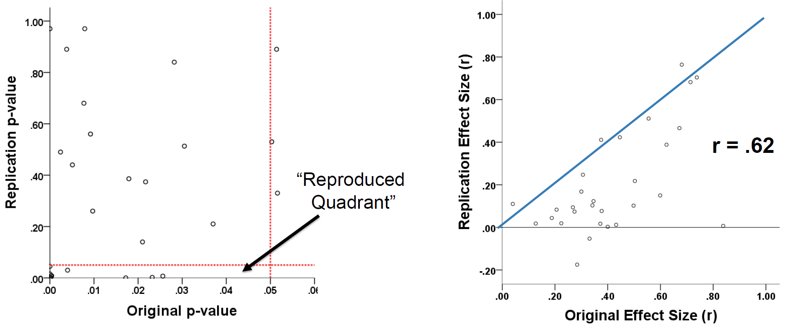

.source[[Gilbert (2014)](https://osf.io/vtksf/)]

---
class: center, middle

# What would Newton say?

---
## Reproducibility: What's up?
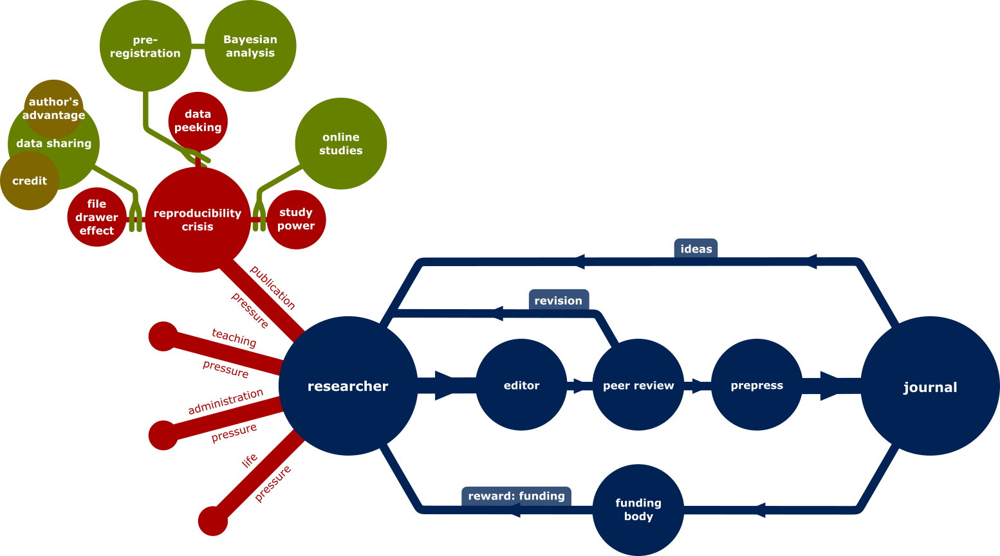

Publication pressure:
- Underpowered studies -- so use more participants!
- Data peeking -- so pre-register your studies
- File-drawer effect -- so publish your findings anyway + journals should change (see [PsychFileDrawer](http://psychfiledrawer.org/))
- Nobody cares
- **In general:** Reward system is broken

---
class: center, middle

## We don't understand p-values

.source[Reprinted by permission from Macmillan Publishers Ltd: Nature (Nuzzo, 506(7487), 150-152), copyright 2014)]

---
## Larger samples

###	Why
- Larger and more representative samples
- Cheap
- Fast
- More brains means a higher probability to find the right expertise (see [Nielsen, 2011](#resources))

--

###	Why not
-	Need to control what people are actually doing
-	Browsers have poor performance

--

###	Available tools
- [jsPsych](http://www.jspsych.org/)
- [Amazon Mechanical Turk](https://www.mturk.com) (use with [psiTurk](https://psiturk.org/)), [CrowdSource](http://www.crowdsource.com/), ...
- Or create a virtual reality with [Oculus Rift](https://www.oculus.com/)

---
##	Data sharing

###	Why
- More transparency
- Better data archiving standards
- More data makes Big Data, i.e., we can discover more

--

###	Why not
-	Data acquisition is costly and precious
-	People want to know who is using their data
-	No time to play these games of sharing
-	Who is going to use all of that data anyways? The problem of filtering again.

--

###	Available tools
[GitHub](https://github.com/), [figshare](http://figshare.com/), [Zenodo](https://zenodo.org/), [BitBucket](https://bitbucket.org/), [Dropbox](https://www.dropbox.com/) ...

---
## Licencing
- **Traditional copyright licenses:** all rights reserved (c)
- **Public copyright licenses:** some rights reserved
	- **Permissive** (anybody can use your stuff for anything they like – even sell it):
		- Software: [BSD 3-clause](http://opensource.org/licenses/BSD-3-Clause) or [MIT]()
		- Else: [Creative Commons Attribution (cc-by)](http://creativecommons.org/licenses/by/4.0/)
	- **Copyleft** ("all rights reversed"; they are reciprocal – anything based on your work will be of the same same license type, ensuring perpetual access to it):
		- Software: [GNU General Public License](https://www.gnu.org/copyleft/gpl.html) (recommended for scientific software so that it always remains open)
		- Else: [Creative Commons ShareAlike (cc-by-sa)](http://creativecommons.org/licenses/by-sa/4.0/) (think twice before using)
- **Public domain:** no rights reserved
	[Creative Commons Zero (cc0)](http://creativecommons.org/about/cc0) if you need to want to put it in the public domain sooner than it would get there legally

---
## Free and Open Source Software

*Copylefted software*

### Why
- Transparent
- Accessible
- Persistent

### Why not
- Often less powerful
- Less polished

### Available tools
- E-Prime, MATLAB, Presentation -> Python
- SPSS -> Python, R
- Photoshop -> GIMP
- Illustrator -> Inkscape
- ...

---
class: middle

#	Chapter 3
.subtitle[where we get stuck in human nature]

---
## Quality
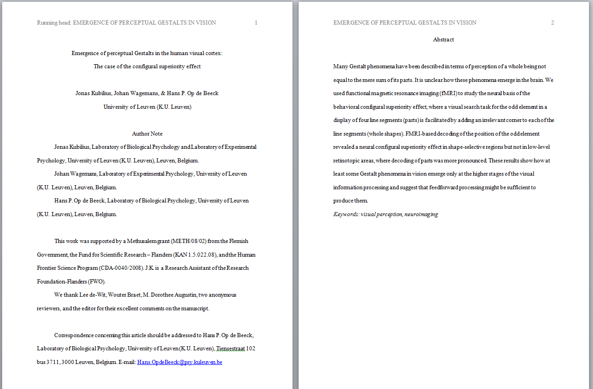

- Need nice outputs (check [eLife Lens](http://lens.elifesciences.org/), [PeerJ Paper Now](https://github.com/peerj/paper-now))
- Online repositories ([arXiv](http://biorxiv.org/), [bioRxiv](http://biorxiv.org/)) need recommendation systems (just like in Amazon, Netflix, Spotify), e.g., [Pubget](http://pubget.com/), [Google Scholar](https://scholar.google.com/)
- Change reward system ([Kubilius et al., 2013](http://klab.lt/education/open-science/occupy-science-until-it-bursts-open.html))

---
class: center, middle

## Peer review
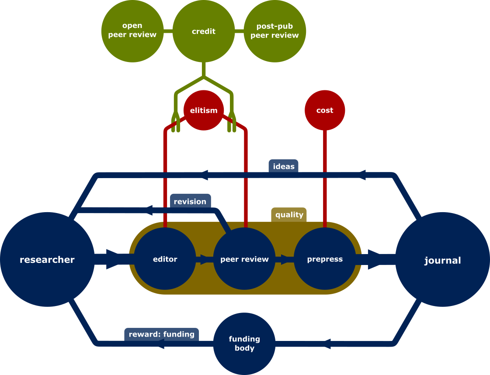

---
## Peer review
### Issues
- How much we get paid for doing reviews ([~5 hours of work (Ware, 2011)](http://dx.doi.org/10.1080/13614576.2011.566812)):
  - €20
  - €45 (~minimal wage in Belgium)
  - €60
  - €100?
- Major bottleneck (with revision might take a year)
- Elitism
- Why only two people decide the fate of your paper?

--

### Solutions
- Double-blind review – nope
- Open peer review (e.g, [PeerJ](https://peerj.com/))
- Giving credit to reviewers (e.g., [Publons](https://publons.com/))
- Post-publication peer review

---
##	Academia's 1%
You've got no chances: [Only 3% of PhDs become professors](http://www.smartsciencecareer.com/become-a-professor/) (30% of PhDs get a postdoc, and 10% of postdocs become a professor)

--

The academic elite has much more chances:
- Top 25% US institutions produce 71-86% tenure-track faculty
- Only 9-14% get positions in more prestigious institutions than their PhD

--

And needless to say: Don't be a woman. A report on women researchers found that

> "Both Latinas and Black women report regularly being mistaken as janitors."
> *New Study Reveals "Double Jeopardy" Faced by Women of Color in STEM* / [UC Hastings Newsroom](http://www.uchastings.edu/news/articles/2015/01/williams-double-jeopardy-report.php)

---
##	A beggar's life
Even if successful, your life will be based on Impact Factors:

<blockquote class="twitter-tweet" lang="en">
Stop crowing about your new Impact Factors. They&#39;re calculated like this. (tho at least here the sum is transparent) <a href="http://t.co/uK9L8wvAJr">pic.twitter.com/uK9L8wvAJr</a>
&mdash; Steve Pettifer (@srp) <a href="https://twitter.com/srp/status/494436649213128704">July 30, 2014</a></blockquote>

---
## I'm fine, folks
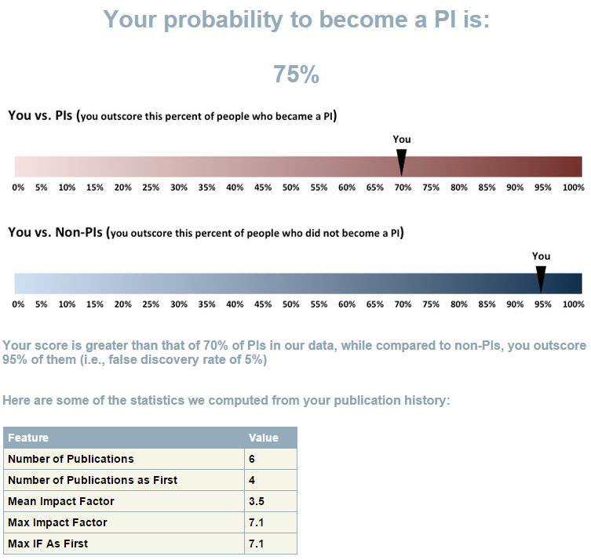
.source[[PIPredictor](http://www.pipredictor.com/)]

---
class: middle

#	Chapter 4
.subtitle[where we wrap up]

---
class: center, middle

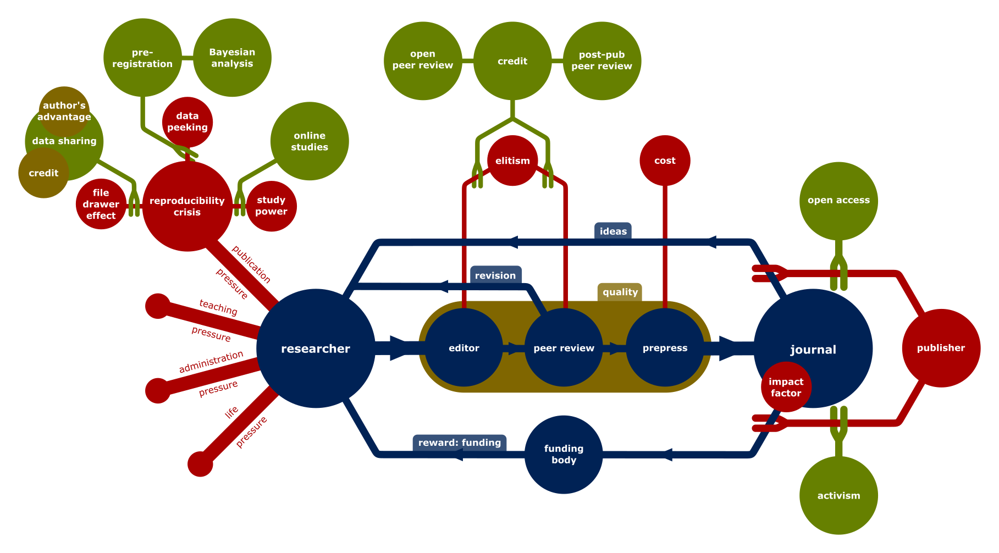

???
- It's definitely not a straightforward thing to implement
- Reward system is broken (impact factors, publication counts, lack of time), just like it's broken in many other domains, incl. education (studying for grades rather than understanding)
- Science is not only about ideas, but also about tools to think. (cf. [Bret Victor](http://worrydream.com/#!/MediaForThinkingTheUnthinkable))
- Open culture
- Personal responsibility

---
## But why bother?

Open Science / Open Culture lead to transparency, accountability, clear thought.

---

class: middle

# The End
.subtitle[where we thank each other for patience]

---
name: resources

# Extra resources

- Belluz, J. (2015). [Taxpayers spend $140 billion funding science each year — but can’t access many of the results](http://www.vox.com/2015/1/10/7522713/open-access). Vox.
- Nielsen, M. (2011). [Reinventing Discovery: The New Era of Networked Science](http://press.princeton.edu/titles/9517.html). Princeton, N.J.: Princeton University Press.
- Kubilius, J. (2014). [Sharing code](http://dx.doi.org/10.1068/i004ir). I-Perception, 5(1), 75–78.
- Nosek, B. A., & Bar-Anan, Y. (2012). [Scientific Utopia: I. Opening Scientific Communication](http://dx.doi.org/10.1080/1047840X.2012.692215). Psychological Inquiry, 23(3), 217–243.
- Nosek, B. A., Spies, J. R., & Motyl, M. (2012). [Scientific Utopia: II. Restructuring Incentives and Practices to Promote Truth Over Publishability](http://dx.doi.org/10.1177/1745691612459058). Perspectives on Psychological Science, 7(6), 615–631.
- Viskontas, I., & Mooney, C. (2014). [Scenes from the Postdocalypse](http://www.motherjones.com/environment/2014/03/inquiring-minds-ethan-perlstein-postdocalypse). Mother Jones.
