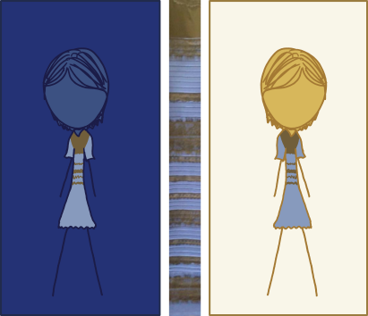
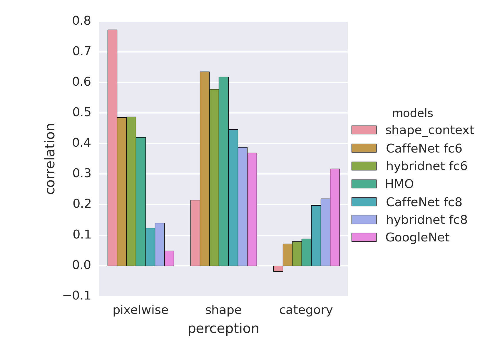
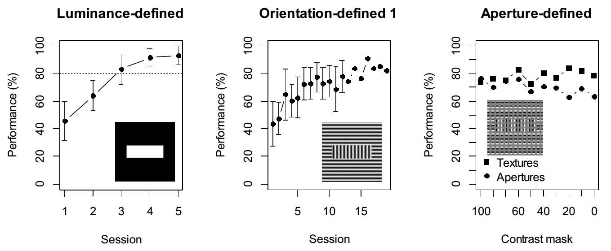
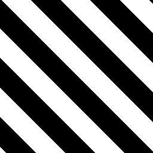
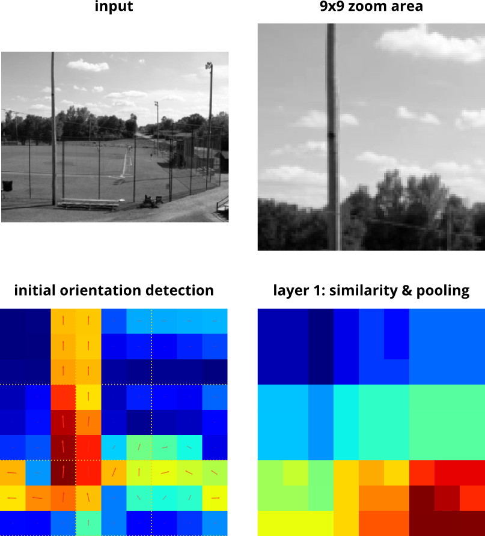

class: center, middle

# Deep nets as a computational model for human shape sensitivity

*Jonas Kubilius*

Brain & Cognition / KU Leuven (Belgium)

<!--DiCarlo lab meeting / 2015-05-27-->
Cox lab / 2015-05-22

.license[

.logo[]
.logo-name[[klab.lt](http://klab.lt)]
]
.aside[except where otherwise noted, these slides are available under the Creative Commons Attribution 4.0 International License]

---
layout: true
class: middle

<!------->
<!--class: center-->
<!--## PhD-->

<!---->

<!------->
<!--class: center-->
<!--## Recent research-->

<!---->

<!------->
<!--# CNNs-->

---
## CNNs learn categories

.source[fair use - [Krizhevsky et al. (NIPS, 2012)](http://papers.nips.cc/paper/4824-imagenet-classification-with-deep-convolutional)]

.source[fair use - [Zhou et al. (ICLR, 2015)](http://arxiv.org/abs/1412.6856)]

---
class: center
## CNNs match neural data

.source[fair use – [Yamins et al. (PNAS, 2014)](http://doi.org/10.1073/pnas.1403112111)]

---
class: center

.full[]

---
class: center, middle

# I want machines to .strike[.strike-fix[see]]
.strike-new[perceive]

---
class: center

## The dress

.cols2[

.source[fair use – [Wikipedia](https://en.wikipedia.org/wiki/File:The_Dress_(viral_phenomenon).png)]

.source[cc by-nc 2.5 – [xkdc](http://xkcd.com/1492/)]
]

---
## CaffeNet

- 5 convolutional layers (conv1 - conv5)
- 3 fully connected layers (fc6 - fc8)

.source[fair use - [Krizhevsky et al. (NIPS, 2012)](http://papers.nips.cc/paper/4824-imagenet-classification-with-deep-convolutional)]

---
## Case 1: Recognition from shape

.source[[Snodgrass & Vanderwart (1980)](http://www.ncbi.nlm.nih.gov/pubmed/7373248)]

- Snodgrass & Vanderwart dataset of **260** drawings of common objects
- **61** of these objects are included in the ImageNet training set, or
- **147** of these objects are in the ImageNet training set if more specific concepts are included too

---
class: center
## Can CNNs abstract?

---
class: center
## Results

---
class: center
## Results

---
class: center
## Case 2: Physical vs. perceived

### Op de Beeck et al. (2008)

---
class: center
## Human vs. model

.full[]
.source[fair use – [Op de Beeck et al. (Journal of Neuroscience, 2008)](http://doi.org/10.1523/JNEUROSCI.2511-08.2008)]

--
.full[]

---
class: center
## Case 3: NAPs and geons

.small[

]
.source[fair use – [Ori Amir](http://geon.usc.edu/~ori/)]

---
class: center
## Model performance

---
class: center
## Case 4: Shape vs category 

### Bracci & Op de Beeck (submitted)

.source[Bracci & Op de Beeck (submitted)]

---
class: center
## Comparison to perception

.full[]

---
class: center
## Comparison to neural data

.full[]

<!------->
<!--class: center-->
<!--## Model representations-->

<!--.full[]-->

---
class: center
## Available information

.full[]

---
class: center
## Available information

.full[]

---
class: center
## Why natural / manmade?

---
class: center
## Case 5: Second-order edges

.cols2[

.source[fair use – [von der Heydt et al. (Science, 1984)](http://doi.org/10.1126/science.6539501)]

.small[]

.source[fair use – [Poort et al. (Neuron, 2012)](http://doi.org/10.1016/j.neuron.2012.04.032)]
]

---
class: center
## Cue-invariant processing

.source[fair use – De Keyser et al. (submitted)
]

---
class: center
## Luminance- vs. orientation-defined

.cols2[
.img50[]
.img50[]

.img50[]
.img50[]
]

---
class: center
## Luminance- vs. orientation-defined

---
class: center
## Receptive field properties

**conv1**

---
class: center
## Receptive field properties

**conv2**

---
class: center
## Receptive field properties

**conv5**

---
# Are CNNs almighty?

---
class: center
## Offset-defined

.cols2[
.img50[]

.img50[]
]

---
class: center
## Receptive field properties

**conv1**

---
class: center
## Receptive field properties

**conv2**

---
class: center
## Receptive field properties

**conv5**

---
## Other issues

- Poor match to categorical decisions
- No filling-in with occlusions

---
## Future directions

- Training on more tasks
- Training not only for categorization, but also semantics
- Unsupervised learning?
 
---
# Thank you!
.aside[slides available at [klab.lt](https://klab.lt)]

---
# Extra slides

---
## Featural vs. configural

- Dynamic linking rules = less parameters

.small[]

- Feature inference

.small[]

---
# gmin
.subtitle[an open, minimalist mid-level framework]

---
class: center
## gmin layer 1

.source[cc by 4.0 – [Kubilius et al. (Frontiers in Computational Neuroscience, 2014)](http://doi.org/10.3389/fncom.2014.00158)]

---
class: center
## In practice

---
class: center
## In practice

.full[]

???
Note also that this kind of segmentation is done in a completely feedforward way, so the fact that we get any structure at all stands in contrast with rapid object detection or scene gist ideas.

---
class: center
## What does feedforward look like?

--

.cols3[

.source[fair use – [LabelMe](http://labelme.csail.mit.edu/Release3.0/index.php)]

]
