class: center, middle

# The psychology of   Deep Neural Networks
*Jonas Kubilius*

Brain & Cognition / KU Leuven (Belgium)

LBP retreat / 2015-09-15

.license[

.logo[]
.logo-name[[klab.lt](http://klab.lt)]
]
.aside[except where otherwise noted, these slides are available under the Creative Commons Attribution 4.0 International License]

---
layout: true
class: middle, center

---
background-image: url(img/alien.jpg)

## Aliens in the lab!

<!-- 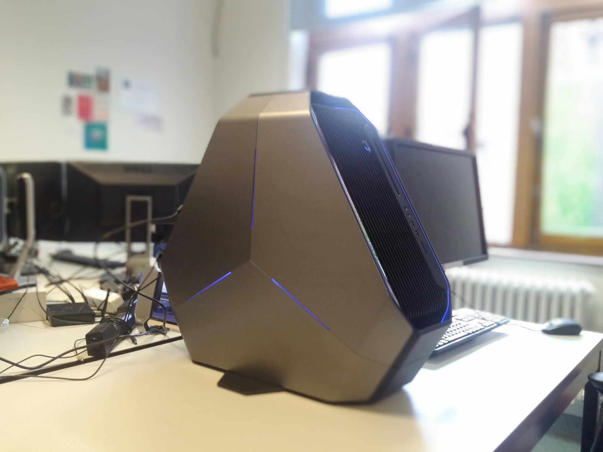 -->

---
layout: true
class: middle, left

---
# Deep learning

---
## Intro

### History

- Used for performing complex tasks (vision, translation, data mining...)
- Around for a while
- Only shallow neural nets used to work

.small[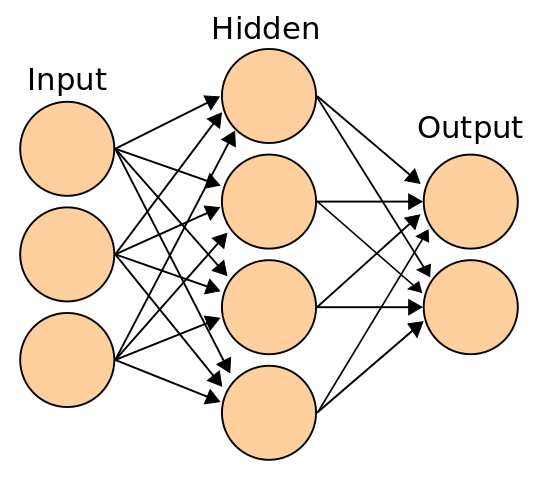]
.source[cc by-sa 3.0 – [Cburnett / Wikipedia](https://en.wikipedia.org/wiki/Artificial_neural_network#/media/File:Artificial_neural_network.svg)]

### Why now?

- Learning algorithms for deep nets
- Faster machines with more memory
- Lots of data

---
## Examples of DNN successes

Neural:

- Modeling monkey IT responses
- Modeling human fMRI responses
- Understanding neural selectivity for faces

Engineering:
- Object, scene, and face recognition
- Texture synthesis
- Applying artistic style
- Self-driving cars
- Text synthesis (with recurrency)

---
layout: true
class: middle, center

---
background-image: url(img/grand-han.jpg)

---
## Post-impressionism

.cols2[

.source[public domain - [Van Gogh, The Starry Night, 1889](https://commons.wikimedia.org/wiki/File:Van_Gogh_-_Starry_Night_-_Google_Art_Project.jpg)]

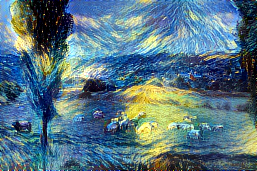
]

---
## Cubism

.cols2[
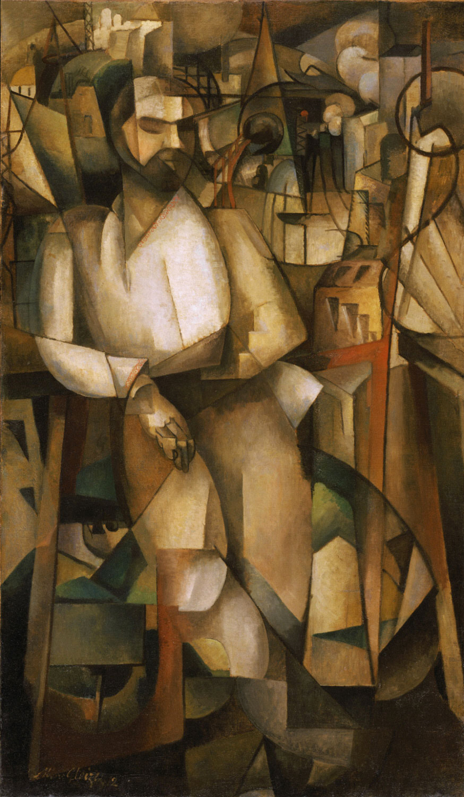
.source[fair use - [Gleizes, L'Homme au Balcon, Man on a Balcony (Portrait of Dr. Théo Morinaud), 1912](https://en.wikipedia.org/wiki/File:Albert_Gleizes,_l%27Homme_au_Balcon,_1912,_oil_on_canvas,_195.6_x_114.9_cm,_Philadelphia_Museum_of_Art.jpg)]

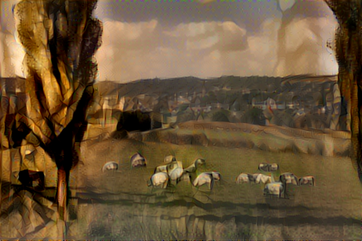
]

---
## Expressionism

.cols2[

.source[public domain - [Munch, The Scream, 1893](https://en.wikipedia.org/wiki/The_Scream#/media/File:The_Scream.jpg)]

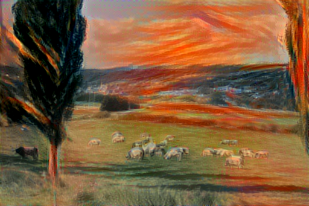
]
.source[]

---
layout: true
class: middle, left

---
# DNNs for perception

---
layout: true
class: middle, center

---
## Spiky smoothie cubie dataset

---
## ...enter Deep Nets

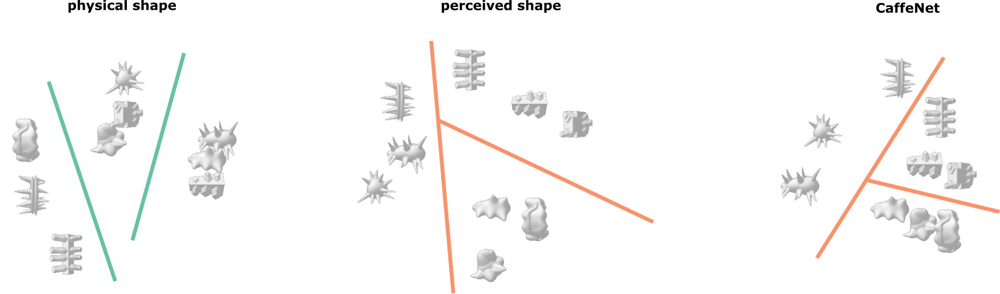

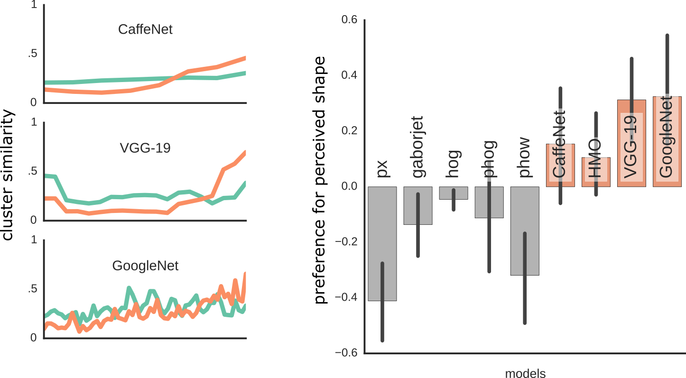

---
## ...also correlates with behavior

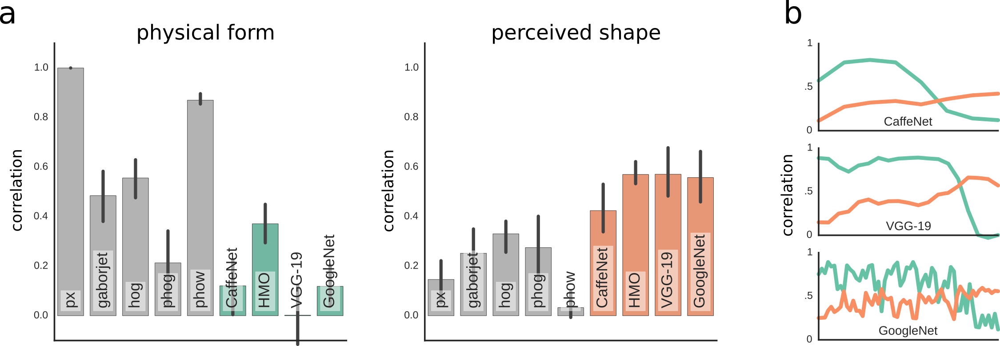

---
## Tested on multiple tasks

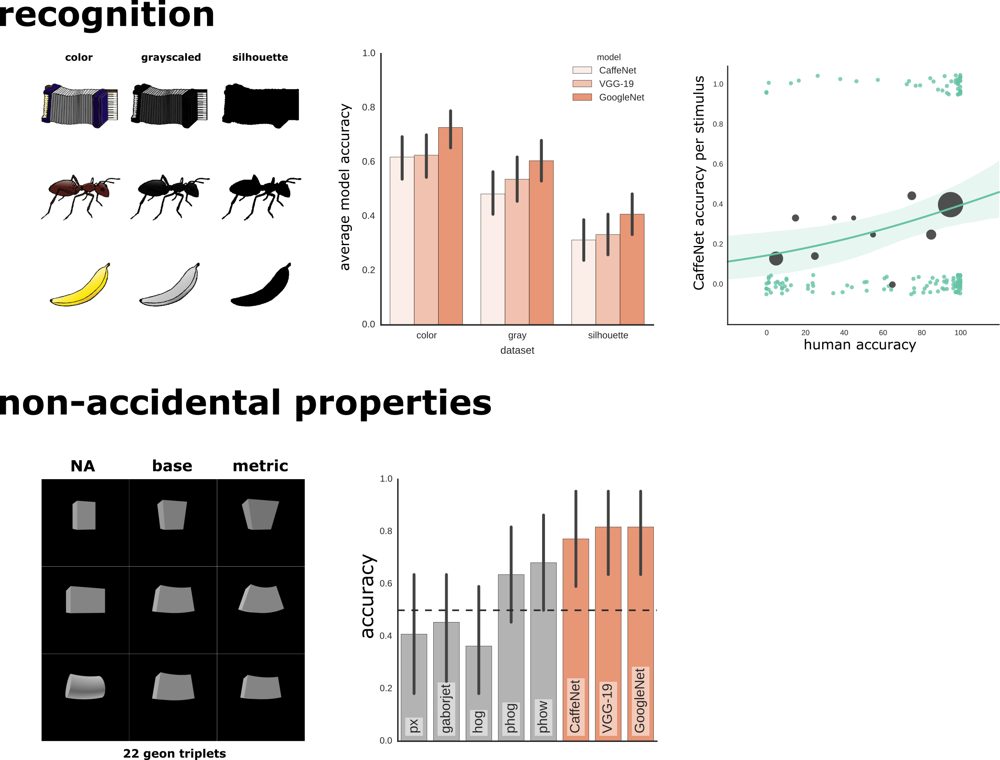

---
## Tested on multiple tasks

---
layout: true
class: middle, left

---
## Take home messages

- DNNs provide a promising model of visual recognition
- DNNs can capture not only objective dimensions (e.g., category) but also subjective  aspects of stimuli (e.g., shape)
- **You too can do Deep Learning in the lab**

---
.cols2[
# Thank you!

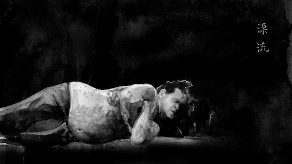
.source[fair use - [Hans Op de Beeck, Extensions, 2009, video still](http://www.onlinegalerij.nl/2013/12/13/metropolitan-scenes)]

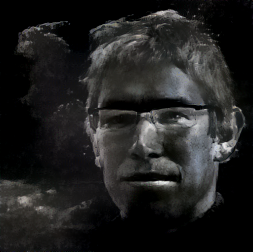
]
