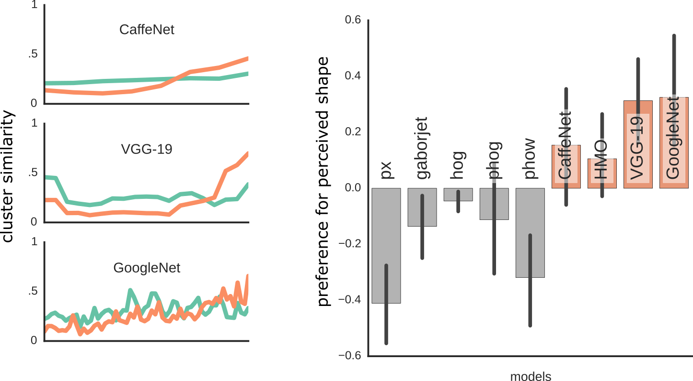
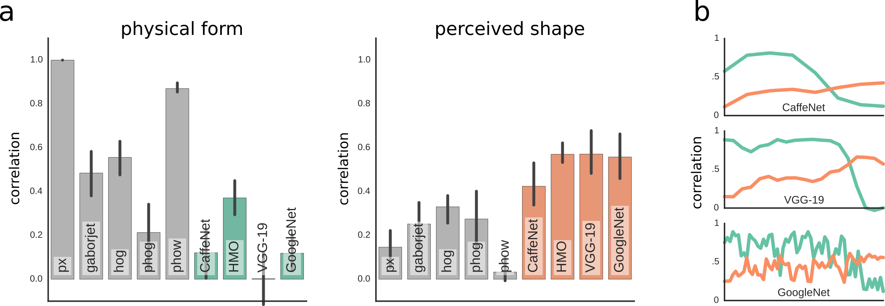
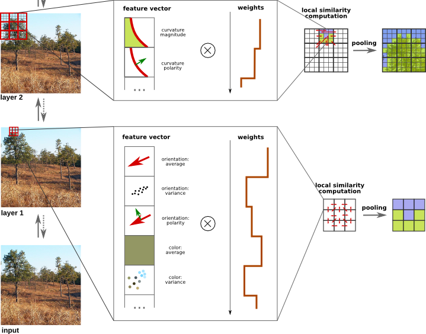
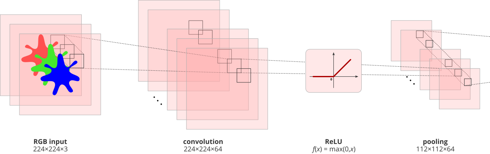

class: center, middle
background-image: url(img/alexnet_bckg.png)

# Understanding and improving deep neural nets
*Jonas Kubilius*

Brain & Cognition / KU Leuven (Belgium)

LEP lab meeting / 2015-09-25

.license[

.logo[]
.logo-name[[klab.lt](http://klab.lt)]
]
.aside[except where otherwise noted, these slides are available under the Creative Commons Attribution 4.0 International License]

???
I will discuss three ideas for investigating deep nets that I want to pursue during my postdoc:

(i) Understanding human rapid visual perception by presenting manipulated versions of objects that need to be detected, and trying to understand which features are critical.
(ii) Training deep nets to match human performance on all these tasks.
(iii) Using summary statistics in deep nets to perform segmentation.

I need feedback which of these ideas are most interesting and how to pursue them best.

.source[fair use – [Krizhevsky et al. (NIPS, 2012)](http://papers.nips.cc/paper/4824-imagenet-classification-with-deep-convolutional)]

---
layout: true
class: middle

---
# Warm up
### or why get hooked on the latest fad

---
## Spiky smoothie cubie dataset

---
## ...enter Deep Nets

---
## ...also correlates with behavior

---
## Artistic style

.cols2[

.source[public domain - [Van Gogh, The Starry Night, 1889](https://commons.wikimedia.org/wiki/File:Van_Gogh_-_Starry_Night_-_Google_Art_Project.jpg)]

.source[cc by 2.0 - [Hühnerauge / flickr](https://www.flickr.com/photos/27086904@N03/3588305201/)]
.source[rendered using [Justin Johnson's implementation](https://github.com/jcjohnson/neural-style)]
]

---
## Artistic style

.cols2[

.source[public domain - [Munch, The Scream, 1893](https://en.wikipedia.org/wiki/The_Scream#/media/File:The_Scream.jpg)]

.source[cc by 2.0 - [Hühnerauge / flickr](https://www.flickr.com/photos/27086904@N03/3588305201/)]
.source[rendered using [Justin Johnson's implementation](https://github.com/jcjohnson/neural-style)]
]

---
## Artistic style

.cols2[

.source[public domain - [Rubens, Bacchus (1638-40)](http://www.ibiblio.org/wm/paint/auth/rubens/)]

.source[cc by 2.0 - [Hühnerauge / flickr](https://www.flickr.com/photos/27086904@N03/3588305201/)]
.source[rendered using [Justin Johnson's implementation](https://github.com/jcjohnson/neural-style)]
]

---
## Why deep nets: Summary

- General-purpose (black box) models
- Work for explaining data at neural and perceptual levels
- Easier to understand because they are feedforward
- But still not understood

---
background-image: url(img/alien.jpg)

# Ideas

---
## Outline

1. Human rapid perception
2. Comparing to deep nets
3. New architecture!

---
# Rapid perception

---
## What we know

- It's fast, probably feedforward (Delorme & Thorpe, 2001; VanRullen & Thorpe, 2002; VanRullen & Koch, 2003)
- Features:
  - shape first, texture second (Elder & Velisavljević, 2009)
  - amplitude spectrum (Gaspar & Rousselet, 2009)
  - canonical posture (Delorme et al., 2010)
  - size ratio (Delorme et al., 2010)
  - diagnostic features (eyes, mouth, limbs; Delorme et al., 2010)
  - edge co-occurence (Perrinet & Bednar, 2015)

???
Implications:

- A wrong task to understand vision
- We want to know what information is available over time, not solve animal detection

---
## Our approach

.full[]

---
class: center
## How to create stimuli

---
# Comparison to machines

???
- Just train for specific tasks
- A single architecture for all tasks

---
# Novel architecture

---
## What does feedforward look like?

.cols2[

.source[cc by 3.0 – [Nige Brown / flickr](https://www.flickr.com/photos/nigel_brown/9404238204)]

]

---
## What does feedforward look like?

.cols2[

.source[fair use – [LabelMe](http://labelme.csail.mit.edu/Release3.0/index.php)]

]

---
## What does feedforward look like?

1. Summary statistics is a V2 bottleneck for features
2. But some structure survives

---
## Metamers of rapid perception

.cols2[

.source[fair use – [LabelMe](http://labelme.csail.mit.edu/Release3.0/index.php)]

]

---
class: middle

# Thank you!
<!--.aside[slides available at [klab.lt](https://klab.lt)]-->

---
class: middle

# Extra slides

---
class: center
## gmin layer 1

.source[cc by 4.0 – [Kubilius et al. (Frontiers in Computational Neuroscience, 2014)](http://doi.org/10.3389/fncom.2014.00158)]

---
class: center
## In practice

---
class: center
## gmin layers 1 & 2

.source[cc by 4.0 – [Kubilius et al. (Frontiers in Computational Neuroscience, 2014)](http://doi.org/10.3389/fncom.2014.00158)]

---
class: center
## In practice

.full[]

---
class: center
## gmin full architecture

.source[cc by 4.0 – [Kubilius et al. (Frontiers in Computational Neuroscience, 2014)](http://doi.org/10.3389/fncom.2014.00158)]

---
class: center
## In practice

.full[]

(Try it online: [gmin.klab.lt](http://gmin.klab.lt))

---
## Tested on multiple tasks

---
## Tested on multiple tasks

---
class: center
## Basic building blocks

