class: center, middle

# What mid-level vision does and other experiments with deep architectures
*Jonas Kubilius*

Brain & Cognition / KU Leuven (Belgium)

LEP seminar / 2015-04-21

.license[

.logo[]
.logo-name[[klab.lt](http://klab.lt)]
]
.aside[except where otherwise noted, these slides are available under the Creative Commons Attribution 4.0 International License]

???
In this talk, I will present a theoretical synthesis of various ideas about the processing of visual information in mid-level areas. To support the proposed framework, I will present some recent experimental evidence from our lab and show a proof-of-the-concept model that implements these ideas in practice. In the second part of the presentation, I will expand the scope of discussions to convolutional neural architectures, another interesting candidate for investigating visual processing, and demonstrate several experiments that I conducted recently to explore their capacities in mid-level processing.

---
layout: true
class: middle

---
class: center
## Goals of research in vision

???
Let's try to get away from box models to things that actually work.

---
class: center
## Human brain

.source[cc by 3.0 – [Kubilius (figshare, 2013)](http://doi.org/10.6084/m9.figshare.106794)]

**How to get from an image to the knowledge about its contents as perceived by a human observer?**

---
## How it works

.cols2[

.source[fair use – [Riesenhuber & Poggio (Nature Neuroscience, 2007)](http://doi.org/10.1038/14819)]

&nbsp;
]

---
class: center
## V1 simple cell

.cols2[

.source[fair use – [Riesenhuber & Poggio (Nature Neuroscience, 2007)](http://doi.org/10.1038/14819)]

.source[cc by-sa 3.0 – [Kyle.wg3139 / Wikipedia](https://en.wikipedia.org/wiki/File:Simple_and_Complex_Cells.pdf)]
Simple cells: **feature selectivity**
]

---
class: center
## V1 complex cell

.cols2[

.source[fair use – [Riesenhuber & Poggio (Nature Neuroscience, 2007)](http://doi.org/10.1038/14819)]

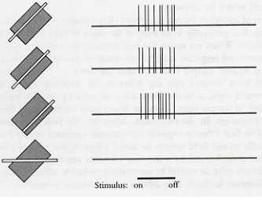
.source[fair use – [David Hubel](http://hubel.med.harvard.edu/book/b18.htm#lec)]
Complex cells: **feature invariance**
]

---
## V2: Curvature detection

.cols2[

.source[fair use – [Riesenhuber & Poggio (Nature Neuroscience, 2007)](http://doi.org/10.1038/14819)]

.source[cc by – [Rodríguez-Sánchez & Tsotsos (PLoS ONE, 2012)](http://doi.org/10.1371/journal.pone.0042058.g003)]
Endstopped cells
]

---
## V4: Curvature detection

.cols2[

.source[fair use – [Riesenhuber & Poggio (Nature Neuroscience, 2007)](http://doi.org/10.1038/14819)]

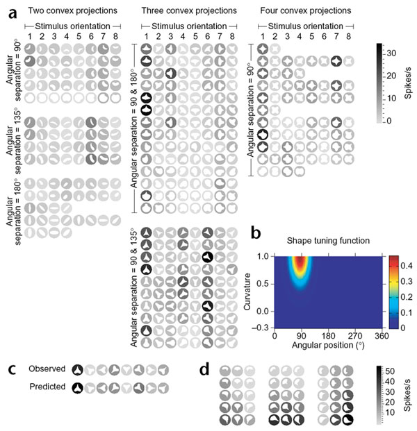
.source[fair use – [Pasupathy & Connor (Nature Neuroscience, 2002)](http://doi.org/10.1038/972)]
]

---
class: top

## Recognition from shape only?

.cols3.fixed-height[

100%

34%

0%
]

--

.cols3.fixed-height[

]
.source[fair use – [Wagemans et al. (Perception, 2008)](http://doi.org/10.1068/p5825)]

---
## More tasks

The visual system does a lot of things:
- Categorization
- Navigation
- Acting on environment
- ...

.source[cc by 4.0 – [Kubilius et al. (Frontiers in Computational Neuroscience, 2014)](http://doi.org/10.3389/fncom.2014.00158)]

---
## Edge- vs. texture-based

.cols2[

.source[cc by 2.0 – [bengt-re / flickr](https://www.flickr.com/photos/bengt-re/3889978926)]
**Edge-based**

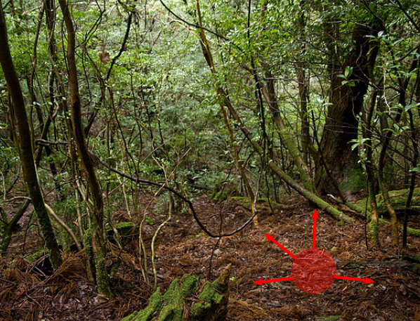
.source[cc by 3.0 – [&#931;64 / Wikimedia Commons](http://commons.wikimedia.org/wiki/File:Forest_in_Yakushima_08.jpg)]
**Region-based**

]

---
## Summary statistics

.cols2[

.source[fair use – [Portilla & Simoncelli (IJCV, 2000)](http://doi.org/10.1023/A:1026553619983)]

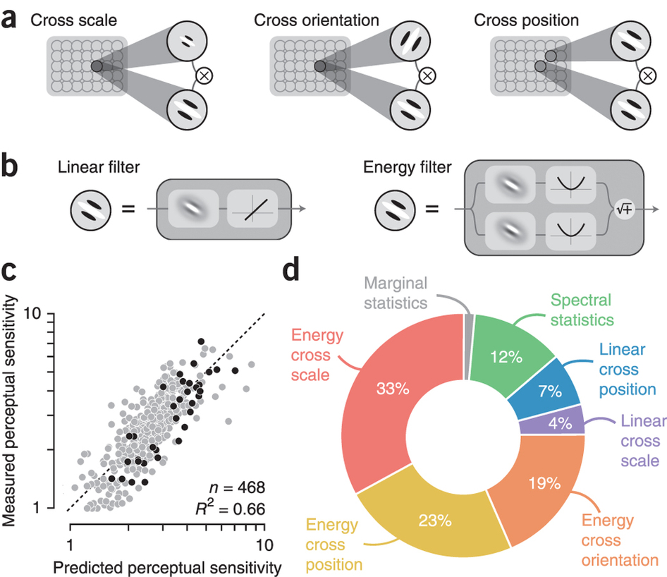
.source[fair use – [Freeman et al. (Nature Neuroscience, 2013)](http://doi.org/10.1038/nn.3402)]
]

---
## V2 processes textures

.cols2[
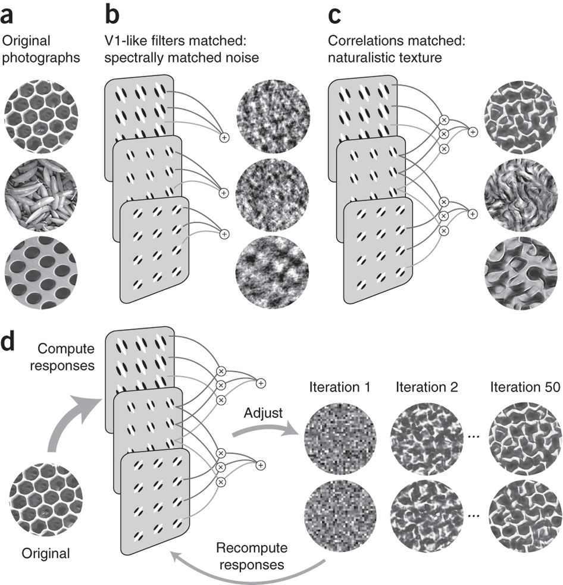

]
.source[fair use – [Freeman et al. (Nature Neuroscience, 2013)](http://doi.org/10.1038/nn.3402)]

---
class: middle

# Could we combine them?

---
class: center
## Similarity & pooling

--

---
## gmin architecture

.source[cc by 4.0 – [Kubilius et al. (Frontiers in Computational Neuroscience, 2014)](http://doi.org/10.3389/fncom.2014.00158)]

---
## gmin architecture

.source[cc by 4.0 – [Kubilius et al. (Frontiers in Computational Neuroscience, 2014)](http://doi.org/10.3389/fncom.2014.00158)]

---
## Interesting predictions

- Second-order edge detection as a basic mechanism
- Grouping present in feedforward signals

---
class: center
## V2 detects second-order edges

.cols2[

.source[fair use – [von der Heydt et al. (Science, 1984)](http://doi.org/10.1126/science.6539501)]

.source[fair use – [Poort et al. (Neuron, 2012)](http://doi.org/10.1016/j.neuron.2012.04.032)]
]

---
## Cue-invariant processing in rats

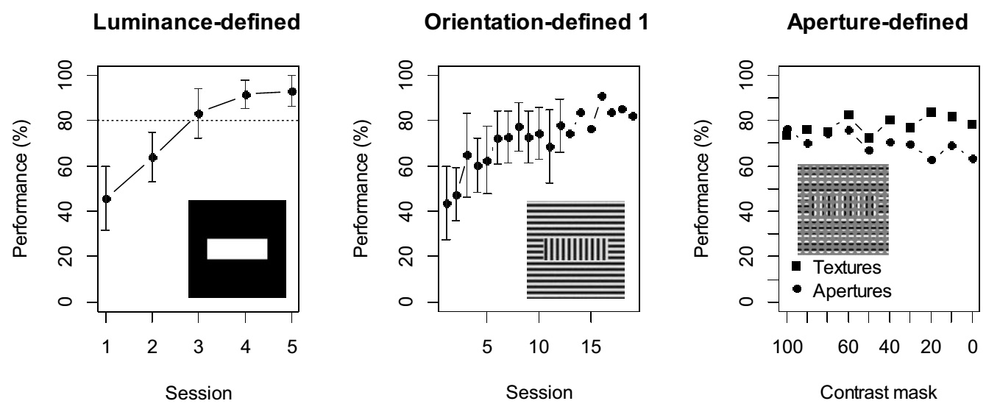
.source[fair use – De Keyser et al. (submitted)
]

---
## Rapid grouping

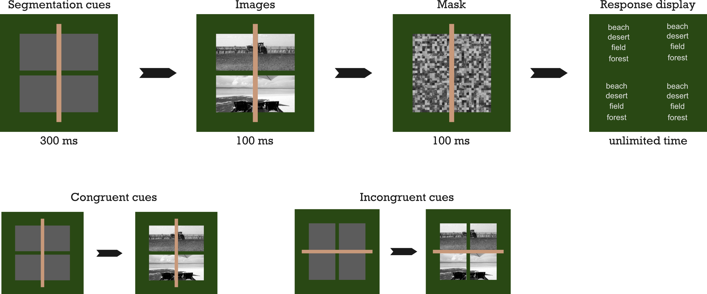
.source[Kubilius et al. (VSS 2015)]

---
## Rapid grouping

.source[Kubilius et al. (VSS 2015)]

---
## What does feedforward look like?

.cols2[
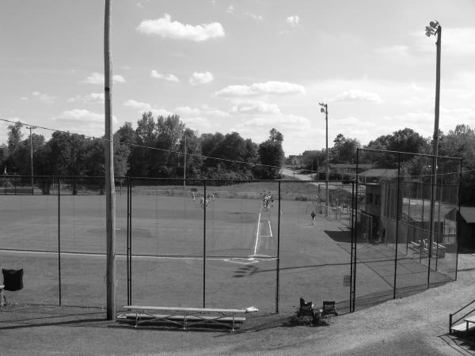
.source[fair use – [LabelMe](http://labelme.csail.mit.edu/Release3.0/index.php)]

]

---
## What does feedforward look like?

.cols2[

.source[fair use – [LabelMe](http://labelme.csail.mit.edu/Release3.0/index.php)]

]

---
## gmin output

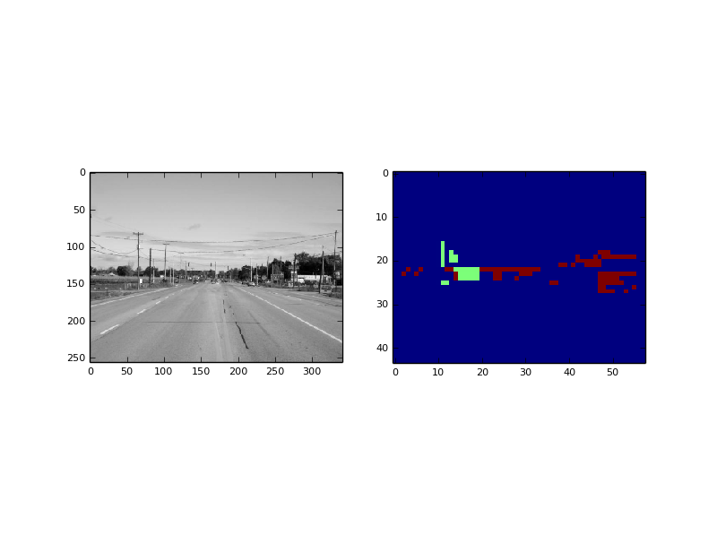
---
## gmin output

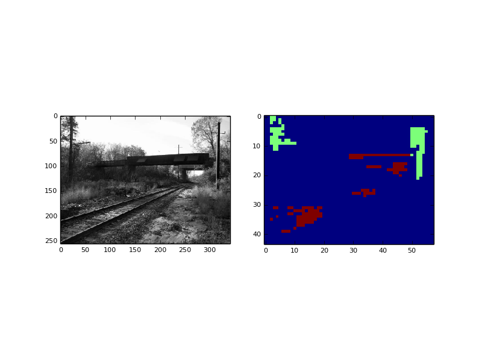

---
## Limitations

- Picks up *similarities* but not necessarily *discriminative* features
- Not clear if feedforward mistakes can be corrected recurrently

---
class: middle

# Deep Neural Networks
.subtitle[(actually, only convolutional)]

---
class: center

## Are you better than a machine?

### Compete against GoogLeNet

[ILSVRC 2014 demo by Andrej Karpathy](https://cs.stanford.edu/people/karpathy/ilsvrc/)

### Place recognition

[Places-CNN](http://places.csail.mit.edu/demo.html)

---
## Early architectures

.source[cc by-nc-sa 3.0 – [Fukushima (Scholarpedia, 2007)](http://doi.org/10.4249/scholarpedia.1717)]

.source[fair use – [LeCun et al. (Neural Computation, 1989)](http://doi.org/10.1162/neco.1989.1.4.541) via [EBLearn](http://eblearn.sourceforge.net/beginner_tutorial2_train.html)]

---
## HMAX

.source[cc by 3.0 – [Serre et al. (PNAS, 2007)](http://doi.org/10.1073/pnas.0700622104) via [Kreiman (Scholarpedia, 2008)](http://doi.org/10.4249/scholarpedia.2667)]

---
## AlexNet

.source[fair use – [Krizhevsky et al. (NIPS, 2012)](http://papers.nips.cc/paper/4824-imagenet-classification-with-deep-convolutional)]

---
class: center
## Basic building blocks

---
class: center
## HMO

.source[fair use – [Yamins et al. (PNAS, 2014)](http://doi.org/10.1073/pnas.1403112111)]

---
class: center
## Fooling ConvNets

With 99.12% confidence, this is what I see...

.source[fair use – [Nguyen et al. (CVPR, 2015)](http://www.evolvingai.org/fooling)]

---
class: center, middle
# Is this what we fought for?

---
class: center, middle
# Deep networks for mid-level vision

---
class: center
## Representation of shape

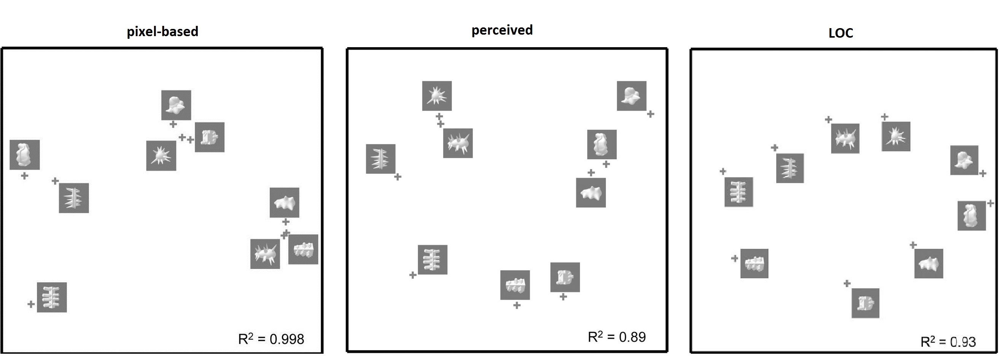

---
class: center
## Representation of category

.source[Bracci et al. (submitted)]

---
class: center
## Representation of category

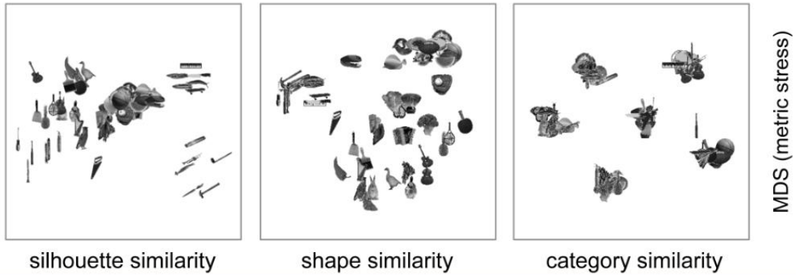
.source[Bracci et al. (submitted)]

---
class: center
## Representation of category

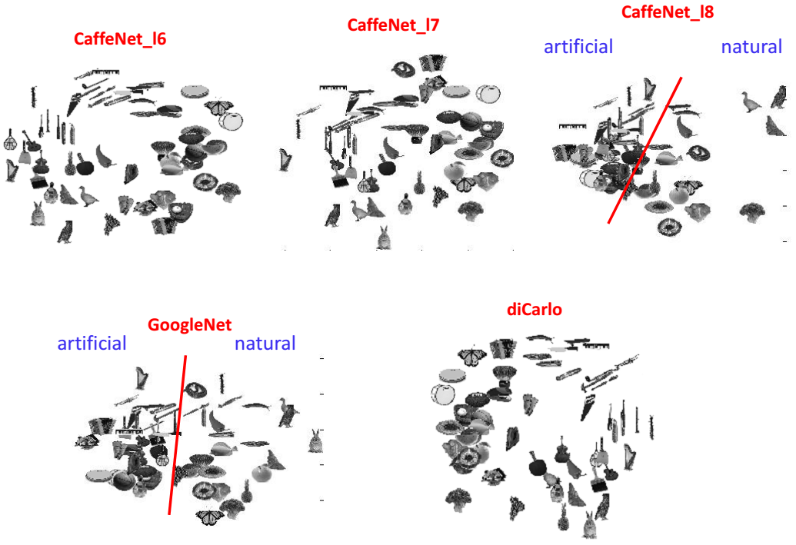

---
class: center
## NAPs and geons

.small[
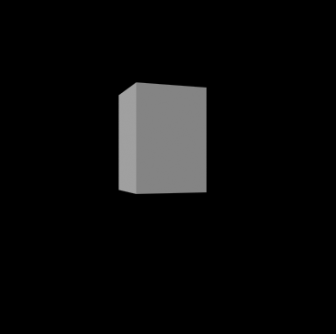

]

[GoogleNet on 3D geons:](https://klab.lt/research/conv-exp/non-accidental-properties-and-geons/3d.html) 86%-90%

---
## Two-line stimuli
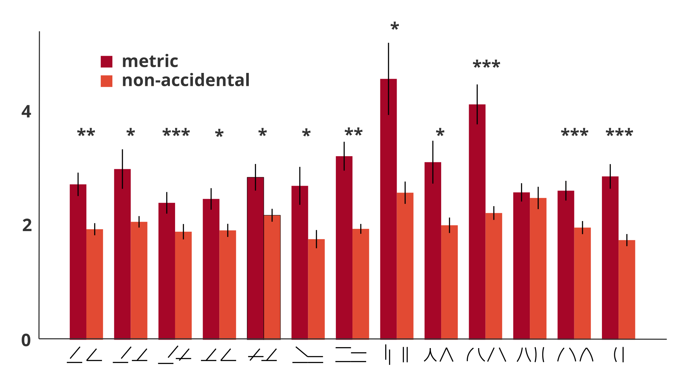

---
## GoogleNet on 2D line stimuli

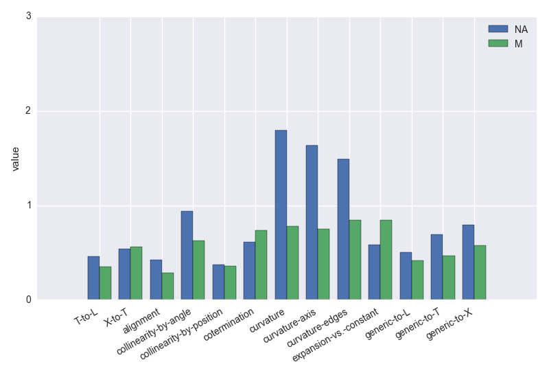

[69%](https://klab.lt/research/conv-exp/non-accidental-properties-and-geons/2d.html)
---
class: center
## Occlusion

[HMO's performance with occlusion](https://klab.lt/research/conv-exp/occlusion/HMO.html)

---
## Recognition from shape

.small[]

- [Snodgrass & Vanderwart (1980)](http://www.ncbi.nlm.nih.gov/pubmed/7373248): 100%
- GoogleNet: 88%

.small[]

- [Wagemans et al. (2008)](http://doi.org/10.1068/p5825): 69%
- GoogleNet: 42%

---
## Cue-invariant processing

.full[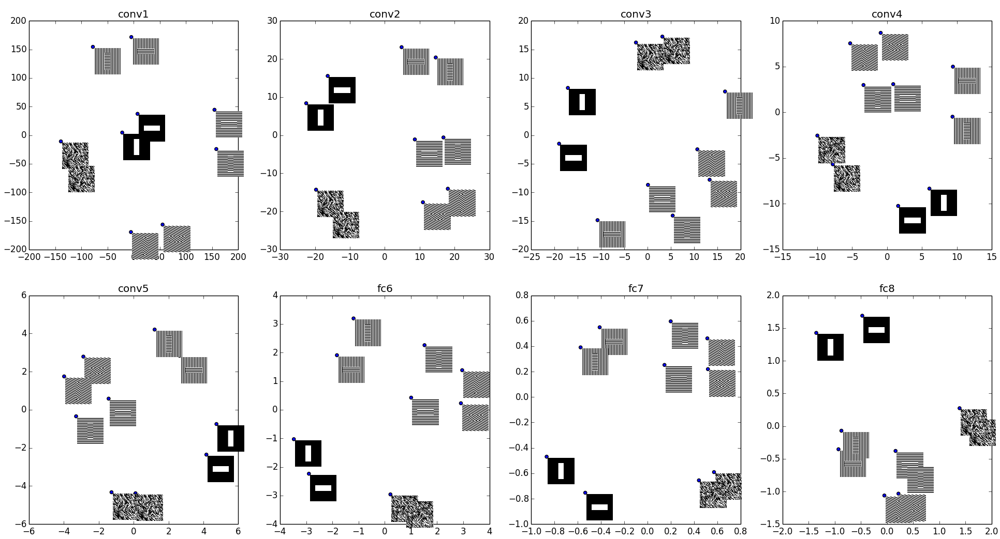]

---
class: center, middle

# I want machines to .strike[.strike-fix[see]]
.strike-new[perceive]

---
class: middle

# Thank you!
<!--.aside[slides available at [klab.lt](https://klab.lt)]-->
