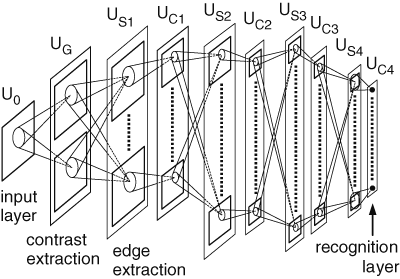
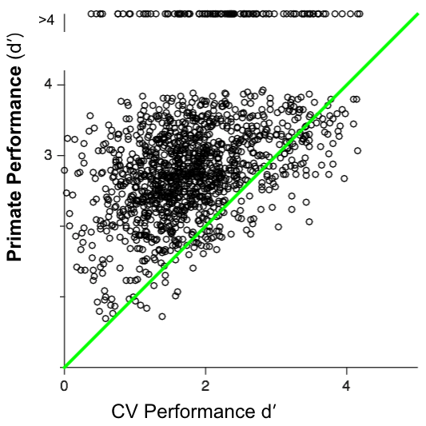

class: center

# Deep learning for understanding human vision

***Jonas Kubilius***

Brain & Cognition / KU Leuven  
McGovern Institute for Brain Research / MIT

HOP lab / 2018-11-13

.license[

.logo[]
.logo-name[[klab.lt](http://klab.lt)]
]
.aside[Content: Creative Commons Attribution 4.0 International License]
.aside[Images: Fair use unless stated otherwise]

???
Topics:
- Rishi behav
- Kubilius behav
- Yamins 2014
- Kar temporal
- NIPS temporal
- Predict then simplify
- Brain-Score
- CORnet
- Generalization
- NIPS Chengxu
- 3dworld

We need:
- robust systems that work on anything, not just training set -> generalization
- systems that work just like human visual system for disease treatment etc -> Brain-Score
- systems that are predictive and simple (interpretable) -> CORnet

Future directions:
- unsupervised / self-supervised learning and learning from few samples (but compare to generalization)
- neuroscience in silico -> NIPS Chengxu, 3dworld
- from sensory to cognitive

---
class: middle

## Overview

1. Intro to deep neural networks for vision
2. Successes up until ~2015: predicting behavioral and neural responses
3. Pushing beyond (2015 - now):
   - strong benchmarks: Brain-Score
   - predictive and simple models: CORnet
   - ability to generalize
4. Future directions

---
class: left, middle

## Goal

Understand how human visual system works

---
class: left, middle

## Goal

~~Understand how human visual system works~~

Build a model that would predict human neural and behavioral responses in a Core Object Recognition task

---
background-image: url(img/task.gif)
background-size: cover

---
class: middle

# Part 1: Intro to Modeling

---
class: center, middle

## Ventral visual stream

.img100[]

---
class: center, middle

## Retinal on-off cells

&nbsp;

---
class: center, middle

## Retinal on-off cells

**Building block #1:** Feature detectors

---
class: center, middle

## V1 simple cells

&nbsp;

---
class: center, middle

## V1 simple cells

**Building block #2:** Hierarchies

---
class: center, middle

## V1 complex cells

&nbsp;

---
class: center, middle

## V1 complex cells

**Building block #3:** Pooling

---
class: middle

## Building blocks

1. Feature detectors
2. Hierarchies
3. Pooling
4. Non-linearities (linear systems are one-layer only)
5. Learning mechanisms (backpropagation)

.split-30[
.column[

.source[[Fukushima (Biological Cybernetics, 1980)](https://doi.org/10.1007/BF00344251)]
]

.column[

.source[[LeCun, Bottou, Bengio, Haffner (Proc. of the IEEE, 1998)](https://doi.org/10.1109/5.726791)]
]
]

---
class: middle

## Modern approach: Deep learning

1. Compute power (fast, large memory GPUs)
2. Big data
3. A couple of engineering tricks
4. (A brave PhD student)

---
class: center, middle

## AlexNet

.img100[]

---
class: middle

# Part 2: Evaluating Models

---
class: center, middle

## Do models explain behavior?

.source[[Rajalingham, Schmidt, DiCarlo (JNeuro, 2015)](https://doi.org/10.1523/JNEUROSCI.0573-15.2015)]

---
class: center, middle

## Do models explain behavior?

.source[[Rajalingham, Schmidt, DiCarlo (JNeuro, 2015)](https://doi.org/10.1523/JNEUROSCI.0573-15.2015)]

---
class: center, middle

## Do models explain behavior?

.source[[Rajalingham, Schmidt, DiCarlo (JNeuro, 2015)](https://doi.org/10.1523/JNEUROSCI.0573-15.2015)]

---
class: center, middle

## Do models explain behavior?

.source[[Rajalingham, Schmidt, DiCarlo (JNeuro, 2015)](https://doi.org/10.1523/JNEUROSCI.0573-15.2015)]

---
class: center, middle

## Do models explain behavior?

.source[[Rajalingham, Schmidt, DiCarlo (JNeuro, 2015)](https://doi.org/10.1523/JNEUROSCI.0573-15.2015)]

---
class: center, middle

## Perceived shape judgments

---
class: center, middle

## Perceived shape judgments

.img40[]

.img60[]
.source[cc-by – [Kubilius, Bracci, Op de Beeck (PLoS Comp Biol, 2016)](http://doi.org/10.1371/journal.pcbi.1004896)]

---
class: center, middle

## Predicting neurons

.split-30[
.column[]
.column[]
]

---
class: center, bottom

## Temporal responses

.source[[Kar, Kubilius, Issa, Schmidt, DiCarlo. (Cosyne, 2017)](http://doi.org/10.1073/pnas.1403112111)]

---
class: center, bottom

## Temporal responses

.source[[Kar, Kubilius, Issa, Schmidt, DiCarlo. (Cosyne, 2017)](http://doi.org/10.1073/pnas.1403112111)]

---
class: center, middle

## Predicting neurons

.split-30[
.column[]
.column[]
]

---
class: center, middle

## Predicting neurons

.img100[]
.source[
  [Yamins, Hong, Cadieu, Solomon, Seibert, DiCarlo (PNAS, 2014)](http://doi.org/10.1073/pnas.1403112111)

  [Yamins & DiCarlo (Nat Neurosci, 2016)](http://doi.org/10.1073/pnas.1403112111)
]

---
class: middle

# Part 3: Are We Done Yet?

---
class: left, middle

## Major issues

- We are not at 100% explained variance

--

- Best ImageNet models are diverging from biology: very deep, feedforward

--

  *But are they good models of the visual system?*

--

- Supervised training is non-biological

--

  *Less important if you care about the end state only*

--

- Models don't generalize well outside their train set

--

  *Really? Do human generalize that well?*

---
class: center, middle

## Brain-Score

.img100[]
<a href="https://doi.org/10.1101/407007">Shrimpf&ast;, Kubilius&ast;, Hong, Majaj, Rajalingham, Issa, Kar, Bashivan, Prescott-Roy, Schmidt, Yamins, DiCarlo. (biorxiv, 2018)</a>

???
Let's keep training on ImageNet and we'll get to 100% explained variance?

---
class: center, middle

<iframe src="http://www.brain-score.org" width="800" height="600" frameborder="0"></iframe>

---
class: middle

# Part 3.1: Recurrence Matters

---
class: center, bottom

## Control vs challenge images

.source[[Kar, Kubilius, Schmidt, Issa, DiCarlo. (biorxiv, 2018)](https://doi.org/10.1101/354753)]

---
class: center, bottom

## Control vs challenge images

.source[[Kar, Kubilius, Schmidt, Issa, DiCarlo. (biorxiv, 2018)](https://doi.org/10.1101/354753)]

---
class: center, bottom

## Temporal responses

.source[[Kar, Kubilius, Schmidt, Issa, DiCarlo. (biorxiv, 2018)](https://doi.org/10.1101/354753)]

---
class: center, bottom

## Temporal responses

.source[[Kar, Kubilius, Schmidt, Issa, DiCarlo. (biorxiv, 2018)](https://doi.org/10.1101/354753)]

---
class: center, bottom

## Temporal responses

.source[[Kar, Kubilius, Schmidt, Issa, DiCarlo. (biorxiv, 2018)](https://doi.org/10.1101/354753)]

---
class: center, bottom

## Temporal responses

.source[[Kar, Kubilius, Schmidt, Issa, DiCarlo. (biorxiv, 2018)](https://doi.org/10.1101/354753)]

---
class: center, bottom

## Temporal responses

.img100[]
.source[[Kar, Kubilius, Schmidt, Issa, DiCarlo. (biorxiv, 2018)](https://doi.org/10.1101/354753)]

---
class: center, middle

## Idea: Use deeper models

.img100[]

*(approximate sizes)*

.source[[Netscope CNN Analyzer](https://dgschwend.github.io/netscope/quickstart.html)]

---
class: center, middle

## Idea: Use deeper models

.img100[]
.source[[Kar, Kubilius, Schmidt, Issa, DiCarlo. (biorxiv, 2018)](https://doi.org/10.1101/354753)]

---
class: center, middle

## Better idea: Add recurrence

.img100[]
<a href="http://arxiv.org/abs/1807.00053">Nayebi&ast;, Bear&ast;, Kubilius&ast;, Kar, Ganguli, Sussillo, DiCarlo, Yamins. (NIPS, 2018)</a>

---
class: center, middle

## CORnet family of models

<a href="http://doi.org/10.1101/408385">Kubilius&ast;, Shrimpf&ast;, Nayebi, Bear, Yamins, DiCarlo. (biorxiv, 2018)</a>

???
Unifying family
Back to the basics

---
class: center, middle

## Explaining temporal responses

.img100[]
.source[[Kar, Kubilius, Schmidt, Issa, DiCarlo (biorxiv, 2018)](https://doi.org/10.1101/354753)]

---
class: middle

# Part 3.2: Generalization

---
class: center, middle

## What is generalization?

---
class: center, middle

## Comparing humans against machines

.img100[]

---
class: center, middle

## Results

.img100[]

---
class: center, middle

## Decoding from primate IT

---
class: middle

# Part 4: Future

---
class: center, middle

## Simulated senses

.source[[Zhuang, Kubilius, Hartmann, Yamins (NIPS oral, 2017)](https://arxiv.org/abs/1706.07555)]

???
We would like to simulate sensory modalities so that we don't have to think about them any longer and could concentrate on higher-level behaviors: decision making, problem solving

---
class: center, middle

## Simulated worlds

<iframe width="560" height="315" src="https://www.youtube-nocookie.com/embed/WeVJIuyJq08" frameborder="0" allow="accelerometer; autoplay; encrypted-media; gyroscope; picture-in-picture" allowfullscreen></iframe>
source: Book of the Dead / Unity

Purpose:
- Self-supervised training
- From sensory cortex to cognitive tasks

???
All of these efforts require more and more computing power and also more and more data. Compute power is what it is but where can we get more data? Simulate the world.

---
class: center, middle

## Human-machine interfaces

.source[[The Swamp Intelligence -- sngan_projection / Jonas Kubilius (16th International Architecture Exhibition---La Biennale di Venezia)](http://swamp.lt)]

---
class: center, middle

.img100[]
.source[[The Swamp Intelligence -- sngan_projection / Jonas Kubilius (16th International Architecture Exhibition---La Biennale di Venezia)](http://swamp.lt)]

---
class: middle

# Part 5: Lessons

???
Things I learned that may be useful for you too

---
class: center, middle

## Lesson 1: Have a goal

Define what a success is

and a means to measure your progress

???

Have a tangible goal, one that is timeless, one that is important and meaningful to your no matter what – politics, current hypes and fashions

---
class: center, middle

## Lesson 2: Predict, then simplify

.source[[Kubilius (NeuroImage, 2018)]()]

???
We're often looking for key factors, trying to reduce the system

What would Newton say?

Reducing all physical interactions to a couple of equations

vs

Absorbing all the data in equations with millions of parameters

---
class: center, middle

## Lesson 3: The new giants

Stand on the shoulders of giant models ––

Let the data and machines do the work for you.

???

In other words,

scientists need to spot patterns in data...

...machines are good at pattern processing

---
class: middle
## Thank you!

.split-60[
.column[
**Collaborators at MIT:**

]

.column[
**Collaborators at Stanford:**
.img50[]
.img50[]
.img50[]
]
]

 

**Slides:** find them on [klab.lt](https://klab.lt/.../slides.html)

**Funding:** European Union's Horizon 2020 research and innovation programme under grant agreement No 705498