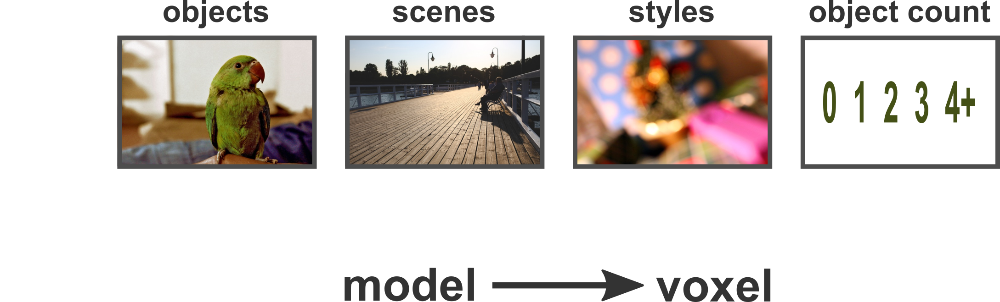
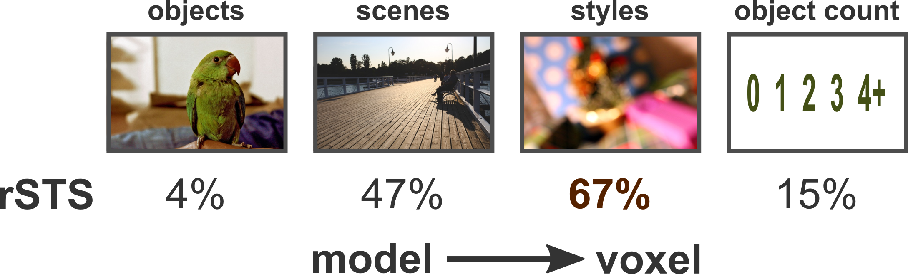
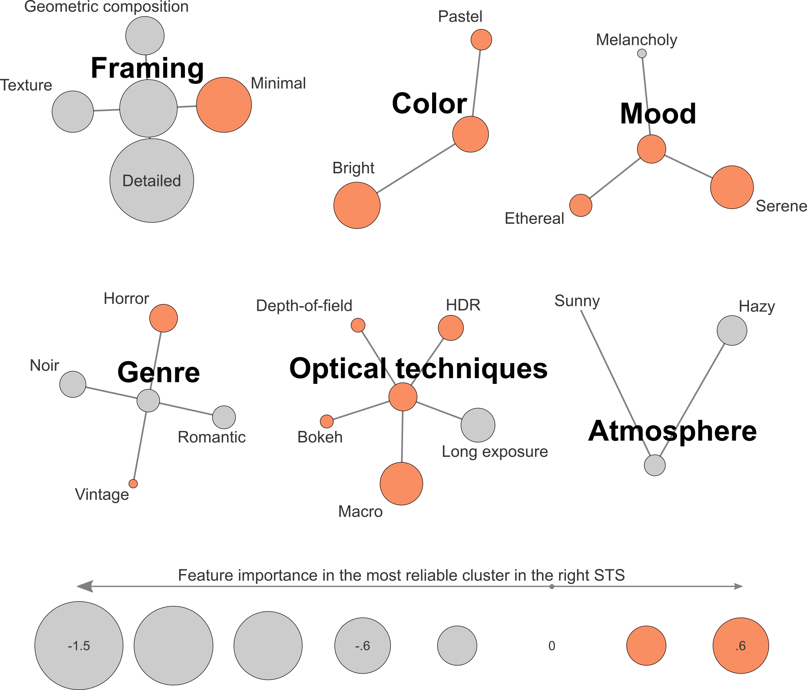
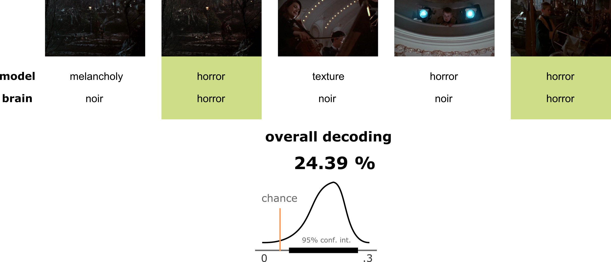
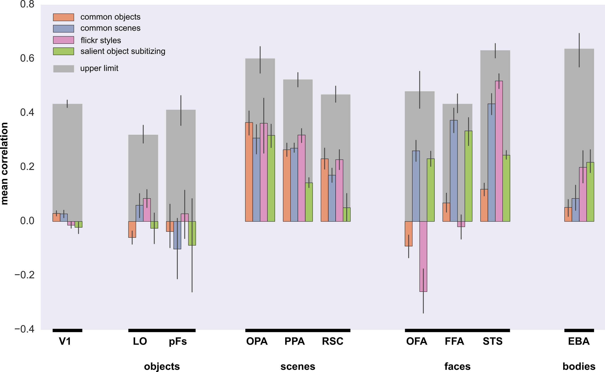

class: center, middle

# Encoding Models for Higher Visual Features

*Jonas Kubilius and Drew Linsley*

KU Leuven (Belgium) / Boston College (USA)

CBMM summer school / 2015-09-02

.license[

.logo[]
.logo-name[[klab.lt](http://klab.lt)]
]
.aside[except where otherwise noted, these slides are available under the Creative Commons Attribution 4.0 International License]

???

---
layout: true
class: middle

---
## "Gallant" for higher visual features

- Encoding models!
- "Massive and unconstrained" data

---
class: center
## Encoding models

.full[]

---
class: center
## Encoding models

.full[]

---
class: center
## Tuning properties in rSTS

---
class: center
## Decoding styles from rSTS

.full[]
.source[Home Alone 2 frames used under the fair use terms]

---
## Observations

- Visual style captures STS activity
- Fine-tuning for a particular task can account for fMRI data

---
# Thank you!

---
class: center
## Predictability

.full[]

---
class: center
## Style predictability

.full[]
