class: center, middle

# I want machines to see
*Jonas Kubilius*

Brain & Cognition / KU Leuven (Belgium)

DataLux / 2015-04-08

.license[

.logo[]
.logo-name[[klab.lt](http://klab.lt)]
]
.aside[except where otherwise noted, these slides are available under the Creative Commons Attribution 4.0 International License]

???
So you've heard of Deep Learning and how it's conquering the world. But are we finally going to have machines that can actually see? I'll discuss how human visual system seems to work based on empirical and theoretical research, and what it means for people who wish to solve visual problems.

---
class: center

## The goal

How to get from an image to the knowledge about its contents as perceived by a human observer.

---
class: center

## Compete against GoogLeNet

[ILSVRC 2014 demo by Andrej Karpathy](https://cs.stanford.edu/people/karpathy/ilsvrc/)

--

How did we get here?

---
## Why is vision difficult?

1. The invariance problem
2. Discovering structure

---
## The invariance problem

.cols2[

.source[cc by 2.0 – [Wendy Cope / Flickr](https://www.flickr.com/photos/litratcher/7389889766)]

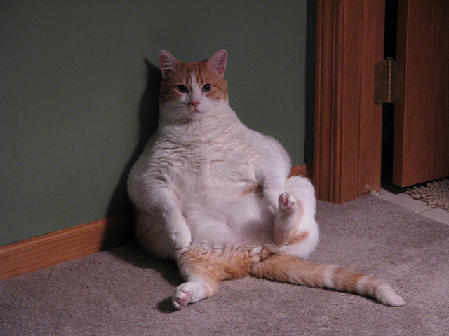
.source[cc by 2.0 – [Dan Perry / Flickr](https://www.flickr.com/photos/golf_pictures/2187242989)]
]

---
class: center

## Discovering structure

.source[cc by-nc 2.0 – [Celeste RC / Flickr](https://www.flickr.com/photos/celesterc/444784759)]

---
class: center

## Discovering structure

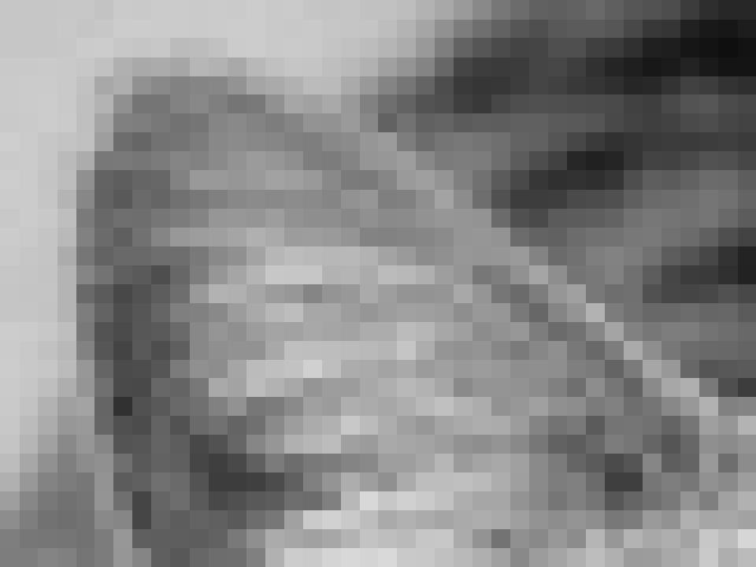
.source[cc by-nc 2.0 – [Celeste RC / Flickr](https://www.flickr.com/photos/celesterc/444784759)]

---
class: center

## Discovering structure

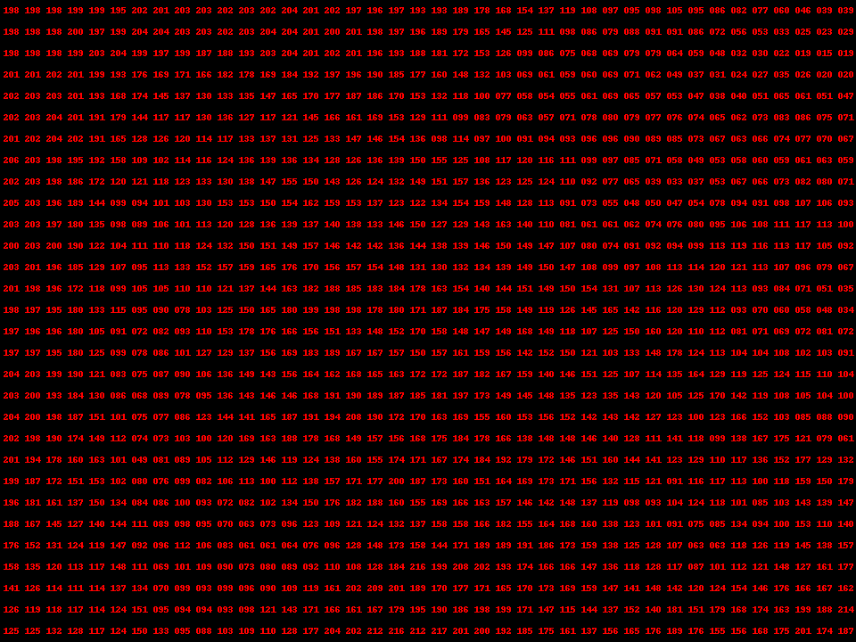

---
class: middle

# Human visual system

---
class: center
## Human brain

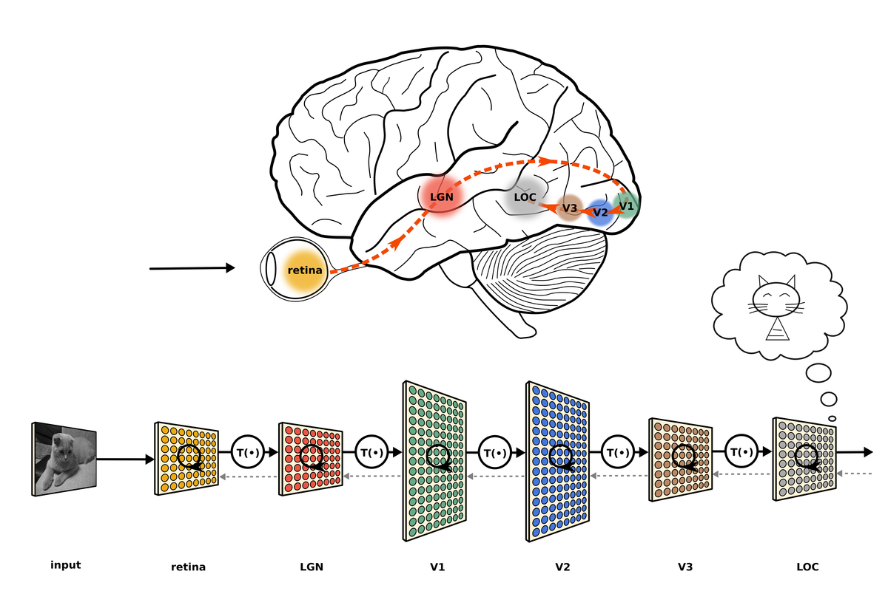
.source[cc by 3.0 – [Kubilius (figshare, 2013)](http://doi.org/10.6084/m9.figshare.106794)]

---
class: center

## Retina

<!--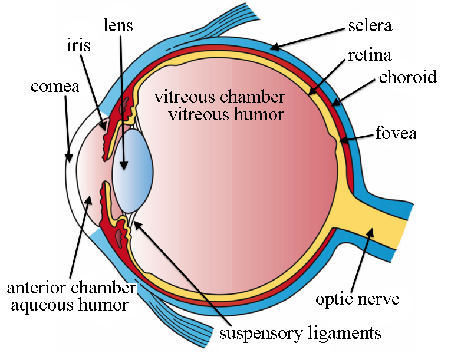-->
<!--.source[[cc by 3.0 – Holly Fischer / Wikimedia ocmmons](https://commons.wikimedia.org/wiki/File:Three_Main_Layers_of_the_Eye.png)]-->
<!--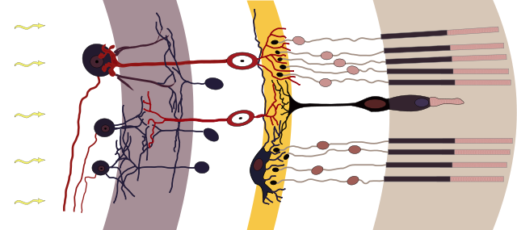-->
<!--.source[[cc by-sa 3.0 – Anka Friedrich / chris 論 / Wikimedia commons](https://commons.wikimedia.org/wiki/File:Retina-diagram.svg)]-->

.rows2[
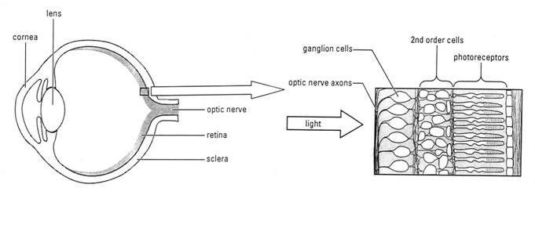
.source[cc by-sa 3.0 – [Dowling (Scholarpedia, 2007), ](http://dx.doi.org/10.4249/scholarpedia.3487)]

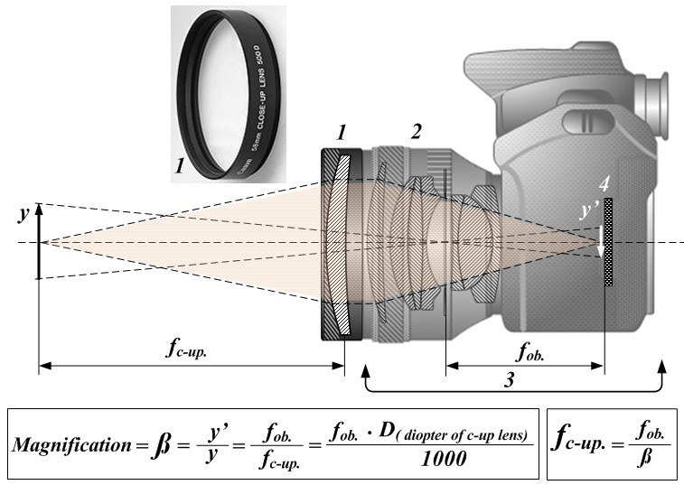
.source[cc by-sa 3.0 – [Tamasflex / Wikimedia Commons](https://commons.wikimedia.org/wiki/File:Close-up.png)]
]

---
class: center

## Retinal ganglion cells

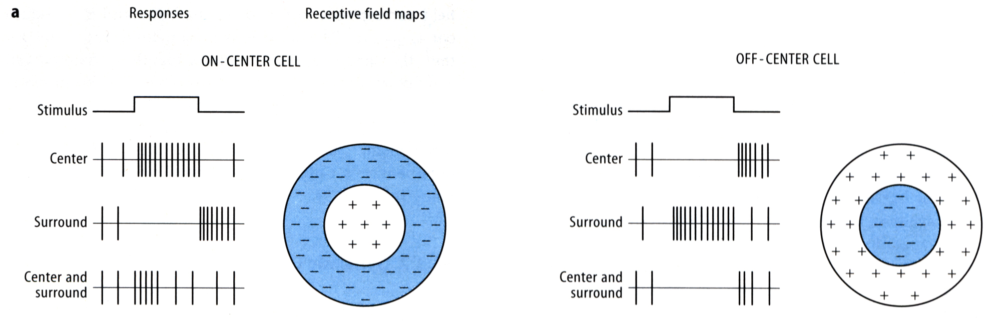
.source[cc by-sa 3.0 –[Dowling (Scholarpedia, 2007)](http://dx.doi.org/10.4249/scholarpedia.3487)]

<iframe width="360" height="270" src="https://www.youtube.com/embed/j1uHdTnJGIM?rel=0" frameborder="0" allowfullscreen></iframe>

---
## V1: Simple cell

.cols2[
<iframe width="420" height="315" src="https://www.youtube.com/embed/jw6nBWo21Zk?rel=0" frameborder="0" allowfullscreen></iframe>

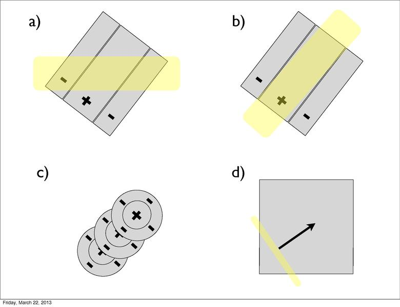
.source[cc by-sa 3.0 – [Kyle.wg3139 / Wikipedia](https://en.wikipedia.org/wiki/File:Simple_and_Complex_Cells.pdf)]
]

---
## V1: Complex cell

.cols2[
<iframe width="420" height="315" src="https://www.youtube.com/embed/jw6nBWo21Zk?rel=0&start=215" frameborder="0" allowfullscreen></iframe>

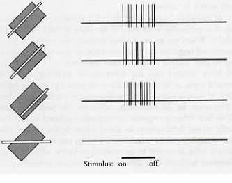
.source[fair use – [David Hubel](http://hubel.med.harvard.edu/book/b18.htm#lec)]
]

---
## V1 function

Simple cells: **feature selectivity**

Complex cells: **feature invariance**

---
## Complex cell connectivity

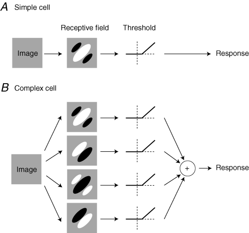
.source[fair use – [Carandini (The Journal of Physiology, 2006)](http://doi.org/10.1113/jphysiol.2006.118976)]

---
class: center

## V1: Local frequency filtering

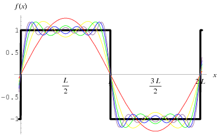
.source[[Weisstein / MathWorld](http://mathworld.wolfram.com/FourierSeriesSquareWave.html)]

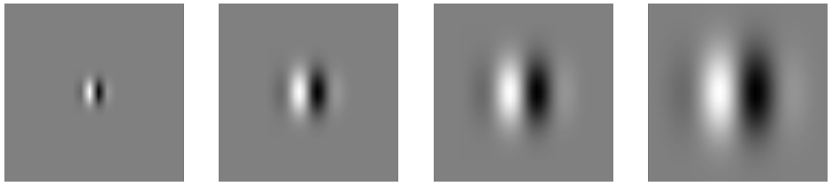

???
Canny edge detector

---
class: center

## Principal components analysis

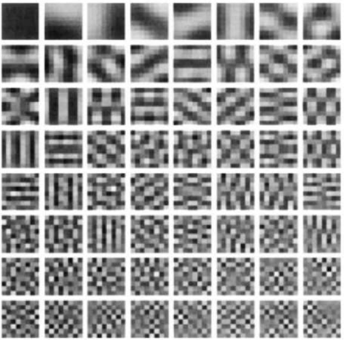
.source[fair use – [Olshausen & Field (Nature, 1996) ](http://doi.org/10.1038/381607a0)]

---
## Sparse coding

Principal Components Analysis (PCA) + sparcity,
or Independent Components Analysis (ICA)

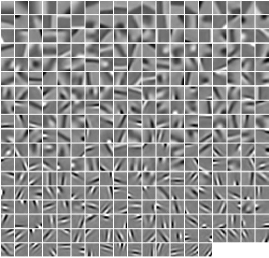
.source[cc by-nc-sa 3.0 – [Foldiak & Endres (Scholarpedia, 2008) ](http://doi.org/10.4249/scholarpedia.2984)]

---
## V2: End-stopping

.cols2[
<iframe width="420" height="315" src="https://www.youtube.com/embed/jw6nBWo21Zk?rel=0&start=498" frameborder="0" allowfullscreen></iframe>

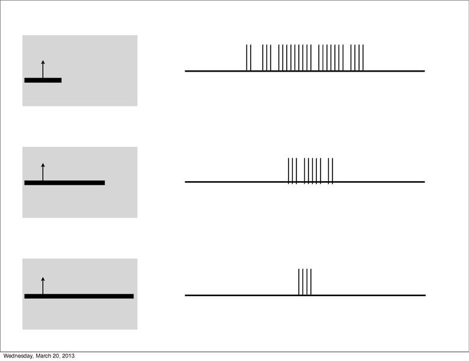
.source[cc by-sa 3.0 – [Kyle.wg3139 / Wikipedia](https://en.wikipedia.org/wiki/File:Hypercomplex_Cell.pdf)]
]

???
Note: also found in V1 ([Gilbert, The Journal of Physiology, 1977](http://doi.org/10.1113/jphysiol.1977.sp011863))

---
## V2: Curvature detection

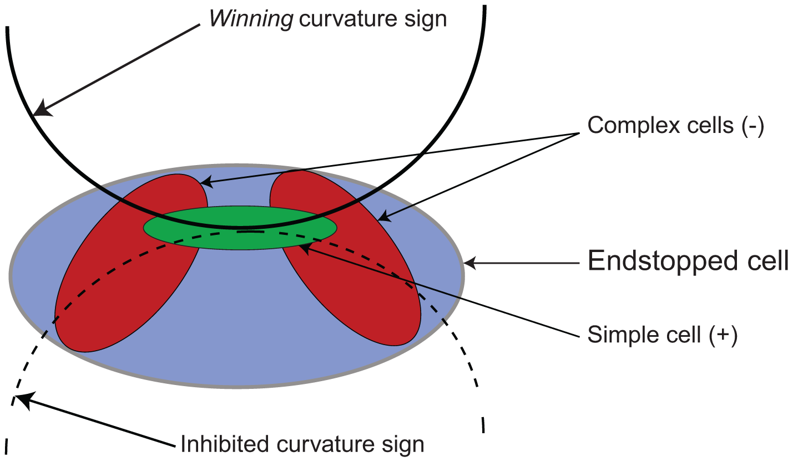
.source[cc by – [Rodríguez-Sánchez & Tsotsos (PLoS ONE, 2012)](http://doi.org/10.1371/journal.pone.0042058.g003)]

---
## V4: Curvature detection

.cols2[
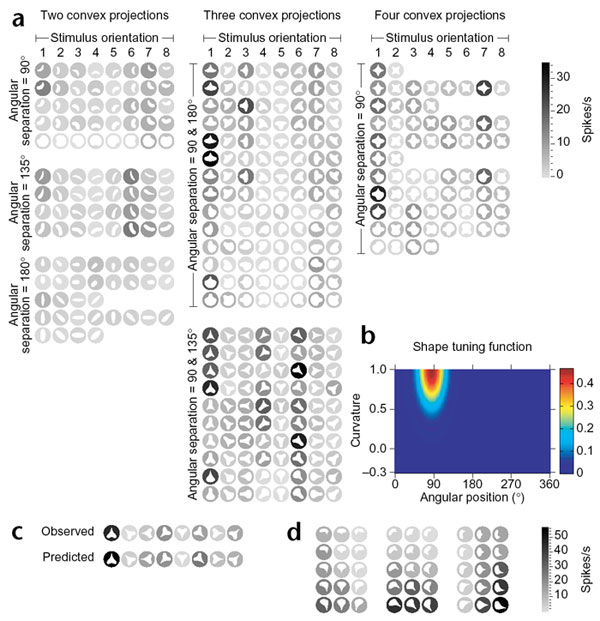
.source[fair use – [Pasupathy & Connor (Nature Neuroscience, 2002)](http://doi.org/10.1038/972)]

.source[fair use – [Yamane et al. (Nature Neuroscience, 2008)](http://doi.org/10.1038/nn.2202)]
]

---
## Putting it all together

.cols2[
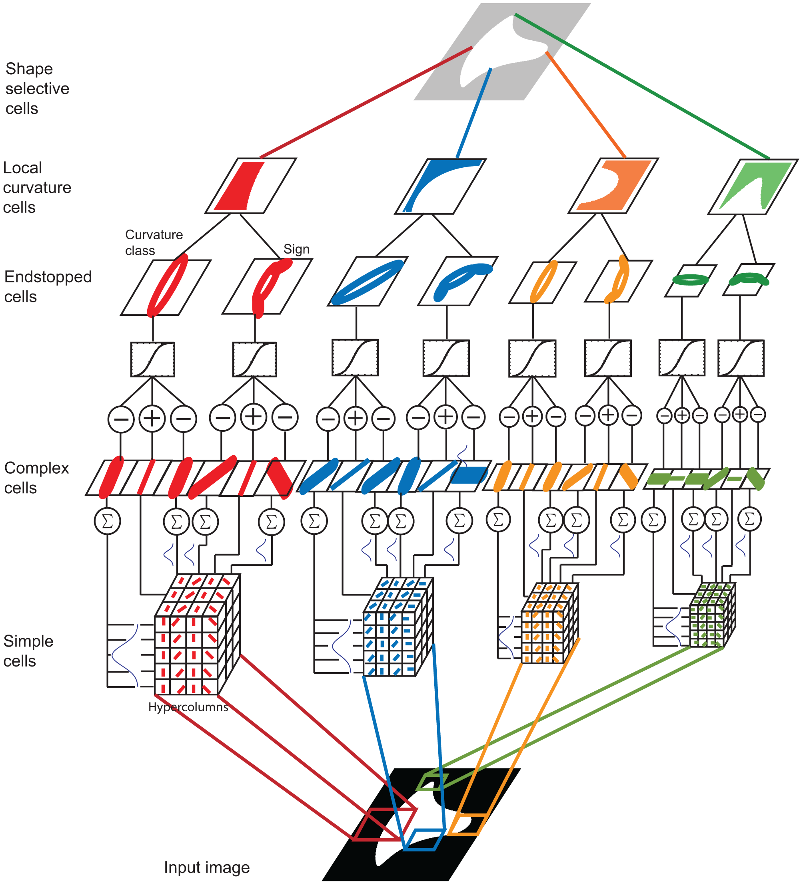
.source[cc by 3.0 – [Rodríguez-Sánchez & Tsotsos (PLoS ONE, 2012)](http://doi.org/10.1371/journal.pone.0042058.g001)]

.source[fair use – [Riesenhuber & Poggio (Nature Neuroscience, 2007)](http://doi.org/10.1038/14819)]
]

---
# Recognition from shape only?

.cols3.fixed-height[
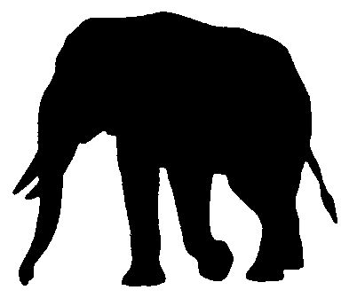
100%

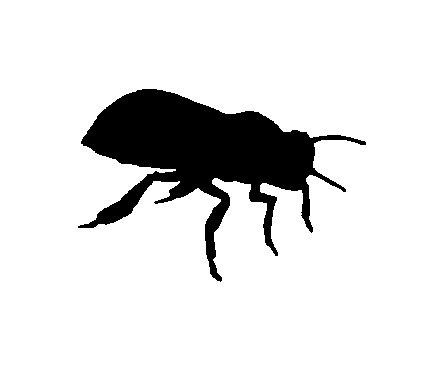
34%

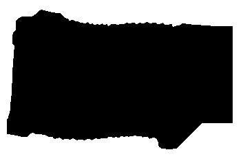
0%
]

--

.cols3.fixed-height[
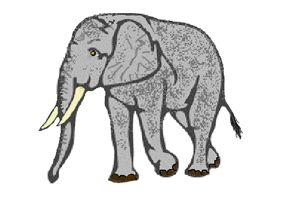

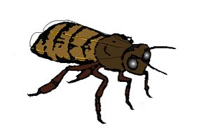

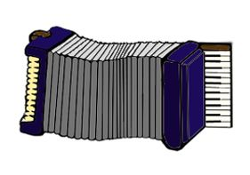
]
.source[fair use – [Wagemans et al. (Perception, 2008)](http://doi.org/10.1068/p5825)]

---
class: center

## You won't get far with edges

.cols2[
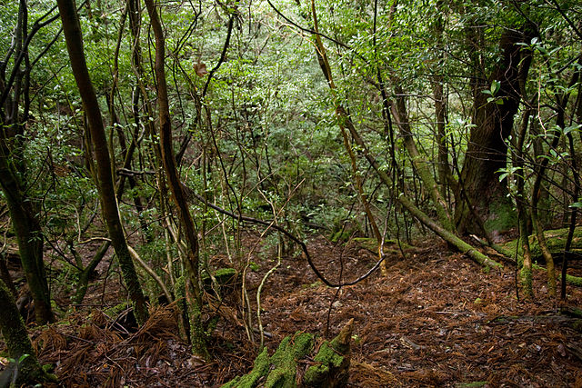
.source[cc by 3.0 – [Σ64 / Wikimedia Commons](https://commons.wikimedia.org/wiki/File:Forest_in_Yakushima_08.jpg)]

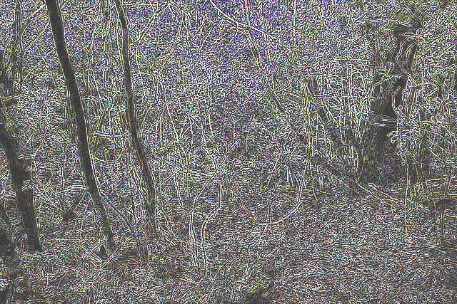
.source[Laplace edge detector]
]

---
class: center

## What is V2 doing?

.cols2[
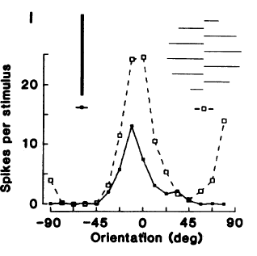
.source[fair use – [von der Heydt et al. (Science, 1984)](http://doi.org/10.1126/science.6539501)]

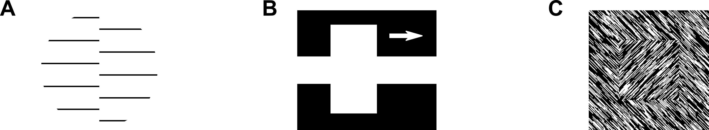
.source[cc by 4.0 – [Kubilius et al. (Frontiers in Computational Neuroscience, 2014)](http://doi.org/10.3389/fncom.2014.00158)]
]

---
## Texture processing

.cols2[
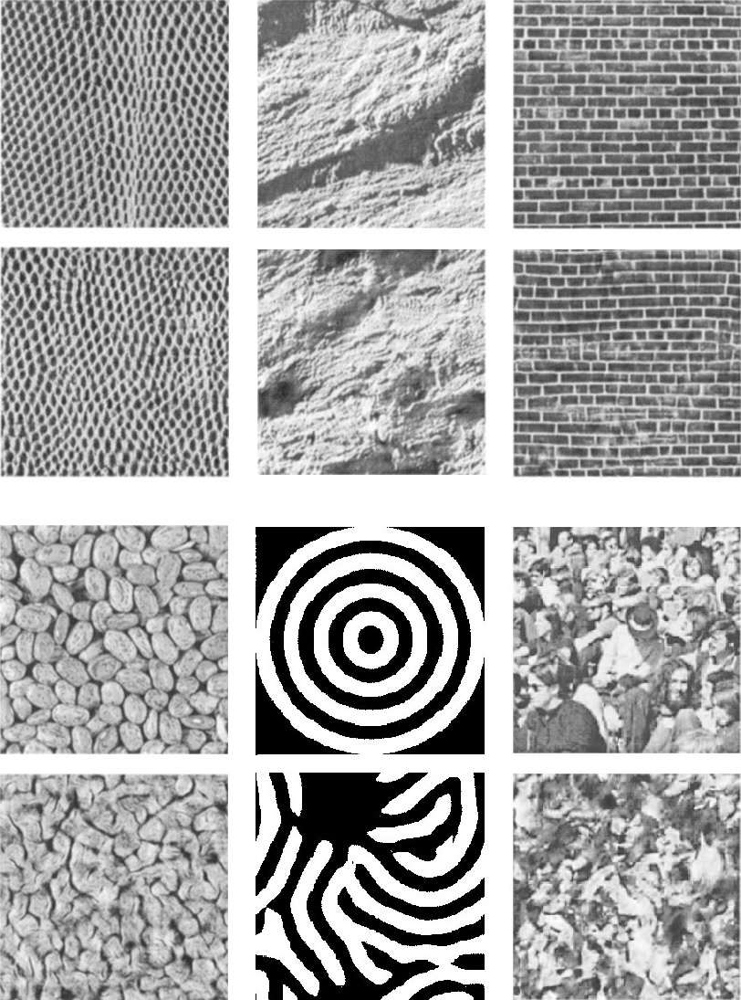
.source[fair use – [Portilla & Simoncelli (IJCV, 2000)](http://doi.org/10.1023/A:1026553619983)]

.source[fair use – [Freeman et al. (Nature Neuroscience, 2013)](http://doi.org/10.1038/nn.3402)]
]

---
## V2 processes textures

.cols2[
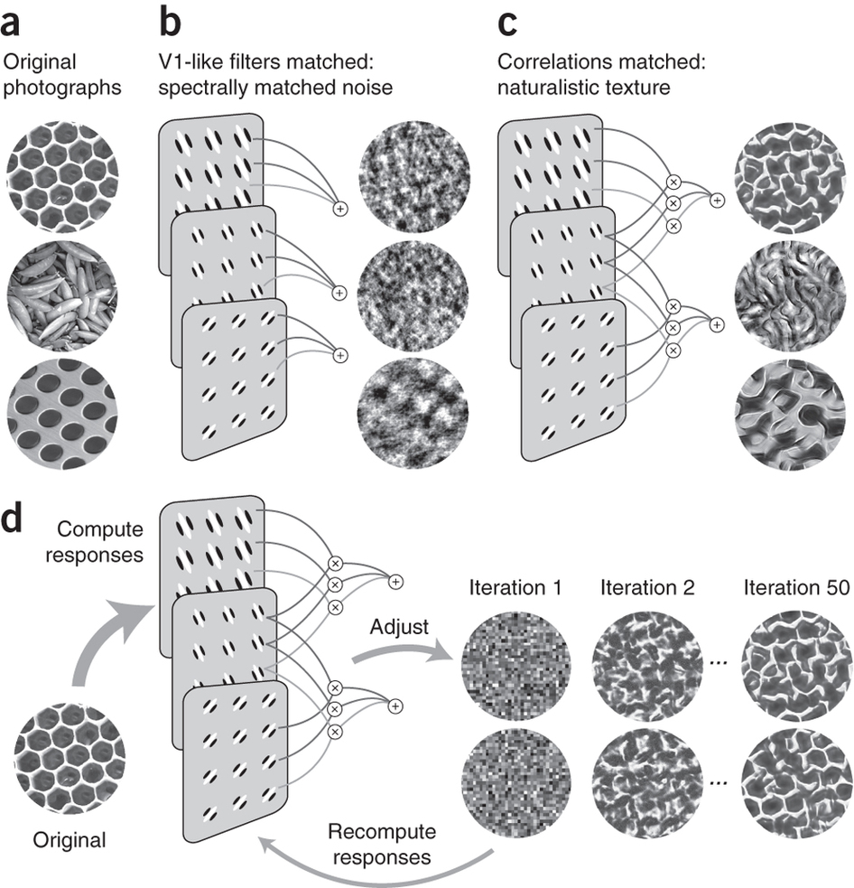

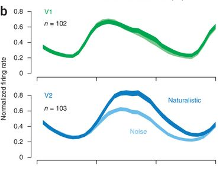
]
.source[fair use – [Freeman et al. (Nature Neuroscience, 2013)](http://doi.org/10.1038/nn.3402)]

---
class: center

## Later stages

.cols2[
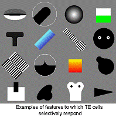
.source[fair use – [Tanaka (Annual Review of Neuroscience, 1996)](http://doi.org/10.1146/annurev.ne.19.030196.000545) via [RIKEN](http://www.brain.riken.jp/en/summer/prev/2007/k_tanaka.html)]

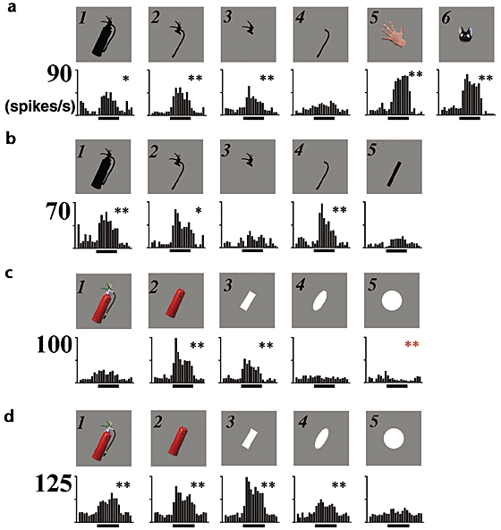
.source[fair use – [Tsunoda et al. (Nature Neuroscience, 2001](http://doi.org/10.1038/90547)]
]

---
## Jeniffer Aniston cell

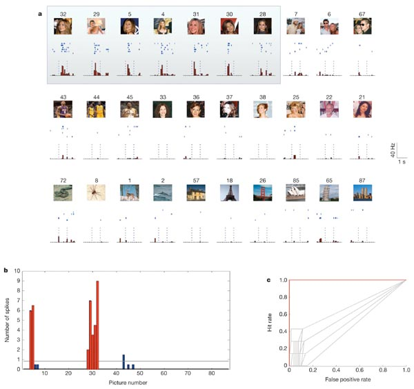
.source[fair use – [Quiroga et al. (Nature, 2005)](http://doi.org/10.1038/nature03687)]

---
class: middle

# Deep Neural Networks
.subtitle[(actually, only convolutional)]

---
## Early architectures

.source[cc by-nc-sa 3.0 – [Fukushima (Scholarpedia, 2007)](http://doi.org/10.4249/scholarpedia.1717)]

.source[fair use – [LeCun et al. (Neural Computation, 1989)](http://doi.org/10.1162/neco.1989.1.4.541) via [EBLearn](http://eblearn.sourceforge.net/beginner_tutorial2_train.html)]

---
## HMAX

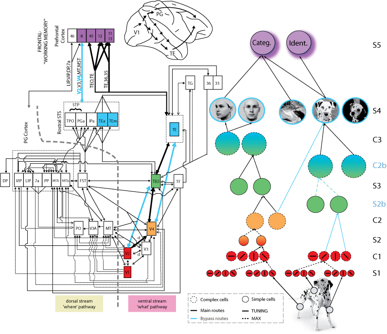
.source[cc by 3.0 – [Serre et al. (PNAS, 2007)](http://doi.org/10.1073/pnas.0700622104) via [Kreiman (Scholarpedia, 2008)](http://doi.org/10.4249/scholarpedia.2667)]

---
## AlexNet

.source[fair use – [Krizhevsky et al. (NIPS, 2012)](http://papers.nips.cc/paper/4824-imagenet-classification-with-deep-convolutional)]

---
class: center

## Basic building blocks

---
class: center

## HMO

.source[fair use – [Yamins et al. (PNAS, 2014)](http://doi.org/10.1073/pnas.1403112111)]

---
class: center

## Fooling ConvNets

With 99.12% confidence, this is what I see...

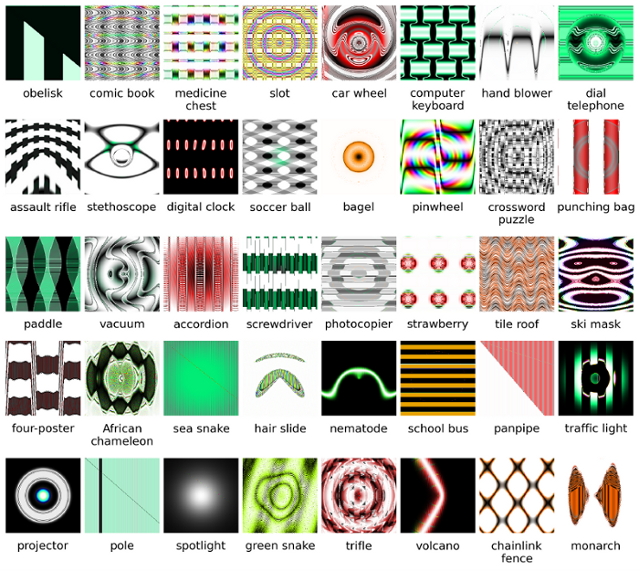
.source[fair use – [Nguyen et al. (CVPR, 2015)](http://www.evolvingai.org/fooling)]

---
class: center, middle

# Is this what we fought for?

---
class: center

## Occlusion

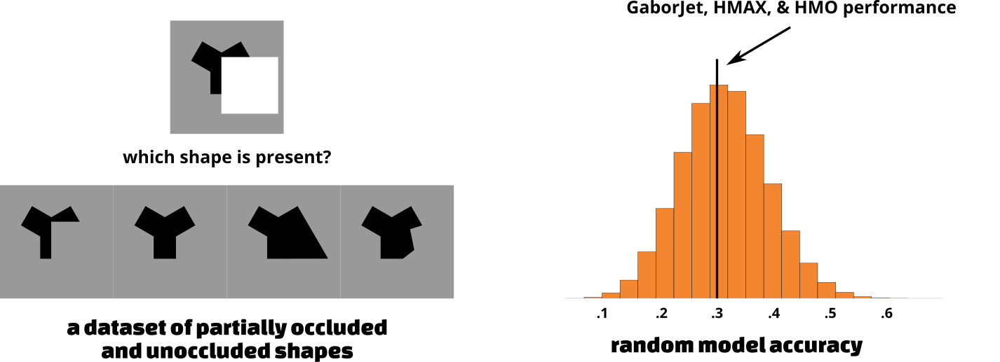

---
class: center, middle

# I want machines to .strike[.strike-fix[see]]
.strike-new[perceive]

---
class: center

## The dress

.cols2[

.source[fair use – [Wikipedia](https://en.wikipedia.org/wiki/File:The_Dress_(viral_phenomenon).png)]

.source[cc by-nc 2.5 – [xkdc](http://xkcd.com/1492/)]
]

---
class: center

## Color tile

<iframe width="550px" height="520px" frameborder="0" src="http://www.lottolab.org/illusiondemos/Demo%2014.html"></iframe>
.source[[Beau-Lotto lab](http://www.lottolab.org/articles/illusionsoflight.asp)]

---
class: center

## Illusory contours

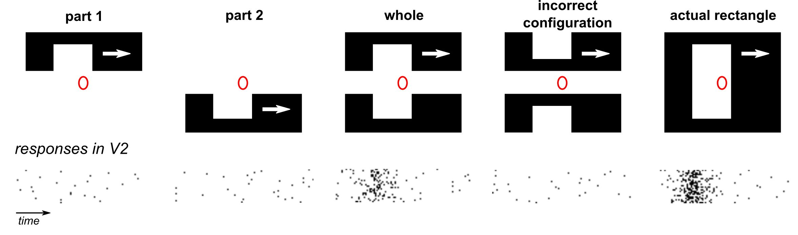
.source[[von der Heydt et al. (Science, 1984)](http://doi.org/10.1126/science.6539501) / via [Kubilius et al. (Cortex,
in press)](http://doi.org/10.1016/j.cortex.2015.01.020)]

---
## Integration

- Need to put things together
- Feedforward architectures are not sufficient
- Must work on multiple tasks

---
class: center

## Gestalts

.source[cc by-sa 3.0 – [Impronta / Wikimedia Commons](https://commons.wikimedia.org/wiki/File:Gestalt_Principles_Composition.jpg)]

---
class: center

## Border-ownership

.cols2[

.source[fair use – [Zhou et al. (The Journal of Neuroscience, 2000)](http://www.jneurosci.org/content/20/17/6594.full)]

.source[fair use – [Craft et al. (The Journal of Neurophysiology, 2007)](http://doi.org/10.1152/jn.00203.2007)]
]

---
class: center

## It takes time to perceive

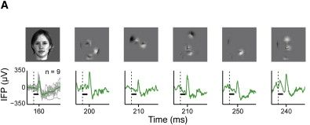
.source[fair use – [Liu et al. (Neuron, 2014)](http://doi.org/10.1016/j.neuron.2014.06.017)]

---
## What does it look like?

.cols2[

.source[fair use – [LabelMe](http://labelme.csail.mit.edu/Release3.0/index.php)]

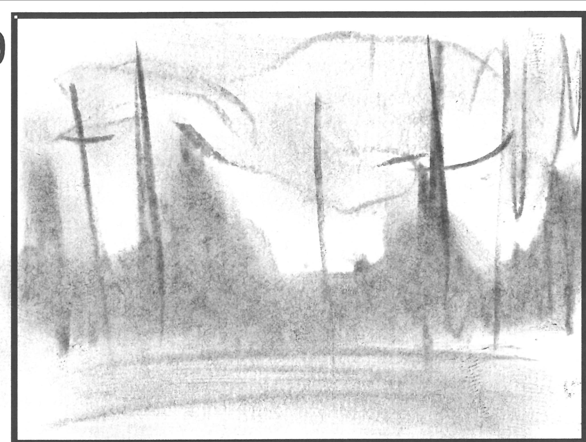
]

---
## What does it look like?

.cols2[

.source[fair use – [LabelMe](http://labelme.csail.mit.edu/Release3.0/index.php)]

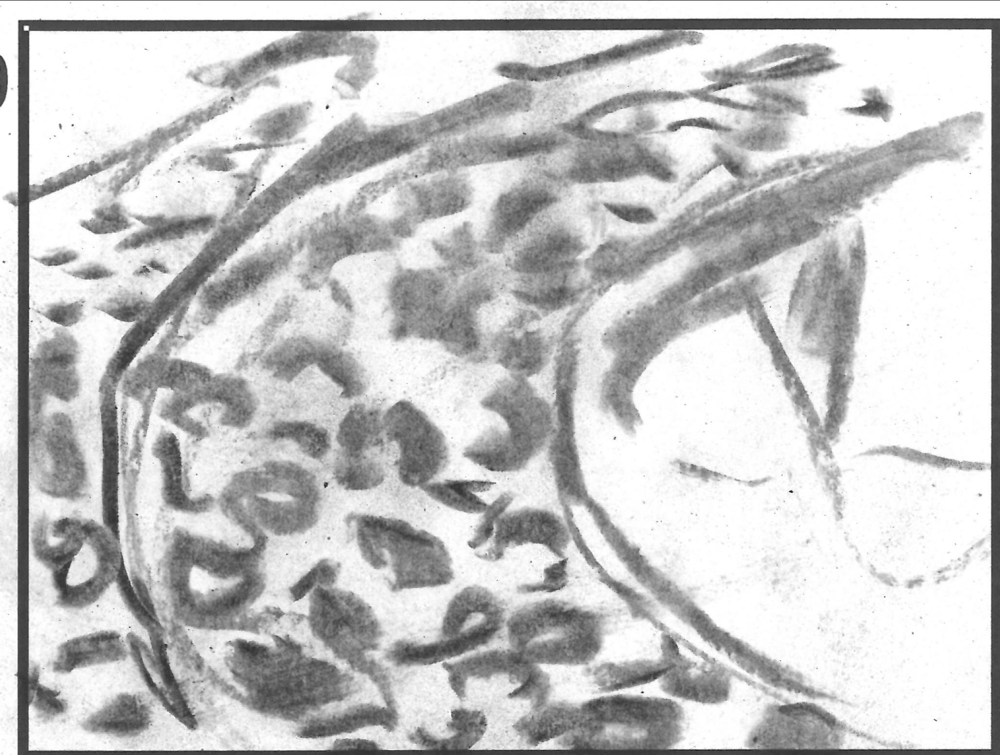
]

---
## More tasks

The visual system does a lot of things:
- Categorization
- Navigation
- Acting on environment
- ...

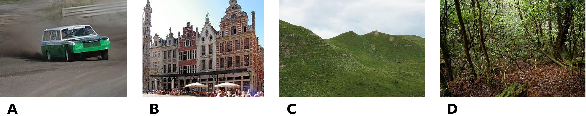
.source[cc by 4.0 – [Kubilius et al. (Frontiers in Computational Neuroscience, 2014)](http://doi.org/10.3389/fncom.2014.00158)]

---
class: center

## Visual Turing test

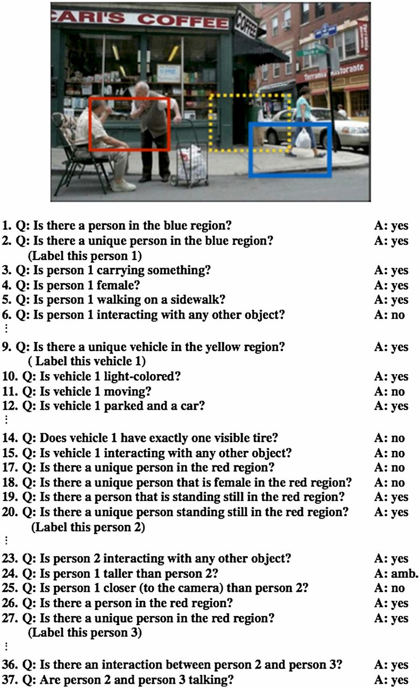
.source[fair use – [Geman et al. (PNAS, 2015)](http://doi.org/10.1073/pnas.1422953112)]

---
class: middle

# A machine who mistook a knife for a cat
.subtitle[or why understanding human perception matters]

---
class: center

## Decision making

Decisions are difficult when only partial or ambiguous information is available.

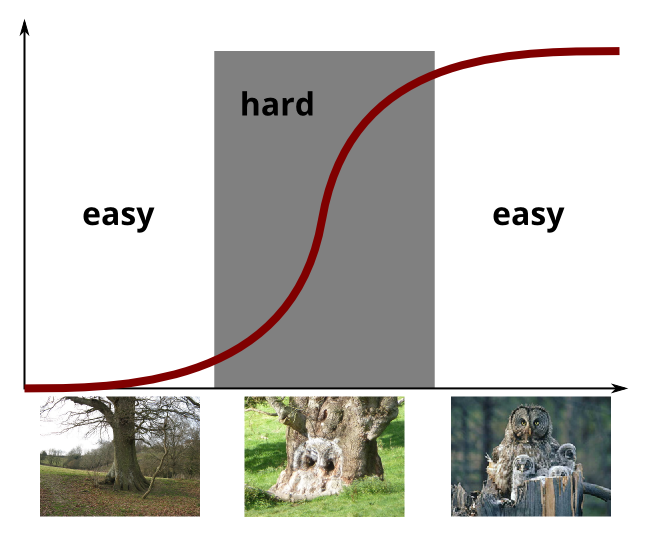
.source[left: cc by-sa 2.0 – [Dave Spicer](http://www.geograph.org.uk/photo/1184422) / middle: cc by-sa 2.0 – [Chris Downer](http://www.geograph.org.uk/photo/3178872) / right: cc by 2.0 – [Chief Trent](https://www.flickr.com/photos/texese/106442121/)]

---
class: center

## The trolley problem

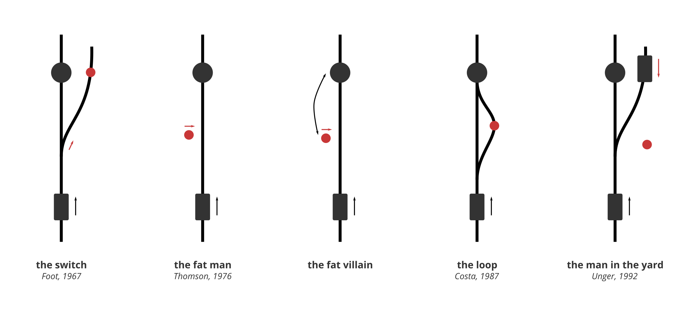
.source[CC0 – [Jonas Kubilius / Wikimedia Commons](https://commons.wikimedia.org/wiki/File:The_trolley_problem.svg)]

???
Machines must be able to adhere to the moral standards that humans impose.

---
## Tools must act clever

1. Tools are too limited (e.g., default location in Google Maps)
2. Programmers often are bad at accounting for human nature (e.g., awful GUIs)

---
class: middle

# Thank you!
.aside[slides available at [klab.lt](https://klab.lt)]
