class: center, middle

# Representation of configural information in human visual cortex
*Jonas Kubilius*

Brain & Cognition / KU Leuven (Belgium)

PhD defence / 2015-05-04

.license[

.logo[]
.logo-name[[klab.lt](http://klab.lt)]
]
.aside[except where otherwise noted, these slides are available under the Creative Commons Attribution 4.0 International License]

---
layout: true
class: middle, center

---
## How do we see?

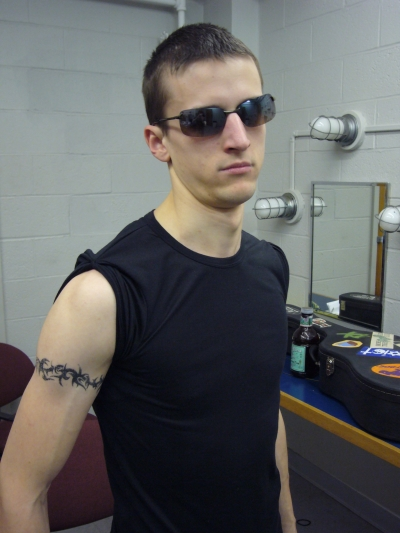

---
## Vision is hard

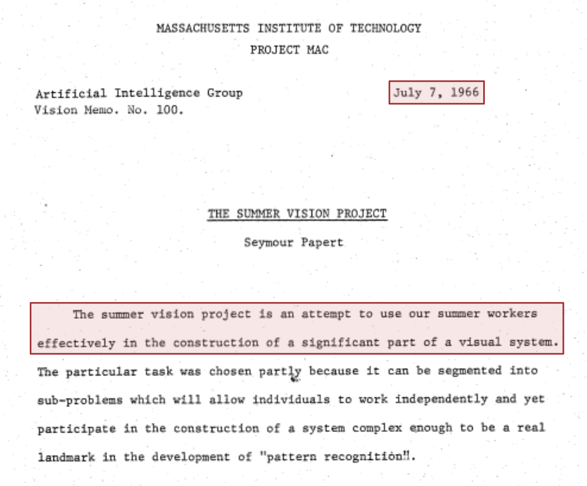

---
## Human brain

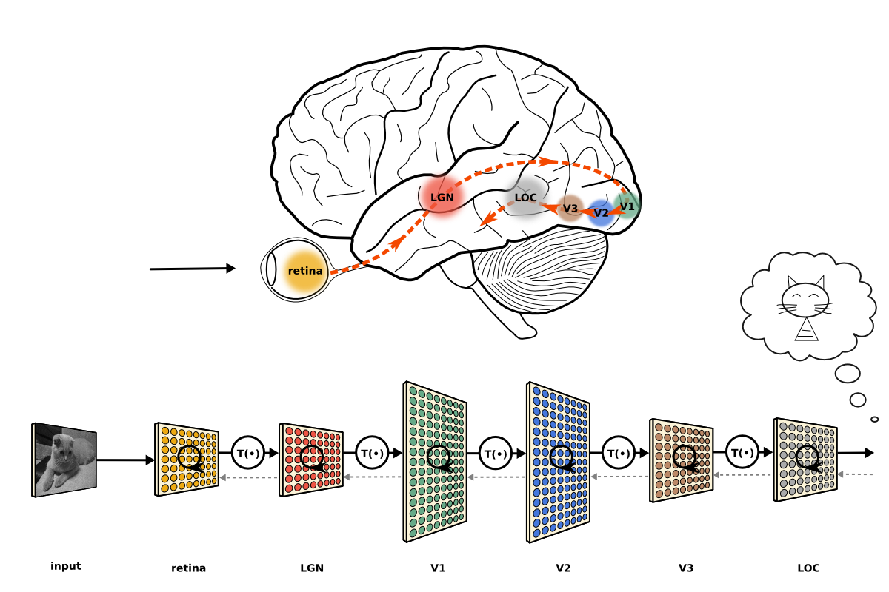
.source[cc by 3.0 – [Kubilius (figshare, 2013)](http://doi.org/10.6084/m9.figshare.106794)]

**How to get from an image to the knowledge about its contents as perceived by a human observer?**

---

.full[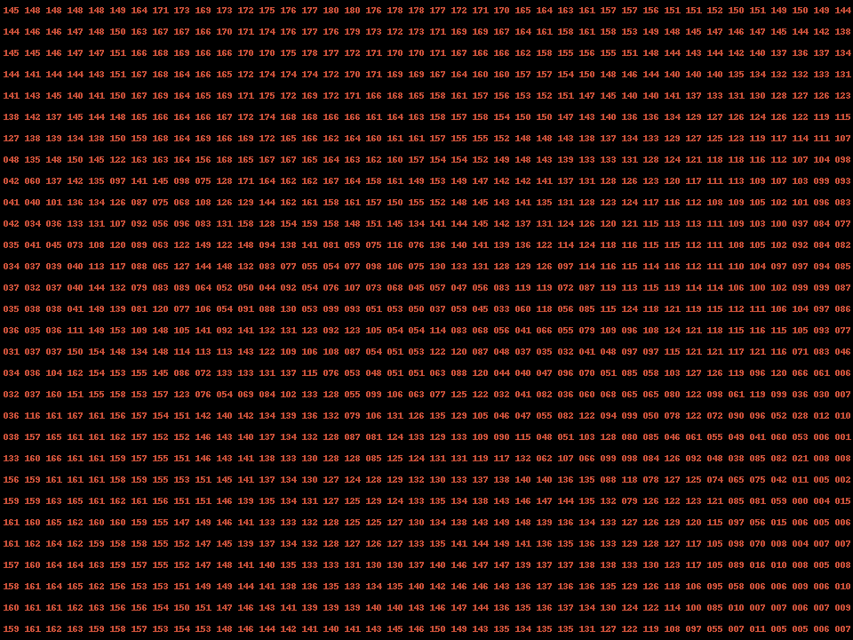]

---

.full[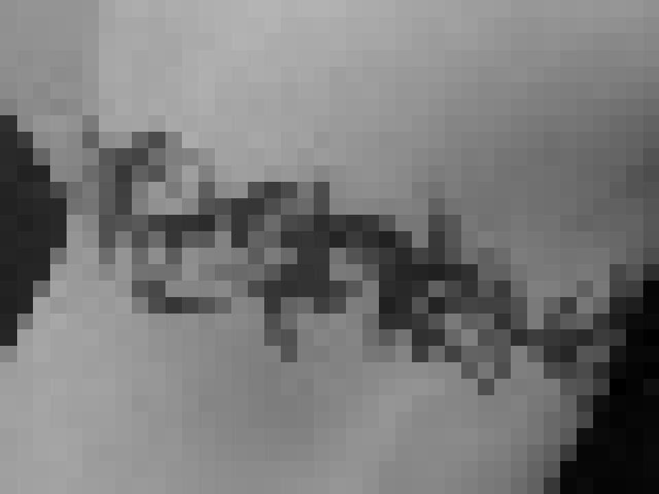]

---
## Configural superiority effect

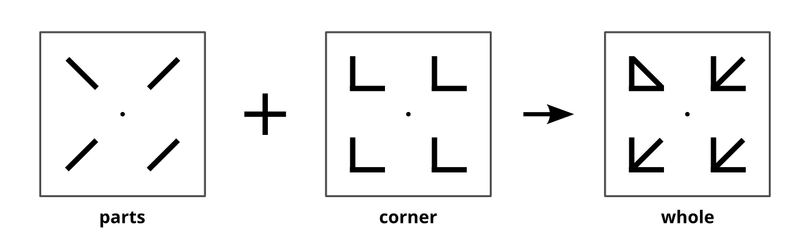

.small[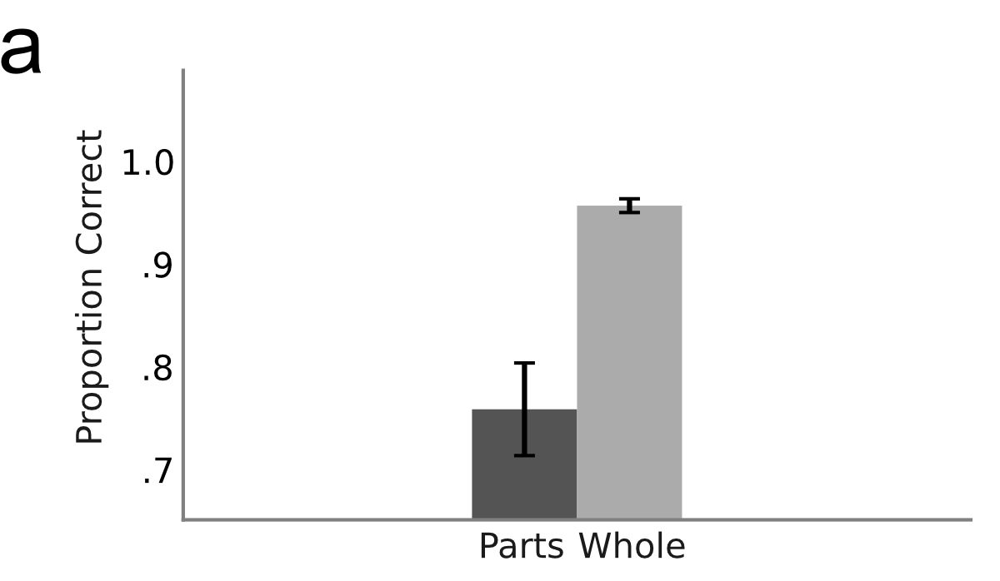]

---
## Results

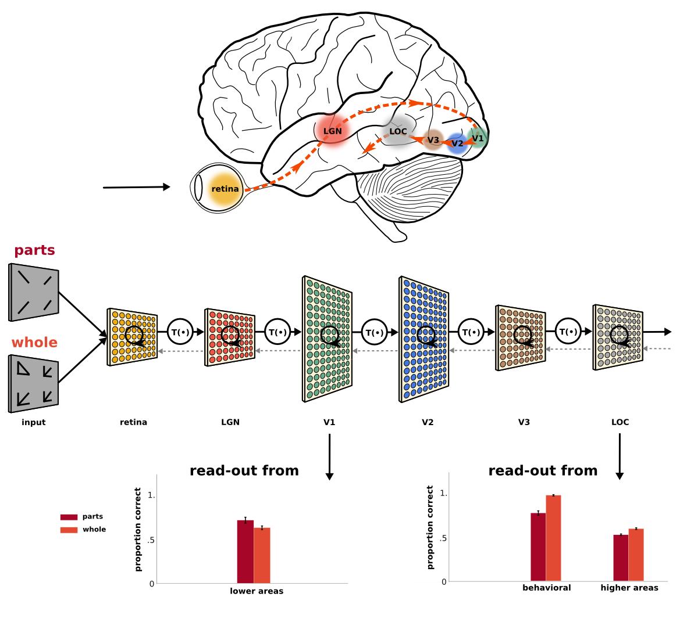

.source[[Kubilius et al. (Psychological Science, 2011)](http://doi.org/10.1177/0956797611417000)]

???
- Higher visual areas contain configural information
- Causal involvement?

---
## Causality

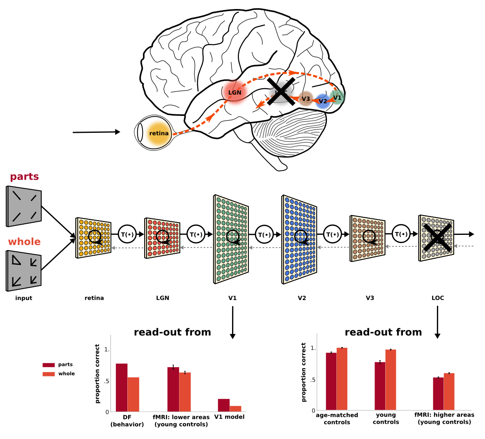

.source[[de-Wit, Kubilius et al. (i-Perception, 2013)](http://doi.org/10.1068/i0613rep)]

---
## More configurations

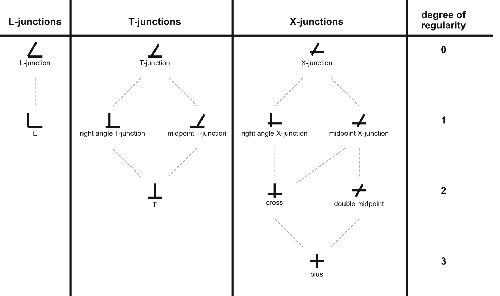

.source[[Kubilius et al. (Journal of Vision, 2014)](http://doi.org/10.1167/14.9.11)]

---
## Results

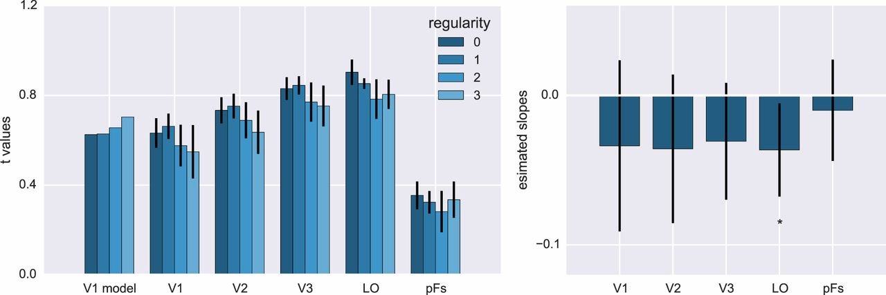

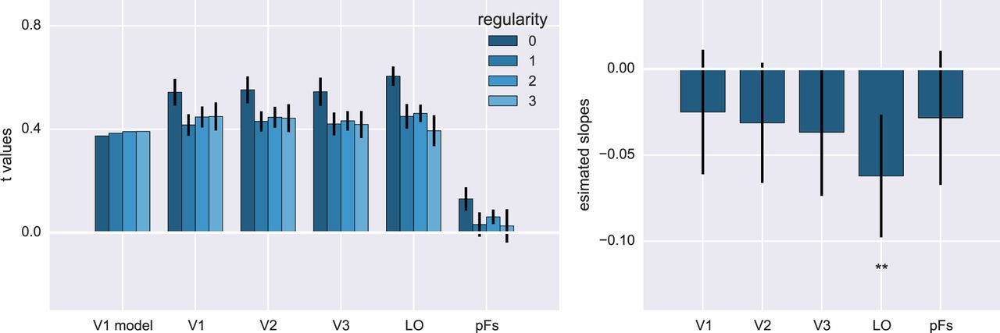

.source[[Kubilius et al. (Journal of Vision, 2014)](http://doi.org/10.1167/14.9.11)]

???
Taken together:
- Grouping might occur in a feedforward way
- How?

---
## Feedforward

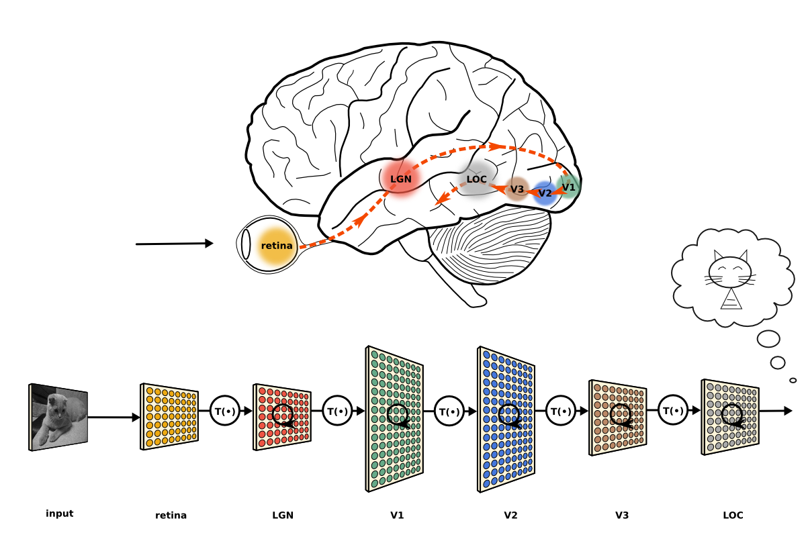
.source[cc by 3.0 – [Kubilius (figshare, 2013)](http://doi.org/10.6084/m9.figshare.106794)]

---
## Recurrent

.source[cc by 3.0 – [Kubilius (figshare, 2013)](http://doi.org/10.6084/m9.figshare.106794)]

.absolute[ .source[cc nc-nd 2.0 – [Martin Heigan / flickr](https://flic.kr/p/3pw3m9)]]

---
## Feedforward perception

.cols2[
    
    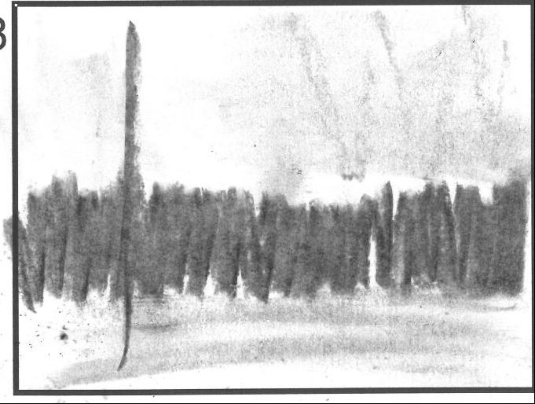
]

---
## Similarity & pooling

.source[cc by 4.0 – [Kubilius et al. (Frontiers in Computational Neuroscience, 2014)](http://doi.org/10.3389/fncom.2014.00158)]

---
## Full architecture

.source[cc by 4.0 – [Kubilius et al. (Frontiers in Computational Neuroscience, 2014)](http://doi.org/10.3389/fncom.2014.00158)]

---
## But does it work?

.cols3[
    
    
    
]

???
- maybe
- **more importantly:** a natural enhancement to the state of the art object recognition systems

---
# Deep and dumb: State of the art in machine vision

---
# Thank you!
.aside[slides available at [klab.lt](https://klab.lt)]