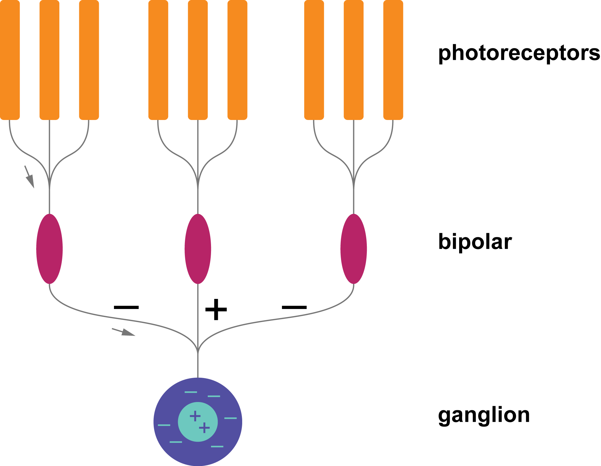
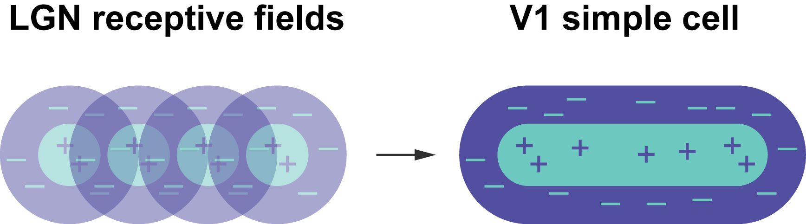
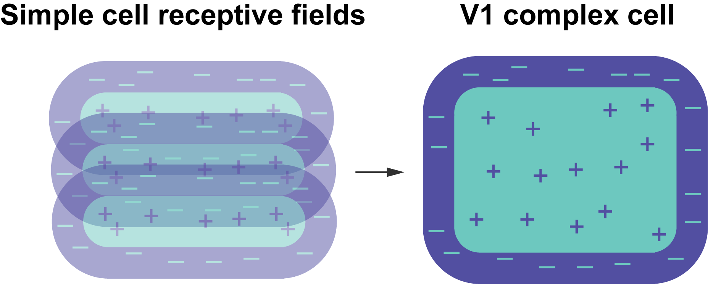
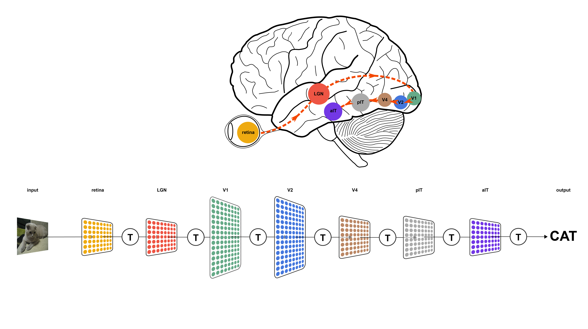
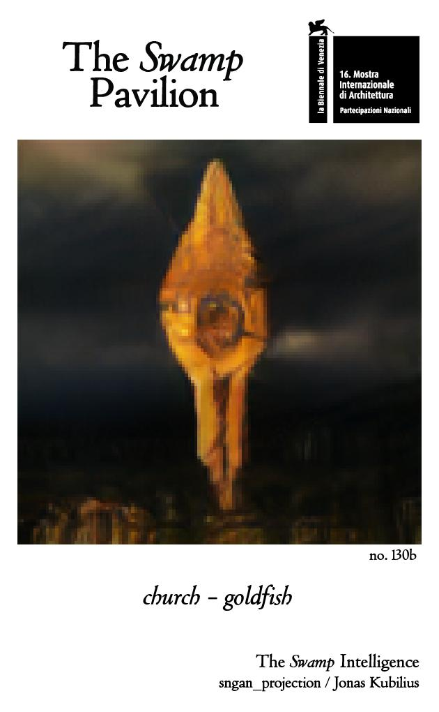

class: center, middle

# Apie dirbtinį intelektą

***Jonas Kubilius***

Brain & Cognition / KU Leuven  
McGovern Institute for Brain Research / MIT

*Švietimo, mokslo ir sporto ministerija / 2019-01-25*

.license[

.logo[]
.logo-name[[klab.lt](http://klab.lt)]
]
.aside[Turinys: Creative Commons priskyrimo 4.0 tarptautinė licencija]
.aside[Paveikslėliai: Sąžiningo naudojimosi, nebent parašyta kitaip]

---
background-image: url(img/cat_zoom.gif)
background-size: cover

---
background-image: url(img/cat_numbers.gif)
background-size: cover

---
class: center, middle

## Tinklainės on-off ląstelės

&nbsp;

---
class: center, middle

## Tinklainės on-off ląstelės

**Ingredientas #1:** Struktūros detektorius

---
class: center, middle

## V1 paprastieji neuronai

&nbsp;

---
class: center, middle

## V1 paprastieji neuronai

**Ingredientas #2:** Hierarchijos

---
class: center, middle

## V1 sudėtingieji neuronai

&nbsp;

---
class: center, middle

## V1 sudėtingieji neuronai

**Ingredientas #3:** Sutelkimas

---
class: center, middle

## Ventralinė regos sistema

.img100[]
.source[[Kubilius (figshare, 2017)](https://doi.org/10.6084/m9.figshare.106794.v3), [DiCarlo & Cox (TiCS, 2007)](http://dx.doi.org/10.1016/j.tics.2007.06.010)]

---
class: center, middle

## Duomenys yra naujoji nafta

<iframe width="560" height="315" src="https://www.youtube-nocookie.com/embed/WeVJIuyJq08" frameborder="0" allow="accelerometer; autoplay; encrypted-media; gyroscope; picture-in-picture" allowfullscreen></iframe>
šaltinis: Book of the Dead / Unity

---
class: center, middle
## Bendradarbiavimas: Dota2

<iframe width="560" height="315" src="https://www.youtube.com/embed/UZHTNBMAfAA?start=18" frameborder="0" allow="accelerometer; autoplay; encrypted-media; gyroscope; picture-in-picture" allowfullscreen></iframe>
.source[[OpenAI Five](https://blog.openai.com/openai-five/)]

---
class: center, middle
## Smalsumas

<iframe width="560" height="315" src="https://www.youtube.com/embed/J3FHOyhUn3A?start=19" frameborder="0" allow="accelerometer; autoplay; encrypted-media; gyroscope; picture-in-picture" allowfullscreen></iframe>
.source[[Pathak, Argrawal, Efros, Darrell. (ICML, 2017)](https://pathak22.github.io/noreward-rl/)]

---
class: center, middle
## Menas

---
class: middle
## Dėkui

**Finansavimas:** European Union's Horizon 2020 research and innovation programme under grant agreement No 705498  
.img30[]