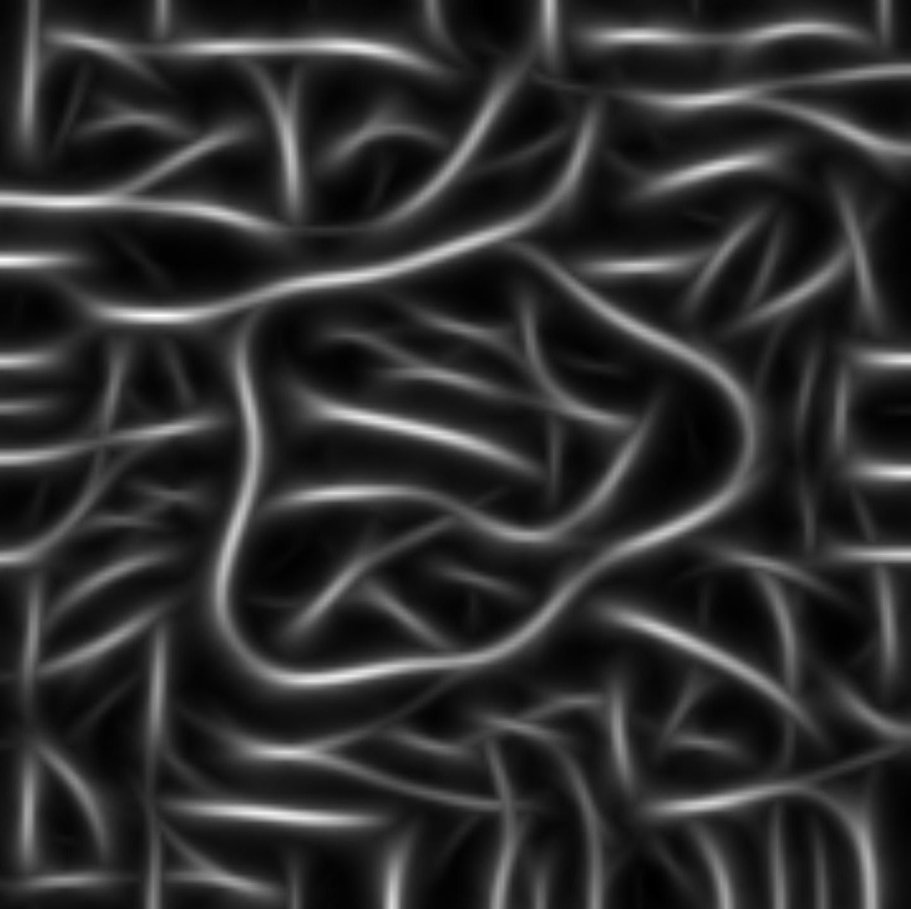
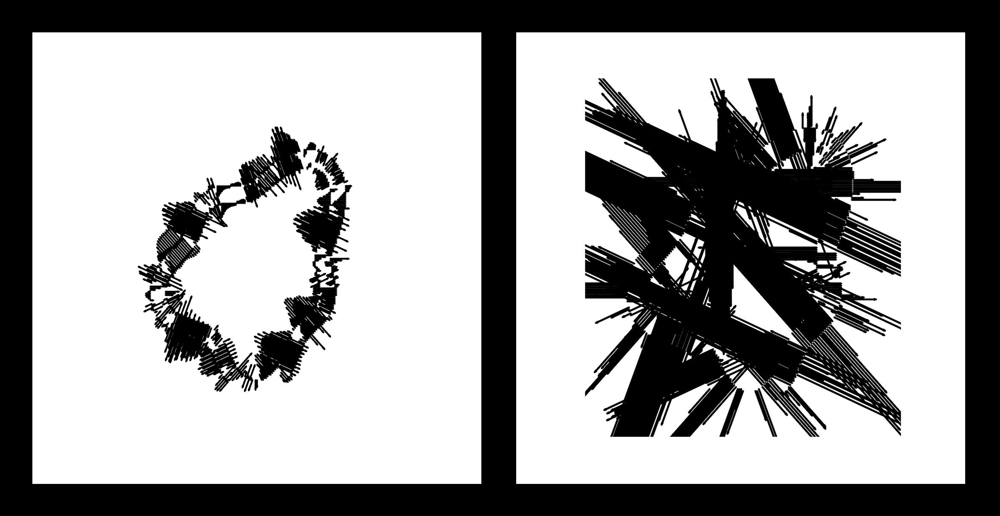
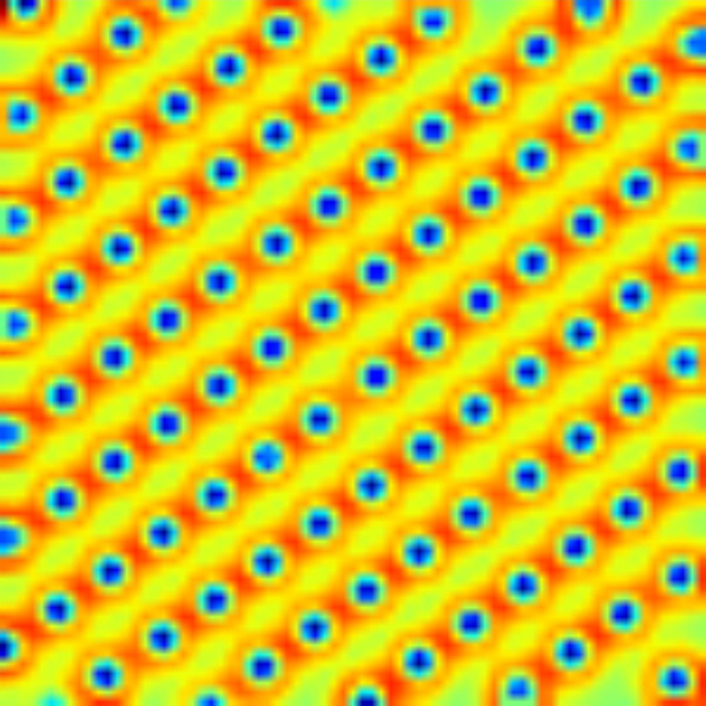

<figure style="float:left">
    
    <caption><strong>Megztinis. </strong><em>Regos algoritmams testuoti naudoju labai paprastus paveikslėlius iš brūkšnelių. Kai kurie brūkšneliai suformuoja objektą, kiti yra tik triukšmas. Šiuo atveju, objektas yra tam tikra netaisyklinga forma, tačiau modelis jos nesugebėjo aptikti ir vietoje to iš triukšmų nuvijo gijas.</em></caption>
</figure>

<figure style="float:left">
    
    <caption><strong>Metalo laidai. </strong><em>Šiuo atveju, objektas yra netaisyklinga forma paveikslėlio centre, kurią modelis teisingai aptinka, tačiau nesugeba visiškai atskirti nuo triukšmų fone.</em></caption>
</figure>

<figure style="float:left">
    
    <caption><strong>Mūsų pasaulis (Zwei). </strong><em>Šiuo atveju, algoritmo tikslas yra aptikti, kur yra figūra, o kur – fonas. Algoritmas abiem atvejais veikia prastai, daugelyje vietų klaidingai nurodydamas, kad figūra nėra centre. Čia vaizduojami du regos algoritmo rezultatai bandant sugrupuoti formos kraštus į visumą. Kairiajame paveikslėlyje grupavimas subalansuotas, antrajame – ne.</em></caption>
</figure>

<figure style="float:left">
    
    <caption><strong>Plieno voratinkliai. </strong><em>Šiuo atveju, objektas yra netaisyklinga forma, kurios skeletą (matomą kaip ryškesnės linijos deimanto formos objekte) algoritmas bando apskaičiuoti.</em></caption>
</figure>

<figure style="float:left">
    
    <caption><strong>Taškai. </strong><em>Čia vaizduojamas iš dalies sėkmingas algoritmo rezultatas bandant sugrupuoti taškus duotame paveikslėlyje, tačiau rezultatas netikėtai organiškas ir gyvas.</em></caption>
</figure>