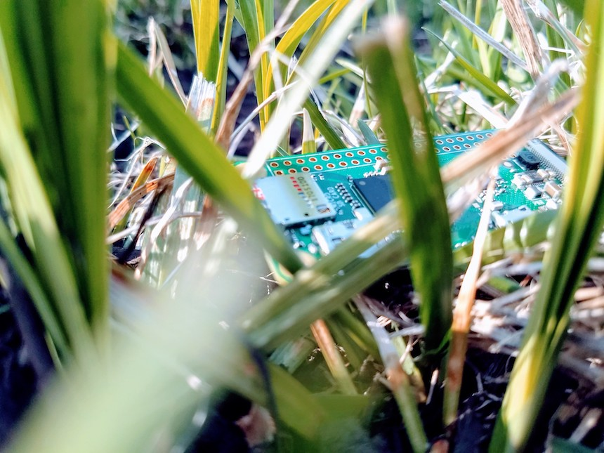
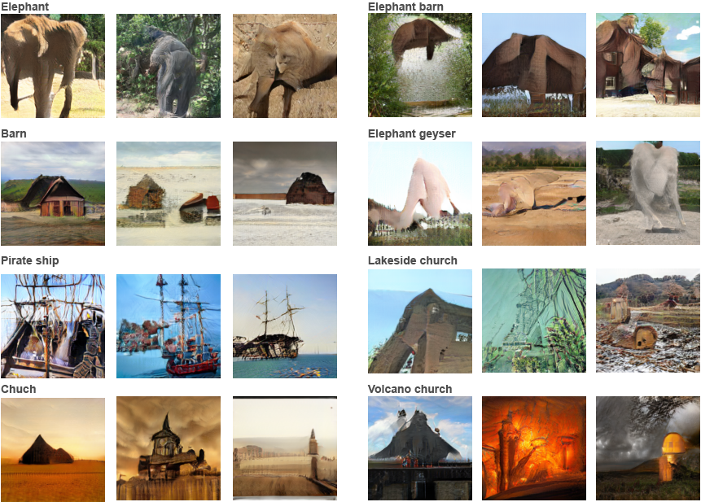

I have long been inspired by the beautiful symbiotic imagery in the verses of Richard Brautigan’s *All Watched Over by Machines of Loving Grace* (1967):

> I like to think  
>     (right now please!)  
> of a cybernetic forest  
> filled with pines and electronics  
> where deer stroll peacefully  
> past computers  
> as if they were flowers  
> with spinning blossoms.

While perhaps more accurately read as a sarcastic look at machine and nature cohabitation, the poem nonetheless brings forward a possibility that machines could exist as a part of natural ecosystems. Engulfed in the dominating doomsday narrative of the rise of artificial intelligence, such possibility is most unusual and unnerving one. Made of very different materials than us, existing in a digital realm governed by different and non-intuitive rules, opaque in their workings, machines occurring in natural habitats appear to destroy their inherent beauty.

Yet I am interested in moving towards the new ecosystems where nature learns how to deal with this new form of life and machines learn to cooperate with the natural world. As a mediator between land, water, and air, a swamp becomes a symbolic place for such an encounter to occur. An artist sets up the machine to critically depend on the swamp, so that its energy demands are contingent on the electricity-producing bacteria living in the swamp’s mud. The machine utilizes these resources to imagine new geological, biological, and architectural forms. Being based on completely different foundations, subject to strict logic, and lacking context, the machine quite paradoxically becomes less restricted to imagine than the artist who set it up, producing rather unsettling imagery for an observer to interpret. Above all, this experiment provides an access to the creative process of a radically different mind than ours.

Could this symbiosis be further tightened? I like to think that a new ecological niche starts to form as the swamp’s ecosystem learns to take advantage from the heat that the machine’s microprocessor dissipates. The machine transfers its creations wirelessly using plants around it. Given its superior compute power, it learns to communicate with the swamp’s inhabitants and cooperate with them. It leverages its connection to the digital world to warn the swamp’s ecosystem about upcoming draughts and storms and learn to regulate the swamp, becoming an indispensable part of this new ecosystem rather than a mere intruder.

## How it works

The algorithm that produces images is a specific instance of a generative adversarial network.
A GAN is composed of two major parts: a generator and a discriminator. A generator starts by taking a sequence of random numbers and one extra number denoting the desired category of an image that will be generated. Input numbers are reshaped into a tiny image and step by step upsampled into a 128x128 px generated image. At each step, the generator is injecting its knowledge about real images according what it learned about the world so far.

These generated images are passed into a discriminator. For each image, the discriminator’s task is to determine whether it is real or generated. If the discriminator guesses incorrectly, it is updated in such a way that next time it would be more likely to spot the generated image. Otherwise, the generator is updated in such a way that next time it would produce something that would be more likely to fool the discriminator. Thus, generator and discriminator work in opposition to each other, constantly pushing each other’s boundaries, until some stable equilibrium is achieved. At the beginning of the training process, both the generator and the discriminator do not know anything and are making decisions randomly. However, upon seeing more and more images, they absorb the statistics of the world to which they are subject and bootstrap each other to produce realistic images and tell the real from the generated. This training often requires about a million unique images to bootstrap and takes about a week on a powerful graphical processing unit.

When training is over, the generator is ready to produce new images. The particular GAN I employed in this project, developed by Miyato and Koyama (2018), allows a user to request the network to generate an image of a particular category from the list of categories that it saw during training. Such generated images are often visually compelling and realistic at the first glance yet curiously incomplete as if they were projections of our imagination.

However, I was interested in pushing this imagery beyond the limits of our own imagination. It may be easy to imagine a river or a church but what lies in between a concept of a volcano and a concept of a church? I certainly do not mean an image of a church next to a volcano but a *volcanochurch*. What would a *volcanochurch* look like? There is not such concept in our language, signifying that the gap between *volcano* and *church* is likely unbridgeable for us. It also has no visual component to it, just like *church* or *volcano* alone would not invoke any imagery to those who have never seen them. Yet for a machine, words are translated into numbers, and *volcanochurch* is yet another one of those numbers, allowing it to freely imagine what it would look like. Thus the roles are now reversed and it is us who learn about the world through the eyes of our more knowledgeable teacher. Other artificial intelligence systems, like AlphaGo or Creative Adversarial Networks (CANs), have demonstrated such possibilities quite convincingly as well. In the case of AlphaGo, this Go-playing machine has been able to generate novel, counterintuitive, yet successful moves that human players described as paradigm-shifting. Similarly, a CAN has been trained to generate artworks of a particular style, and then forced to generate an artwork that would be judged to be a proper artwork by a discriminator yet would not look like any style known to the machine. The resulting images are rather compelling and seriously question the origins of human creativity.

Similar to CANs, in our case the code can be modified to accept any combination of categories, thus forcing the generator to come up with something that would look like all requested categories simultaneously. The generator could be pushed even further by only outputting those images that it judges as highly realistic and also the discriminator has a great difficulty to tell apart from real or that the discriminator cannot reliably identify as any of the categories known to it. Whenever the discriminator is confused, the generator will have created an image of a novel category.

## References

- Richard Brautigan (1967). [All Watched Over by Machines of Loving Grace](http://www.brautigan.net/machines.html).
- Ian Goodfellow et al. (2014). [Generative Adversarial Networks](https://arxiv.org/abs/1406.2661).
- Takeru Miyato, Toshiki Kataoka, Masanori Koyama, Yuichi Yoshida (2018). [Spectral Normalization for Generative Adversarial Networks](https://arxiv.org/abs/1802.05957).
- Takeru Miyato, Masanori Koyama (2018). [cGANs with Projection Discriminator](https://arxiv.org/abs/1802.05637).
- Ahmed Elgammal, Bingchen Liu, Mohamed Elhoseiny, Marian Mazzone (2017). [CAN: Creative Adversarial Networks, Generating "Art" by Learning About Styles and Deviating from Style Norms](https://arxiv.org/abs/1706.07068).
- David Silver et al. (2016). [Mastering the game of Go with deep neural networks and tree search](https://www.nature.com/articles/nature16961).

*This project has received funding from the European Union's Horizon 2020 research and innovation programme under grant agreement No 705498.*
