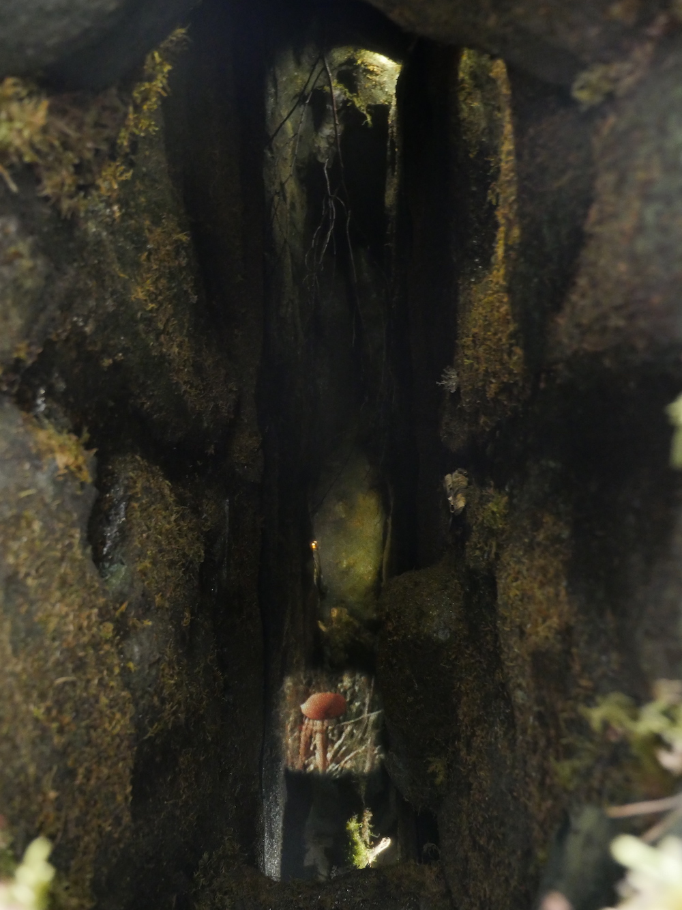
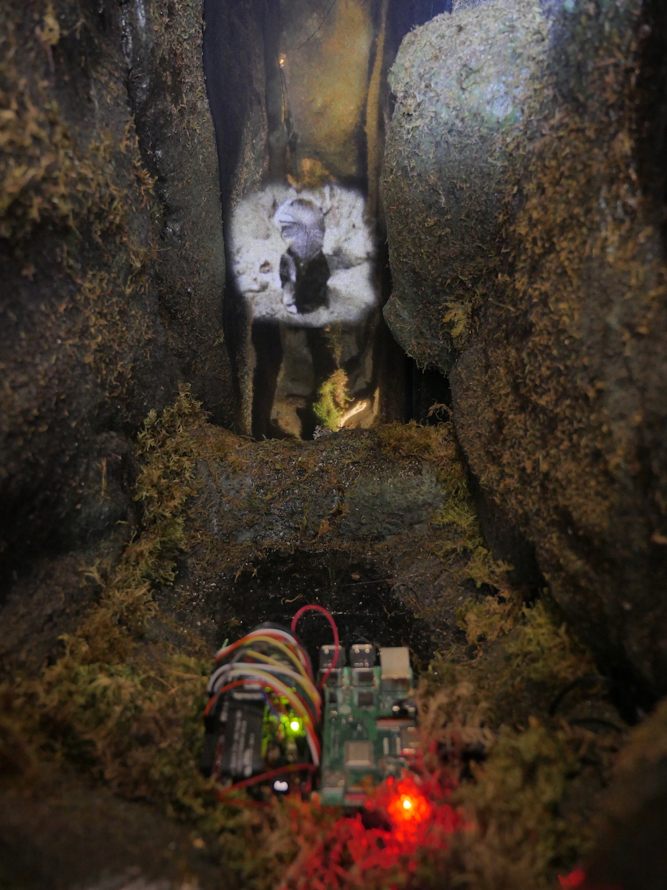
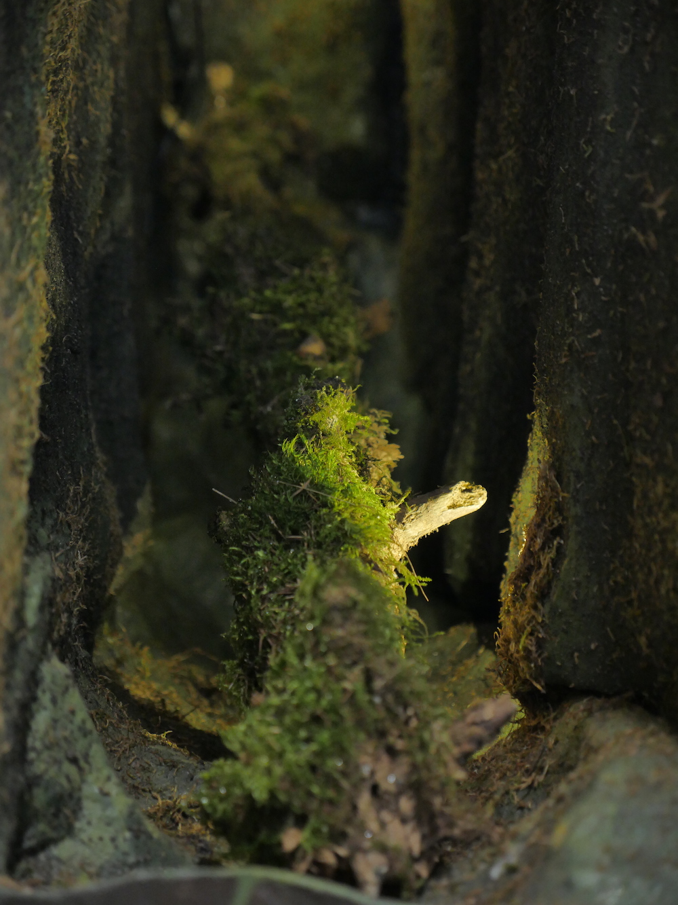
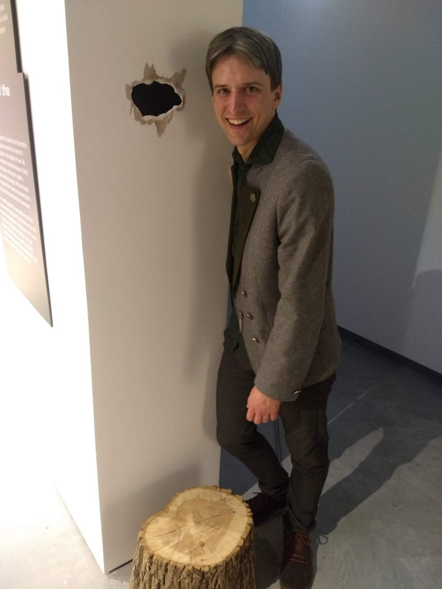

Lietuvos nacionalinės kultūros ir meno premijos laureatų Nomedos ir Gedimino Urbonų (g. 1968 ir 1966) kūrybai būdingas domėjimasis ekologinėmis temomis, taip pat architektūros ir politikos ryšiais. 2018 Urbonų kuruotas projektas „Pelkių mokykla“ atstovavo Lietuvai Venecijos architektūros bienalėje. Šio projekto dalis yra „Pelkių intelektas“, sukurtas kartu su dirbtinio intelekto tyrėju Jonu Kubiliumi (g. 1985). Tai dirbtinio intelekto algoritmo *sngan_projection* pagrindu išvystyta sistema, apmokyta iš baltojo triukšmo sukurti gamtą, architektūrą ir techniką suliejančius vaizdinius, neįprastus žmogiškajam suvokimui. Projektas pristato naujųjų ekosistemų koncepciją, kur gyvosios gamtos formos organiškai susilieja su skaitmeninėmis gyvybės formomis.

Nomeda and Gediminas Urbonas (b. 1968 & 1966), both recipients of the Lithuanian National Prize for Culture and the Arts, are known for their artistic exploration of environmental subjects, as well as their focus on the relationship between architecture and politics. In 2018 Urbonas curated the *Swamp School*, a project that represented Lithuania at Architecture Biennale––La Biennale di Venezia. A portion of this project, *Swamp Intelligence*,
was created together with AI researcher Jonas Kubilius
(b. 1985). It is a system based on an AI algorithm *sngan_projection* that uses white noise to generate blendings of natural, architectural and technological imagery, unusual for human perception. The project presents a concept of new ecosystems, where natural forms organically merge with digital life forms.

Mišri technika / Mixed media
Autorių nuosavybė / Property of the artists

Pelkės aplinką kūrė / Swamp environment by: Simona Kačinskaitė ir Rytis Urbanskas

Šis kūrinys iš dalies finansuotas Europos Sąjungos „Horizonto 2020“ mokslo ir inovacijų programos lėšomis (sutarties nr. 705498) / This project has received funding from the European Union's Horizon 2020 research and innovation programme under grant agreement No 705498

