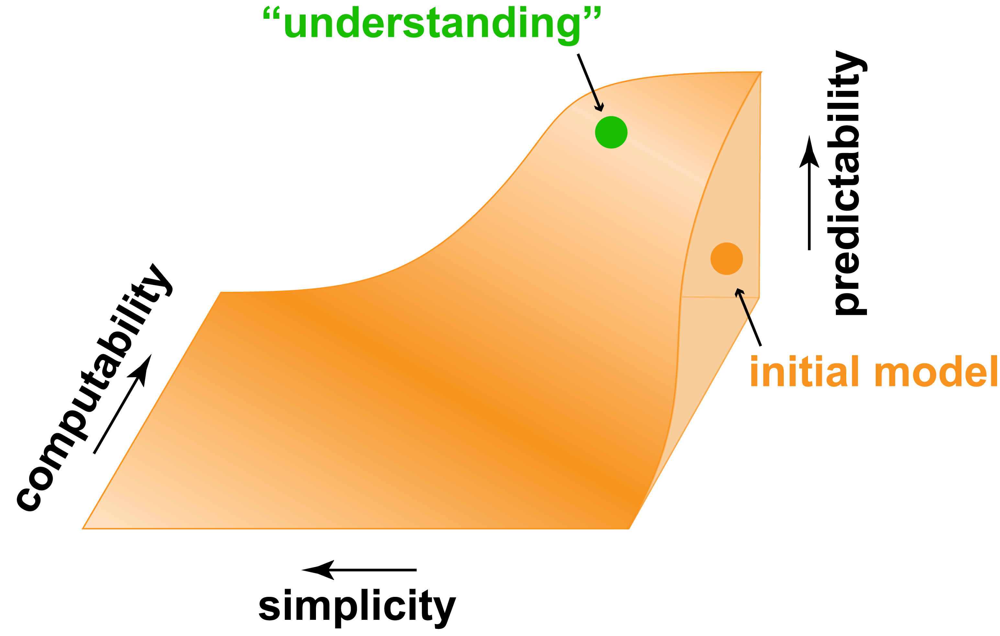

<figure>

<figcaption><strong>Figure 1.</strong> The space of possible models is bound by the predictability, simplicity, and computability trade-off surface. Too simple or uncomputable models cannot predict well, but there are many overly complicated and computationally intense models that may still predict well. I think “understanding” means having a computable model of a phenomenon with as few parameters as possible without sacrificing too much predictability. My preferred strategy of working towards this understanding begins with a sufficiently broad (thus also complex) computable model subspace and is guided primarily by parameter tuning for higher predictability and to a lesser extent by model simplification.</figcaption>
</figure>

The desire to understand a given phenomenon is at the core of a scientist’s mission. Yet what is meant by “understanding”? As soon as we try to operationalize this concept, I argue that understanding amounts to building models of a set of related empirical phenomena. While models may not even be stated explicitly and a single study may consider only a small part of the overall model, the overarching goal is nonetheless a systematic organization of knowledge how that phenomenon occurs.
 
Agreeing upfront on what counts as a success, or a good model, is therefore critical. That is, which set of empirical phenomena need to be explained? For brain systems, does one only care about explaining behavior? Or also explaining internal neural responses? Or also explaining synaptic connection strengths? And also the channel distributions on each synapse? The art of science is choosing and collecting fruitful sets of empirical phenomena, but this is also subjective and may be guided by one’s imagined application goals. Yet once set, a clear, quantifiable goal to one’s research program is established, and “progress” becomes an objective metric.
 
In practice, however, such commitments are rarely made and opinions vary as to what counts as progress. In an effort to encourage quantifiable progress, Kay (2017) listed several criteria to evaluate models. In my view, the criteria should be slightly different and emphasis should be placed elsewhere. In this commentary, I discuss three such criteria that I find useful in guiding the quest for better models and what they imply for the use of deep nets in brain research:

- **Predictability:** Does it predict unseen data?
- **Simplicity:** How many principles does it depend on?
- **Computability:** Can one compute model’s outputs from the inputs? 

## Predictability

To me, when we say we understood a phenomenon, first and foremost it means that we can predict all of the explainable variance in the data for any input in the domain over which the model is claimed to hold. For example, in trying to understand visual area V1, the goal may be to predict neural responses to any given image, and progress in our understanding is quantified by how close model predictions are to the actually observed V1 response.

To discover highly predictable models, any strategy is fair. For instance, models with millions of parameters are acceptable. Models that sponge up the data until virtually no unseen data is left are acceptable. Even models that are nothing but simulations are acceptable (but good luck building one!). It is only critical that the model predicts well on independent held-out datasets.

Perhaps the desire for a model to “just work” at any cost sounds closer to engineering than science. In my view however, models that work are the eventual deliverables of our research. Even basic research is often motivated by some application, such as treating a disease or building brain-machine interfaces. So even if little insight is gained by building models that “just work”, at least we can use them.

## Simplicity

Historically, the greatest triumphs in science came not from brute-force search for predictive models but from the ability to describe a complex system with relatively few parameters or equations. While the objective value of preferring simpler models might not be immediately clear, I think the power of simplification comes through the crystallization of principles that end up connecting to other domains.

However, in brain research, we are in the business of building the model of the brain. The brain need not be optimal, simple, or otherwise very reducible. It evolved haphazardly and may include random hacks, duplicated functionalities, and cumbersome shortcuts instead of conceptually elegant solutions. So even if one is able to build a simpler model, it doesn’t mean that it is in fact closer to the target system. Occam’s Razor need not always apply.

In fact, there is no guarantee whatsoever that a particular phenomenon is reducible. There is no reason to expect that human visual object recognition, for instance, is a simple process that one can spell out in a few equations. There is no reason to demand that a specific parameter in the system should be responsible for a specific effect in the output of the system. It may well be, and one should strive to isolate such key parameters, but one should equally accept that the majority of a system’s output could be driven by complex nonlinear interactions between multiple parameters.

In that regard, perhaps instead of concentrating on having simpler models, a more productive approach would be figuring out simple generative procedures for complex models. Even if there is no hope to have simple models, knowing how to obtain them is still useful.

## Computability

Finally, I want to highlight the concept of computability. If we do not think computationally, it is extremely easy to propose great models. Here is an example: The Act of God. This great model can predict anything you want, yet there is something unsatisfying about it, to say the least, –– one simply cannot compute any outputs from the inputs to this model.

While quite silly, this example underscores the idea already implicitly expressed in the notion of predictability –– that there is no room for a homunculus in a model. For any valid model, we should know what counts as a valid input and how to compute the internals and the outputs. By demanding end-to-end computable systems, one excludes beautiful solutions that, when attempted to be implemented, do not work because their inputs are not computable or the details of the model turn out to be not sufficiently specified.

In practice, we would prefer models that are fully computable but still simple enough to lead to good predictions. Start with too many details and you will quickly find yourself dealing with models whose predictions are impossible to compute and verify against actual data in realistic time frames. With increasing computational power and dataset sizes, moving towards such broad, unconstrained models that discover the best parameters on their own is becoming quite lucrative. The balance is delicate: while replacing scientist’s intuitions with data-driven approaches might speed up discoveries, the search space of the correct parameters in such “master” models might also grow so rapidly that it becomes impossible to find a needle in the haystack. Narrowing the search space by a principle or two obtained by the good old reductionist approach might get you much further.

## Why embrace deep learning

In practice, these three criteria are tricky to jointly apply (Figure 1). Simpler models will often lack predictive power, which is sometimes negligible yet in other cases critical for success. Highly predictive models will often have high computational cost and hidden caveats that only come to light when people try to figure out the principles. In brain research, currently I find deep learning to be the most useful technique to navigate this space of trade-offs and obtain the best models. In particular, deep learning seems to allow us to obtain highly predictable models on multiple goals while leveraging the cutting edge of computational resources and our own ability to grasp how the technique works.

These are still early days of applying deep learning for brain research and many questions remain open but some successes are clear. For instance, deep nets, unlike black box models, already predict not only primate behavior –– the internal representations of these models predict neural responses in primate brain. Furthermore, while tighter links to neuroanatomy and reduction of parameters might be warranted, deep nets already compress the complexities of the brain to a great extent. After all, deep nets are not infinitely scalable and quality data is still severely limited, driving more principled ways of building and training new models. If anything, it is astonishing that their relative simplicity does not preclude them from being useful models of the brain.

In other words, the success of deep learning in the sensory modalities domain should only encourage us to continue tackling open questions in a fearless data-driven, maximal practical complexity way. Yet one may wonder where such cold, dry approach may lead us if little thought is dedicated to understanding the principles. Such concerns remind me of an insightful poem by a Lithuanian poet Sigitas Geda on a centipede who was happily treading along the way until he started thinking how he is able to manage all his hundred feet and, as a result, could no longer walk. While the poem leaves the fate of the poor centipede open, in the context of this commentary try to guess if the centipede successfully built a model of its own walking or instead, while introspecting, was overrun by a self-driving car?

## Acknowledgments

I would like to thank Jim DiCarlo and the members of DiCarlo lab for the multiple discussions on this topic. I have received funding from the European Union's Horizon 2020 research and innovation programme under grant agreement No 705498.

## References

Kay, K.N. Principles for models of neural information processing. NeuroImage (2017) doi:10.1016/j.neuroimage.2017.08.016 (in press)