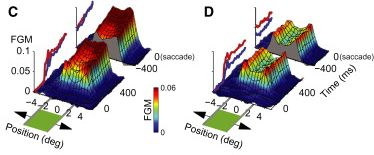
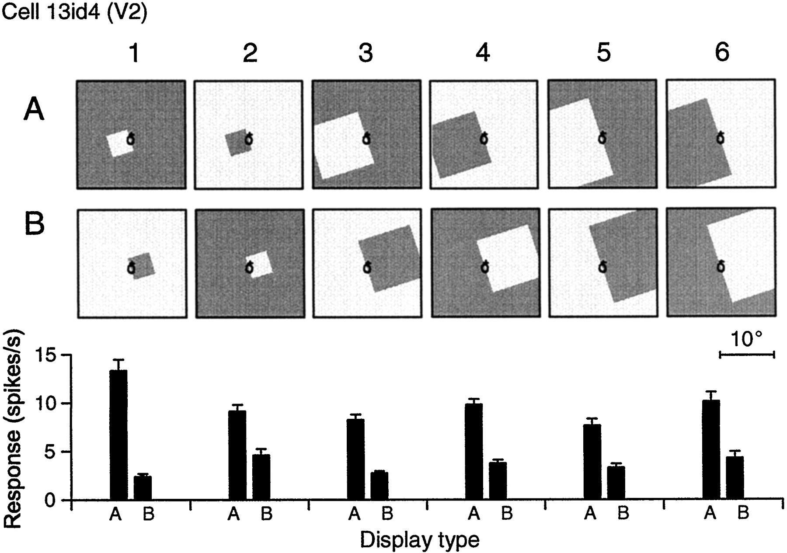
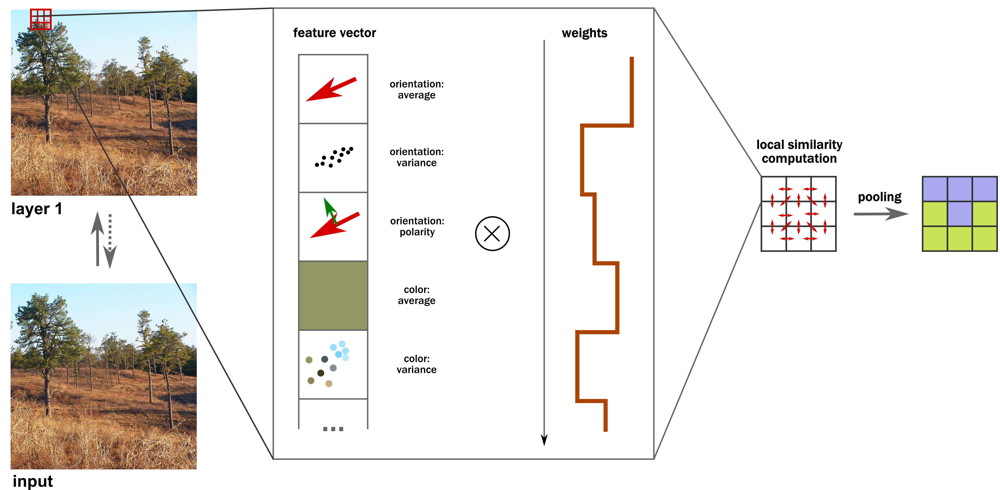

class: center, middle

# A Conceptual Framework of Computations in Mid-Level Vision
***Jonas Kubilius***, *Johan Wagemans*, *Hans P. Op de Beeck*

Brain & Cognition / University of Leuven (Belgium)

MODVIS / 2015-05-14

.license[

.logo[]
.logo-name[[klab.lt](http://klab.lt)]
]
.aside[except where otherwise noted, these slides are available under the Creative Commons Attribution 4.0 International License]

???
The goal of visual processing is to extract information necessary for a variety of tasks, such as grasping objects, navigating in scenes, and recognizing them. While ultimately these tasks might be carried out by separate processing pathways, they nonetheless share a common root in the early and intermediate visual areas. What representations should these areas develop in order to facilitate all of these higher-level tasks? Several distinct ideas have received empirical support in the literature so far: (i) boundary feature detection, such as edge, corner, and curved segment extraction; (ii) second-order feature detection, such as the difference in orientation or phase; (iii) computation of summary statistics, that is, correlations across features. Here we provide a novel synthesis of these ideas into a single framework. We start by specifying the goal of mid-level processing as the construction of surface-based representations. To support it , we propose three basic computations: (i) computation of feature similarity across local neighborhoods; (ii) pooling of highly similar features, and (iii) inference of new, more complex features. These computations are carried out hierarchically over increasingly larger receptive fields and refined via recurrent processes when necessary.

---
layout: true
class: middle

---
# Mid-level vision does a lot of things...

---
class: center
## Selectivity & invariance

.source[fair use – [Riesenhuber & Poggio (Nature Neuroscience, 2007)](http://doi.org/10.1038/14819)]

---
class: center
## Second-order edges

.cols2[

.source[fair use – [von der Heydt et al. (Science, 1984)](http://doi.org/10.1126/science.6539501)]

.source[fair use – [Poort et al. (Neuron, 2012)](http://doi.org/10.1016/j.neuron.2012.04.032)]
]

---
class: center
## Grouping

.source[fair use – [Dakin & Baruch (Journal of Vision, 2009)](http://doi.org/10.1167/9.2.13)]

**e.g., association field**

---
class: center
## Border-ownership

.source[fair use – [Zhou et al. (Journal of Neuroscience, 2000)](http://www.jneurosci.org/content/20/17/6594)]

---
class: center
## Summary statistics

.cols2[

.source[fair use – [Portilla & Simoncelli (IJCV, 2000)](http://doi.org/10.1023/A:1026553619983)]

.source[fair use – [Freeman et al. (Nature Neuroscience, 2013)](http://doi.org/10.1038/nn.3402)]
]

---
## Mid-level processes

- Feature detection
- Second-order feature detection
- Feature integration / linking (incl. border-ownership)
- Texture processing / summary statistics
- ...

--

### Issues

- Many phenomena modeled but no unified framework
- Models work with simplistic stimuli – generalizability to natural scenes?
- Code not available

--

### similarity & pooling

???
We wanted to see if these seemingly different processes could have common basic mechanisms behind them. In particular, I want to put forward the idea that these processes coudl be understood in terms of two mechanisms: feature similarity estimation and pooling of highly similar units.

---
# gmin
.subtitle[an open, minimalist mid-level framework]

---
class: center
## gmin layer 1

.source[cc by 4.0 – [Kubilius et al. (Frontiers in Computational Neuroscience, 2014)](http://doi.org/10.3389/fncom.2014.00158)]

---
class: center
## In practice

---
class: center
## gmin layers 1 & 2

.source[cc by 4.0 – [Kubilius et al. (Frontiers in Computational Neuroscience, 2014)](http://doi.org/10.3389/fncom.2014.00158)]

---
class: center
## In practice

.full[]

---
class: center
## gmin full architecture

.source[cc by 4.0 – [Kubilius et al. (Frontiers in Computational Neuroscience, 2014)](http://doi.org/10.3389/fncom.2014.00158)]

---
class: center
## In practice

.full[]

???
Note also that this kind of segmentation is done in a completely feedforward way, so the fact that we get any structure at all stands in contrast with rapid object detection or scene gist ideas.

---
class: center
## What does feedforward look like?

--

.source[fair use – [LabelMe](http://labelme.csail.mit.edu/Release3.0/index.php)]

---
## Some interesting predictions

- Grouping present in feedforward signals
- Similarity and pooling as basic mechanisms

---
class: center
## Rapid grouping

.img50[]
.source[Kubilius et al. (VSS 2015)]

*See my poster on Saturday*
### Does segmentation influence rapid scene categorization?
*(2:45 pm / Scene Perception: Categorization and memory)*

---
## Cue-invariant processing in rats

.source[fair use – De Keyser et al. (submitted)
]

---
## Strengths

- Synthesis of older ideas
- Compatible with many known neural and behavioral results
- Biologically plausible

.cols2[

]

- Similarity and pooling are **unsupervised** image processing rules
- Provides insights into feedforward representations
- Fast (takes seconds), can be implemented in parallel
- Free and open source ([github.com/qbilius/gmin](https://github.com/qbilius/gmin)), try it yourself now: [gmin.klab.lt](http://gmin.klab.lt)

---
## Limitations

- How are feature weights learned?
- Can a single set of weights work for all images?
- Picks up *similarities* but not necessarily *discriminative* features
  - Might be resolved in combination with deep networks
- No recurrent processing
  - Not the purpose of this model

---

Try it online: [gmin.klab.lt](http://gmin.klab.lt)

or

read more: [Kubilius et al. (Frontiers in Computational Neuroscience, 2014)](http://dx.doi.org/10.3389/fncom.2014.00158)

---
# Thank you!

.aside[slides available at [klab.lt](https://klab.lt)]

.aside[code available at [github.com/qbilius/gmin](https://github.com/qbilius/gmin)]