class: center, middle

# Deep Neural Networks as a Computational Model for Human Shape Sensitivity
***Jonas Kubilius***, *Stefania Bracci*, *Hans P. Op de Beeck*

- Brain & Cognition / University of Leuven (Belgium)
- McGovern Institute for Brain Research / MIT

VSS / 2016-05-16

.license[

.logo[]
.logo-name[[klab.lt](http://klab.lt)]
]
.aside[Creative Commons Attribution 4.0 International License]

???
Theories of object recognition agree that shape is of primordial importance, but there is no consensus about how shape might be represented and so far attempts to implement a model of shape perception that would work with realistic stimuli have largely failed. Recent studies suggest that state-of-the-art convolutional ‘deep’ neural networks (DNNs) capture important aspects of human object perception. We hypothesized that these successes might be partially related to a human-like representation of object shape. Here we demonstrate that sensitivity for shape features, characteristic to human and primate vision, emerges in DNNs when trained for generic object recognition from natural photographs. We show that these models explain human shape judgments for several benchmark behavioral and neural stimulus sets on which earlier models mostly failed. In particular, although never explicitly trained for such stimuli, DNNs develop acute sensitivity to minute variations in shape and to non-accidental properties that have long been implicated to form the basis for object recognition. Even more strikingly, when tested with a challenging stimulus set in which shape and category membership are dissociated, the most complex model architectures capture human shape sensitivity as well as some aspects of the category structure that emerges from human judgments. As a whole, these results indicate that convolutional neural networks not only learn physically correct representations of object categories but also develop perceptually accurate representational spaces of shapes. An even more complete model of human object representations might be in sight by training deep architectures for multiple tasks, which is so characteristic in human development.

---
class: center, middle

Hans Op de Beeck

Stefania Bracci

???
Good morning. This work has been done together with Hans Op de Beeck, who is here in the audience, and Stefania Bracci back at University of Leuven in Belgium.

---
class: middle

## Object recognition in the wild

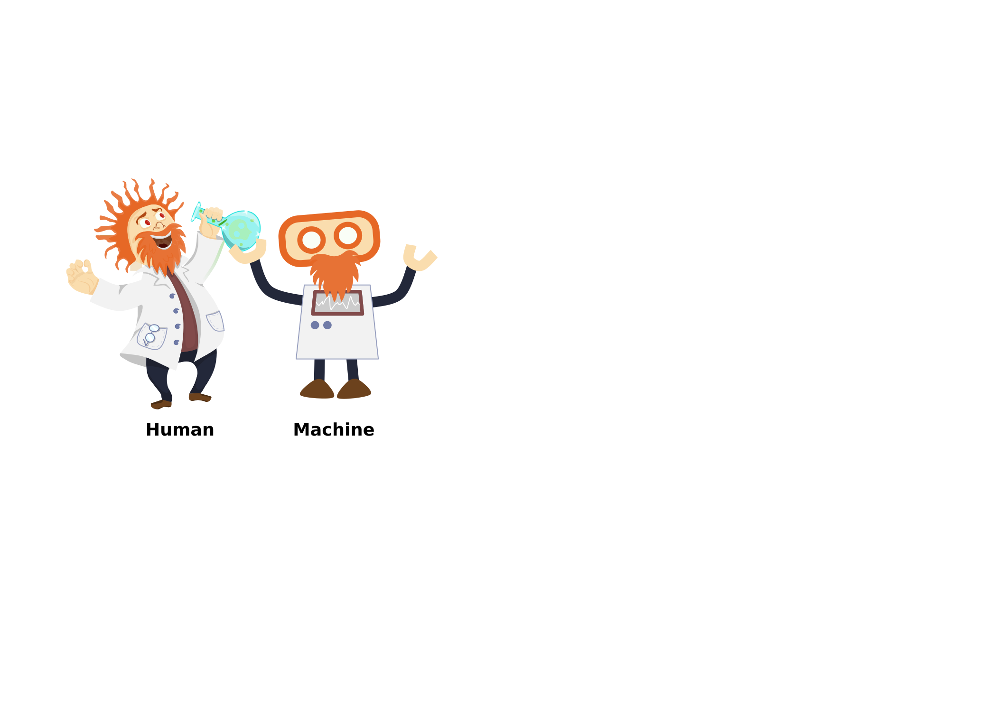

???
It's been a long morning, so let me introduce the topic of my talk with this simple example. Suppose you're walking on a beach with your new best friend, the latest and greatest deep convolutional neural net. Suddenly, you stumble upon this.

---
class: middle

## Object recognition in the wild

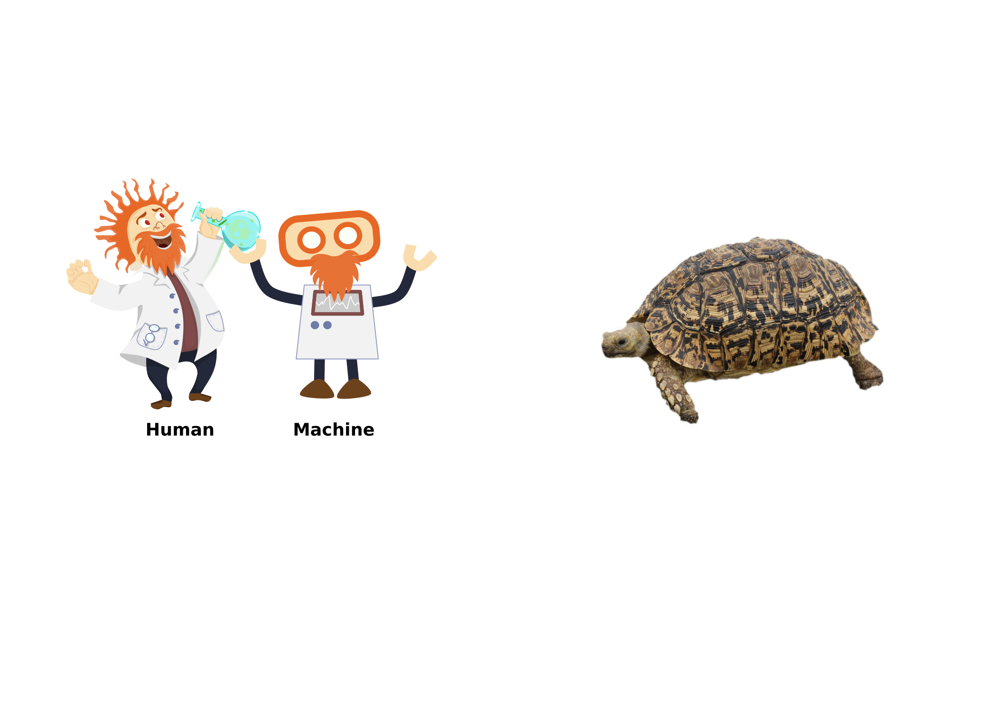

???
What's that? Well, that's a turtle, you say. And your best friend deep convolutional neural net will probably also say they same thing. After all, this is what they're very good at -- identifying objects from the list of objects that they have been trained on.

Alright, you keep going and now you stumble upon this.

---
class: middle
## Object recognition

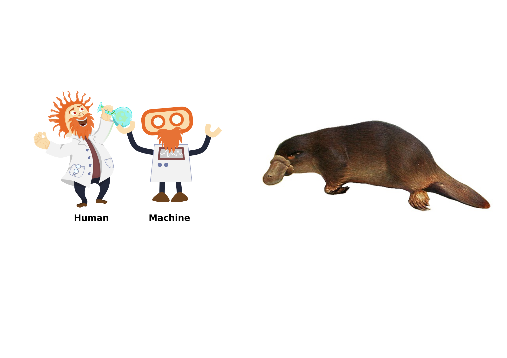

???
What's that? Well, if you've never heard of a platypus before, you might say: "It looks like a beaver but has this funny beak of a duck." Now, the question is: If it has not been trained on platypus either, what would your latest and greatest deep convolutional neural net say?

---
class: middle
## Deep net training

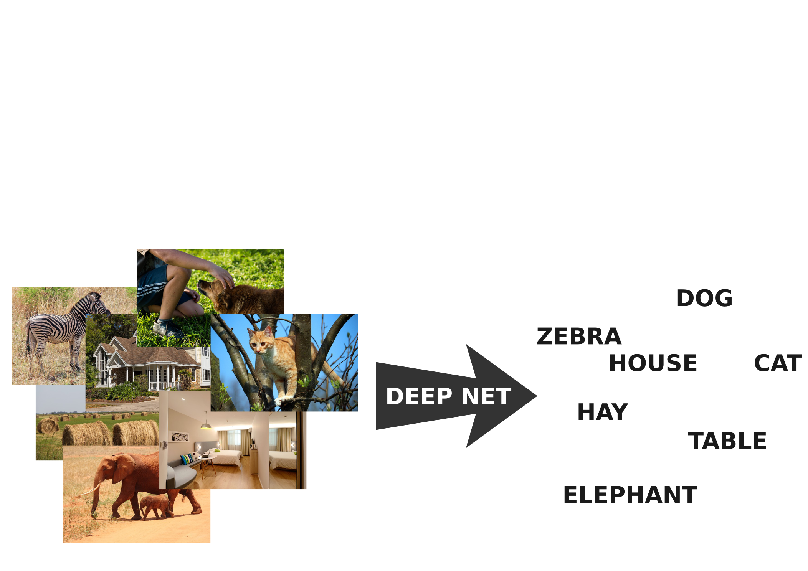

???
- Learning mapping from pixels to category labels
- What kinds of features are learned?

Remember, the way we train these networks to perform object categorization is by presenting them with natural images and labels of objects in them. In the standard ImageNet stimulus set there are 1000 object categories, so deep nets learn a mapping from pixels to 1000 category labels.

Now it could be that this mapping is rather arbitrary and specific to this one task (producing category labels).

---
class: middle
## Representations

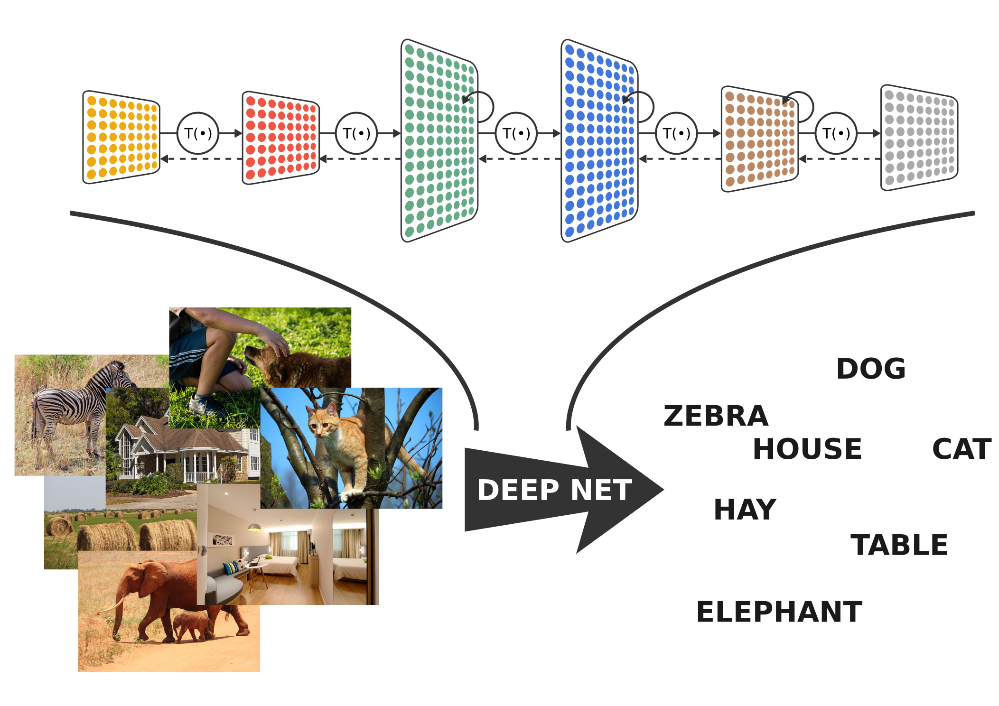

???
But of course, when we're training deep convnets on hundreds of object categories, we're actually hoping that somewhere in the hidden layers of a deep net, a rich high-level vocabulary of the visual world is learned that will be useful in novel situations with new stimuli.

Arguably, *shape* is one of the most important such high-level descriptions, yet so far there has been no model that could adequately capture human judgments of shape. So we set out to explore whether deep convolutional neural nets could be a viable model of human shape representations.

---
class: middle
## Question

Can you get **shape for free** when optimizing for **category**?

???
In other words, just to state our goal very clearly here: If you took a deep net and optimized it for producing category labels using the standard ImageNet dataset and nothing else, would you get shape representations for free?

We tested this hypothesis in a series of three experiments.

---
class: middle
## Exp. 1: Novel shapes

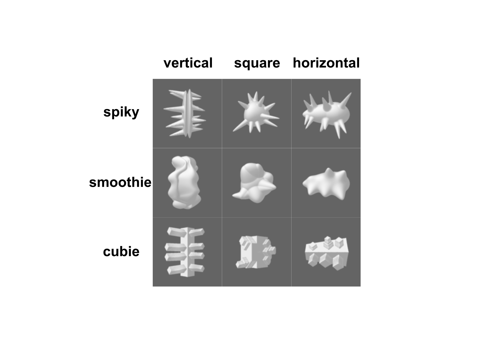
.source[[Op de Beeck et al. (J Neuro, 2008)](http://doi.org/10.1523/JNEUROSCI.2511-08.2008)]

???
In our first experiment, we used a set of nine stimuli from the study of Op de Beeck and colleagues in 2008. This stimulus set was designed with two orthogonal dimensions in mind. If you look at the columns, the stimuli are grouped in terms of their overall shape envelope, or aspect ratio: vertical, square, horizontal. If you look at the rows, stimuli are grouped in terms of their appearance: spiky shapes, smooth shapes, and cubie shapes.

---
class: middle
## Exp. 1: Novel shapes

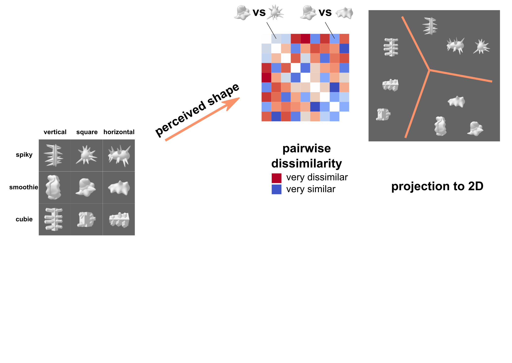

???
Eight participants performed a shape similarity judgment task. That is, they were asked to rate the similarity between each pair of stimuli. So, for instance, participants judged this smoothie and this spiky to be neither very similar nor dissimilar (as show by grayish colors) but these two smoothies were rated as highly similar (as shown by blueish colors). The average of all such pairwise comparisons is depicted in this nine-by-nine dissimilarity matrix. We can further visualize these similarities by projecting this eight-dimensional space down to two dimensions using multidimensional scaling. You can see how all spikies, all smoothies, and all cubies are forming clear clusters in this space, so we call the spiky/smmothie/cubie dimension the *perceived shape* dimension.

---
class: middle
## Exp. 1: Novel shapes

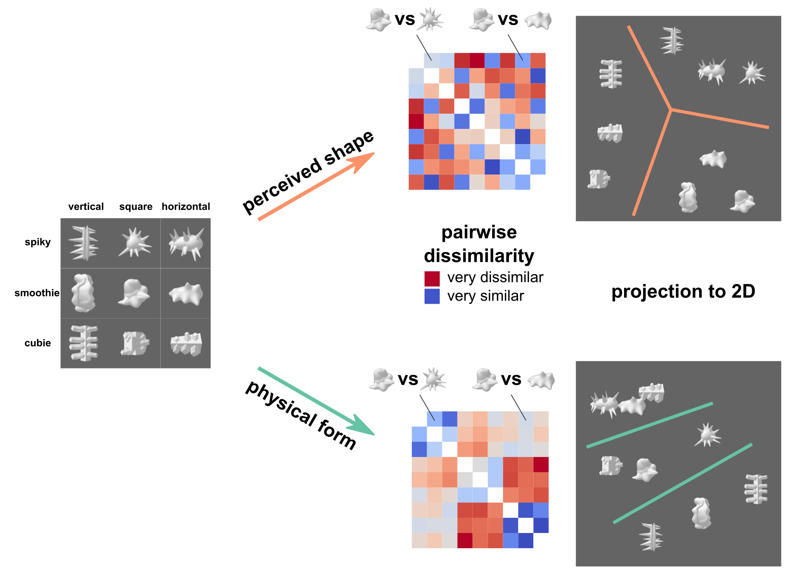

???
On the other hand, we also computed a similarity of these stimuli based on the raw pixels. Again, we obtained another nine-by-nine dissimilarity matrix where each cell represents a particular pairwise comparison. Here you can see how a spiky and a smoothie are judged pretty similar, but the two smoothies are no longer similar, unlike what we saw in human jugdments. In the corresponding multidimensional scaling plot it is clear that stimuli group by their shape envelope, so we call this dimension the *physical form* dimension.

---
class: middle
## Exp. 1: Novel shapes

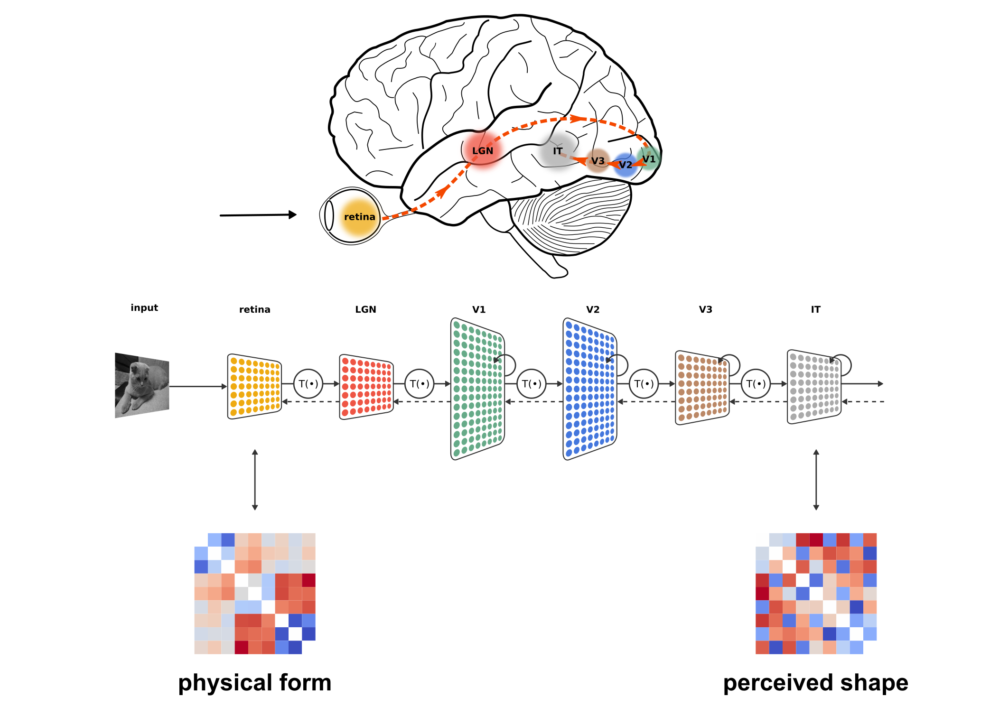

???
By having decorrelated these two dimensions, we now have two competing hypotheses of shape representations: one - the physical form one - that corresponds to the lower levels of visual processing, and another one - the perceived shape one - that corresponds to the high level of visual processing.

---
class: middle
## Exp. 1: Novel shapes

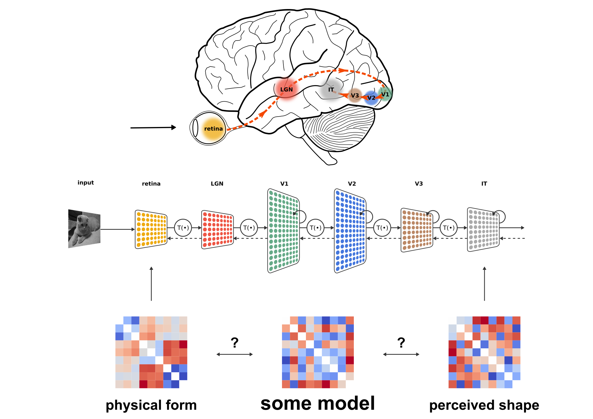

???
Now for any given computer vision model, using its responses to these stimuli, we can also construct a dissimilarity matrix just like before and ask whether it is closer (that is, correlates more) with the physical form or the perceived shape.

We tested three groups of models: shallow models, HMAX family of models, and deep nets.

---
class: middle

## Exp. 1: Shallow models

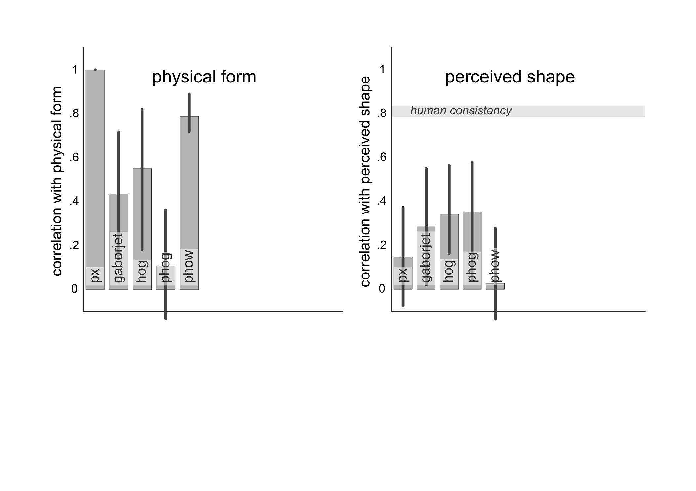

???
Shallow models, whether V1-like GaborJet model or popular computer vision descriptors such as HoG or PHOG, were overall closer to the physical form than the perceived shape. Here error bars are 95% confidence intervals, and human level consistency is shown here by the gray bar.

---
class: middle
## Exp. 1: HMAX family

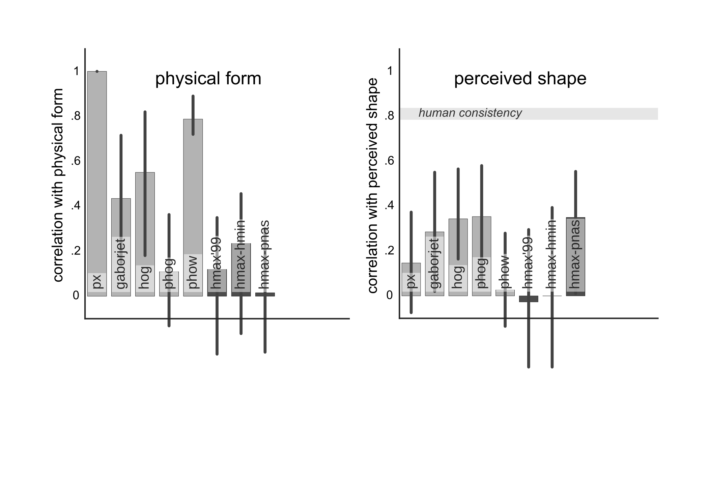

???
Similarly, simple hierarchical models of the HMAX family were also not very good at capturing human shape judgments, but at least they were not representing physical form as much as shallow models.

---
class: middle
## Exp. 1: Deep nets

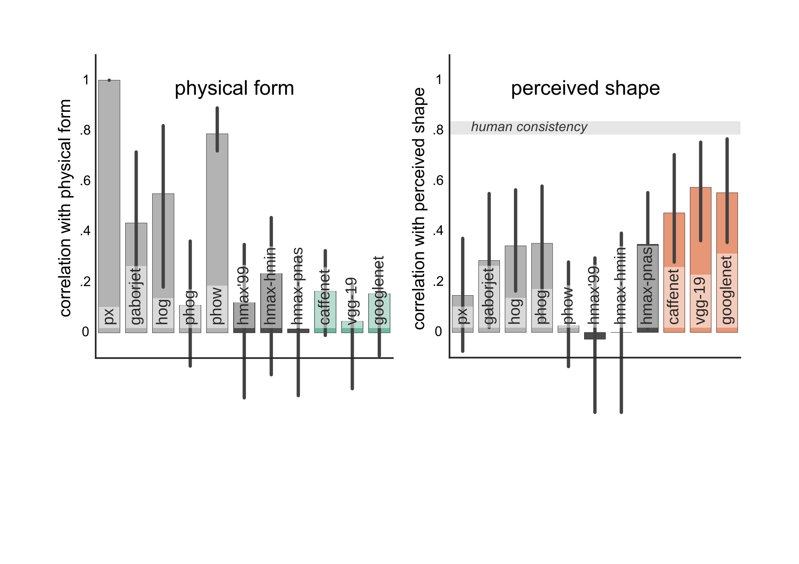

???
With deep nets, we found that representations in higher layers were even less like physical form representations and even closer to human-level shape judgments. This is a good progress - we started here with pixelwise models and progressively got less of physical form representations and more of perceived shape representations with deep nets.

---
class: middle
## Exp. 1: Deep nets

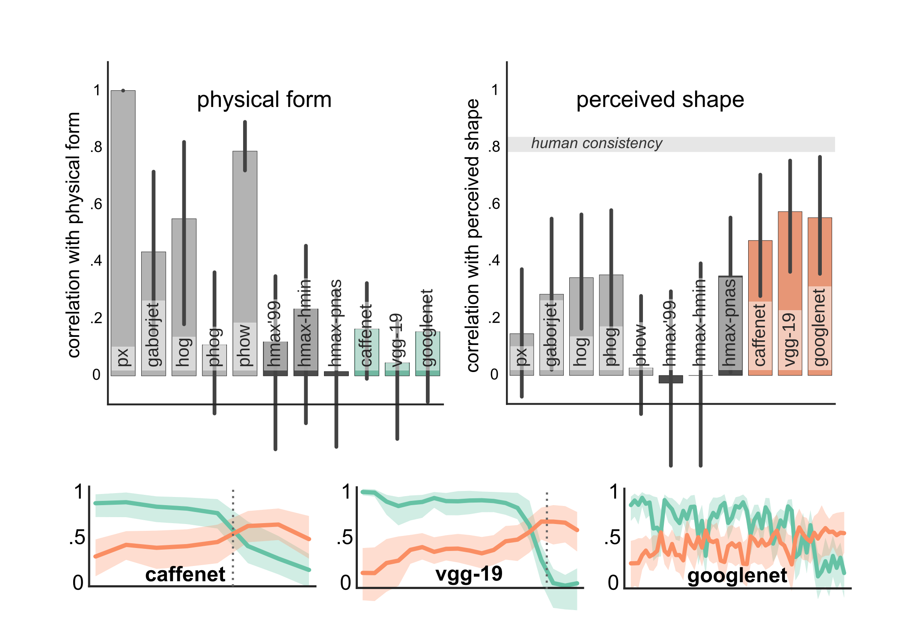

???
This progress is also nicely captured in these layer-by-layer plots where the dominance of the two dimensions is gradually reversed as we go from the inputs to the output layer.

So how far are we still from human performance? This stimulus set is a bit limited to answer this question as there were few stimuli and only two rather arbitrary dimensions.

---
class: middle
## Exp. 2: Novel fonts

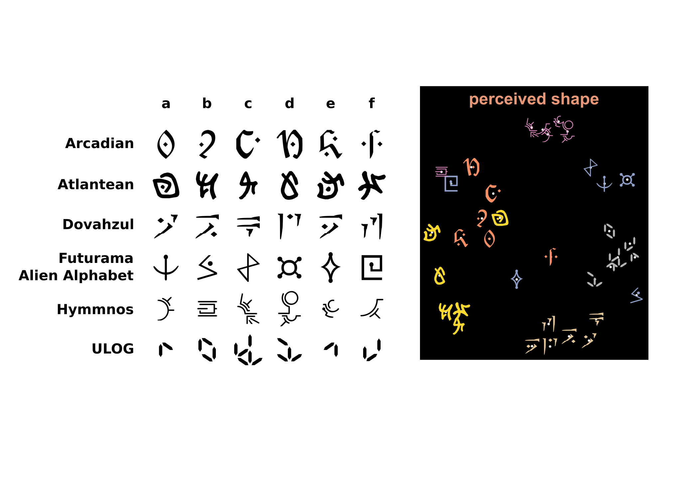

???
So in our second experiment, we constructed the following larger set with no built-in dimensions. It was set of 36 novel characters from 6 artificial alphabets. Again, we asked participants to rate shape similarity without telling them anything about these fonts. On the right side, you can see how participants judged the similarity of these characters with colors indicating different fonts. Some fonts appear to easily cluster together whereas others are more spread around, so there is some interesting and non-trivial variance to explain.

---
class: middle
## Exp. 2: Novel fonts

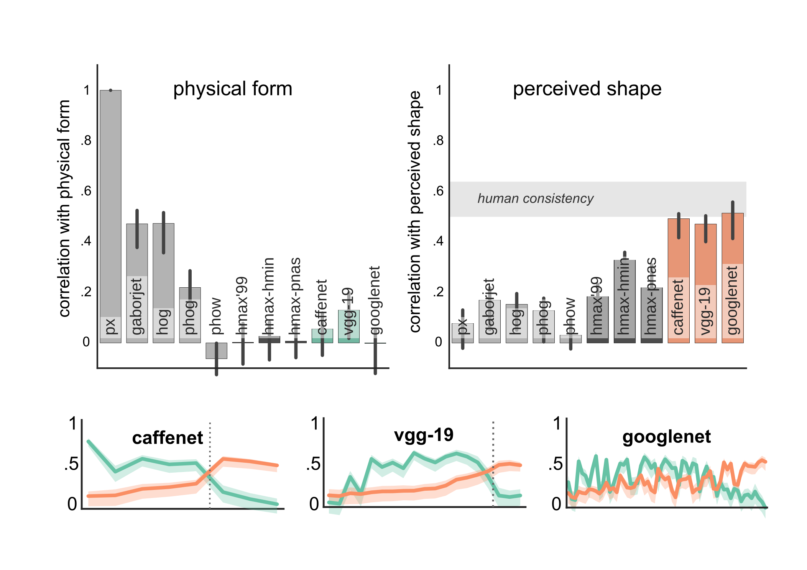

???
Now deep nets are very clearly and robustly outperforming other models. In fact, they are even reaching human-level consistency in this task.

Together, these two experiments demonstrate that deep nets are capturing a significant portion of variance in human shape judgments even without ever being trained for shape or having seen any of these stimuli before. In fact, our font stimuli are probably as far as you can get from natural images that deep nets have been trained on.

---
class: middle
## Exp. 3: Non-accidental properties

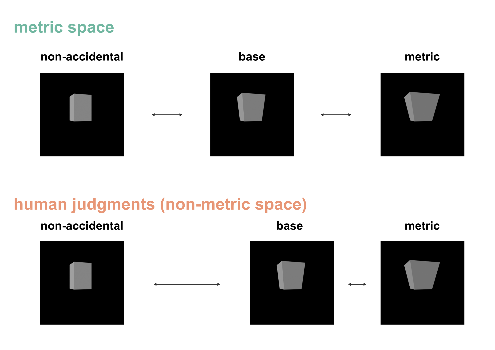
.source[[Kayaert et al. (J Neuro, 2003)](http://doi.org/10.1111/j.1460-9568.2005.04202.x)]

???
I have one more thing left. Remember Recognition-by-Components theory and non-accidental properties, that is, those properties of objects that remain invariant under various transformations, such as parallelism, curvature and so on? Irv Biederman, who spoke in this session earlier today, and other researchers have shown that human and non-human observers are very sensitive to changes in these non-accidental shape properties. In the example shown here, although these two stimuli are equally far from the base stimulus, observers do not treat them as equivalent: they are much more sensitive to a change in the non-accidental property, that is, the sides becoming parallel.

Would deep nets also show the same sensitivity just out of the box without being trained for these properties at all?

In the figure you'll see next, I'm plotting how often various models judged non-accidental stimuli to be further away than the metric ones.

---
class: middle
## Exp. 3: Non-accidental properties

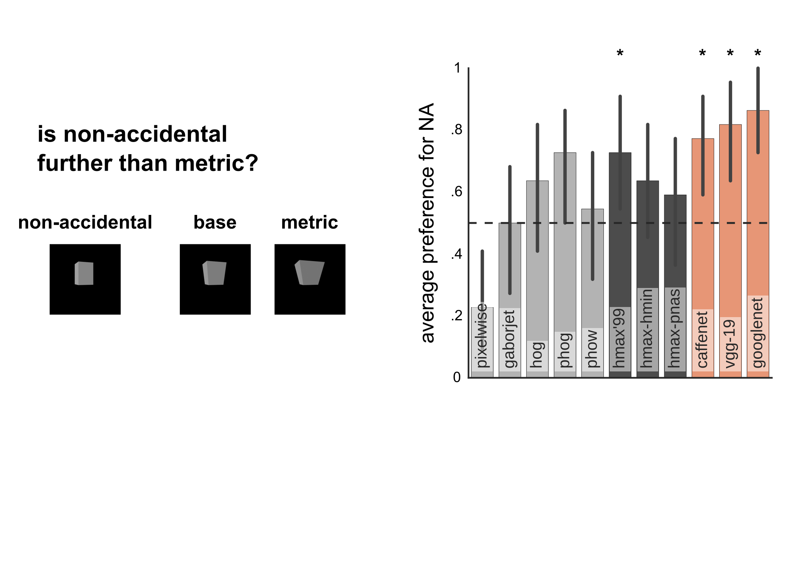

???
We found that deep nets performed robustly above chance, unlike almost all other models. In particular, notice how far they are from the pixelwise, or metric, measures.

---
class: middle
## Exp. 3: Non-accidental properties

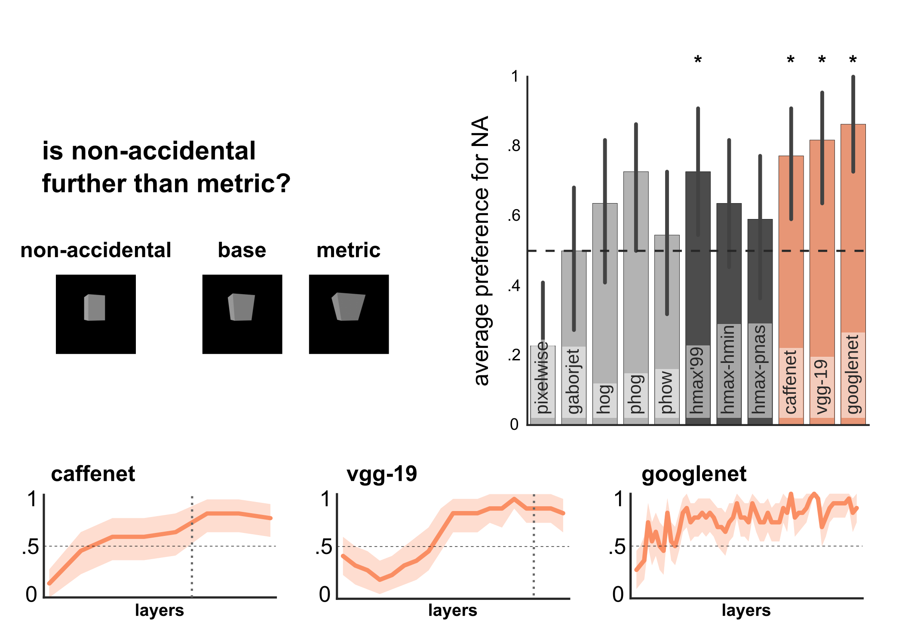

???
Furthermore, here we're only looking at the output layers. The performance turned out to be nearly perfect intermediate layers.

---
class: middle
## Summary

- When trained for category, convnets learn human-like shape representations too
- Subjective human sensitivity to shape is captured by deep nets
- Complementary to [Ha, Yamins et al. (2016)](http://doi.org/10.1038/nn.4247): latent variables (size, pose, position, ...) in the top layers
- Feature representations in deep nets are general-purpose

---
class: bottom
# Thank you!

- Major help with presentation: Arash Afraz, Caitlin Mullin, Jim DiCarlo, Dan Yamins
- *Read more:* [Kubilius et al. (*PLoS Computational Biology*, 2016)](http://doi.org/10.1371/journal.pcbi.1004896)
- *Code:* [osf.io/jf42a](https://osf.io/jf42a)
- *Reproduce:* `python run.py --bootstrap`
- *Slides:* [klab.lt](https://klab.lt/publications/talks/2016-vss/slides.html)

---
class: middle
count: false
# Extra slides

--
class: middle
count: false
## Exp. 4: Shape vs. category

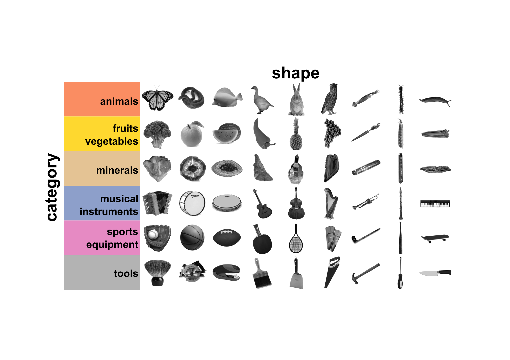
.source[[Bracci & Op de Beeck. (J Neuro, 2016)](http://doi.org/10.1523/JNEUROSCI.2314-15.2016)]

???
Alright, so apparently, categorization is aided by developing sensitivity to shape. But is there anything beyond sensitivity to shape then that convnets develop? In other words, to what extent do these networks develop semantic representations similar to human categorical representations over and above mere shape information?

Once again, typically, shape and category are closely correlated, such that shape is predictive of category, making it hard to address this question. So again, we constructed a stimulus set where shape and category would be largely orthogonal. This is a beautiful work by Stefania Bracci, who investigated representations of these two dimensions neurally and found interesting dissociations in the brain.

So how much semantic information do deep nets capture?

---
class: middle
count: false
## Exp. 4: Shape vs. category

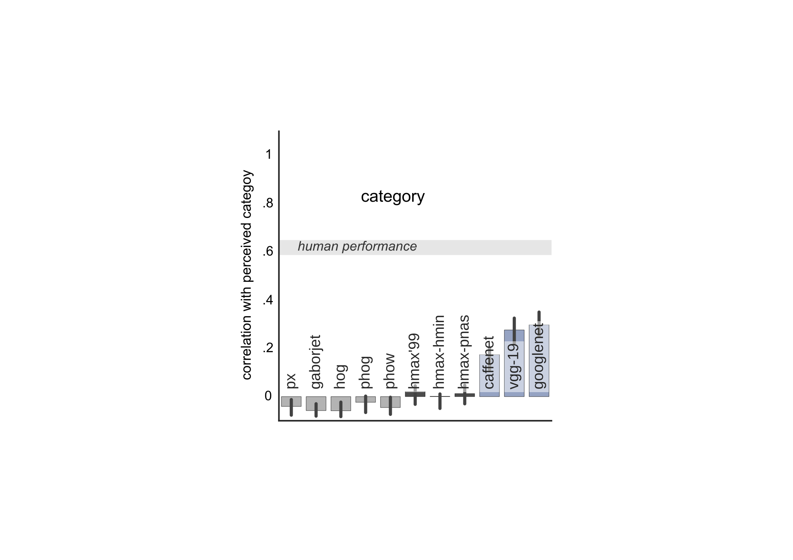

???
Not a whole lot. There is remarkably more semantic information in them than in any other models we tested but it is far from human level judgments still.

Nonetheless, what is this little bit of categorical information that deep nets do acquire?

---
class: middle
count: false
## Exp. 4: Shape vs. category

???
If you projected dissimilarity matrix of our best model, GoogLeNet, you would see that there is a clear distinction between natural and manmade categories, but finer-grain clustering is not present yet.

---
class: center, middle
count: false
## Exp. 1: Feature generality

.img80[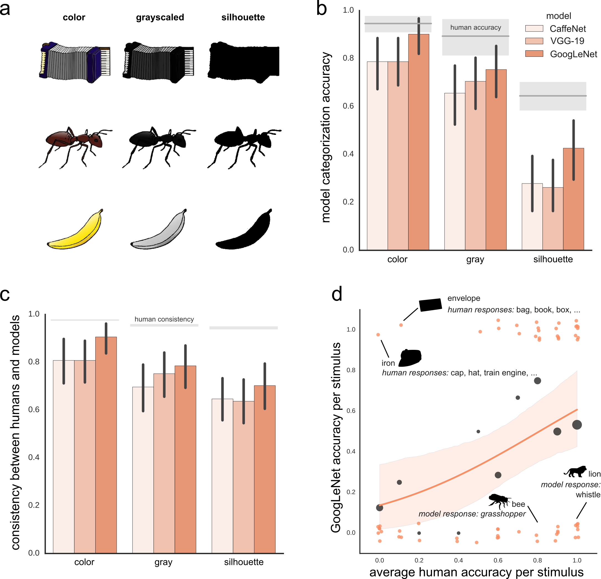]
.source[cc-by – [Kubilius et al. (PLoS Comp Biol, 2016)](http://dx.doi.org/10.1371/journal.pcbi.1004896)]

---
class: center, middle
count: false
## Exp. 2a: Novel shapes

.img80[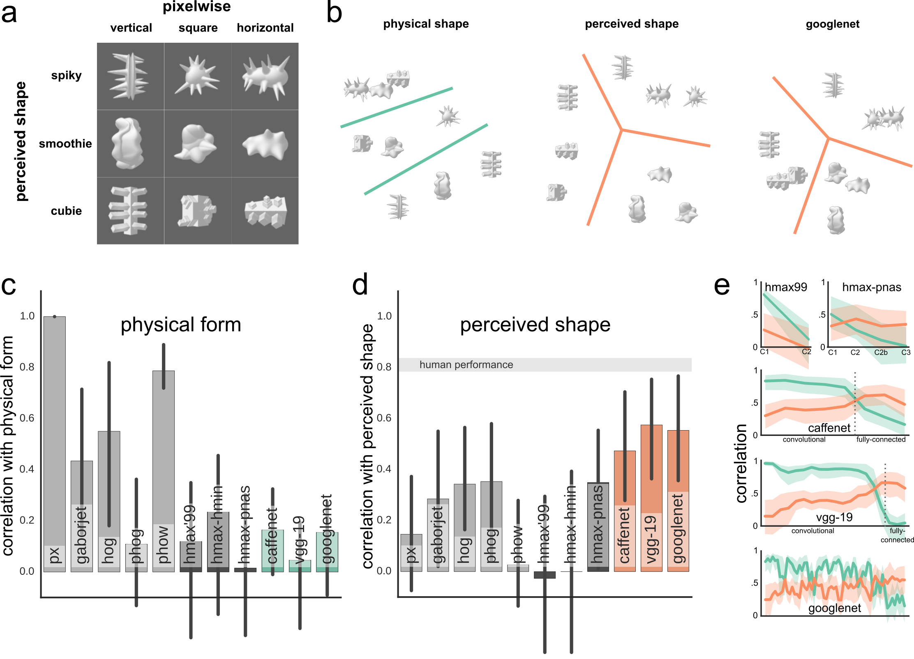]
.source[cc-by – [Kubilius et al. (PLoS Comp Biol, 2016)](http://dx.doi.org/10.1371/journal.pcbi.1004896)]

---
class: center, middle
count: false
## Exp. 2b: Fonts

.img80[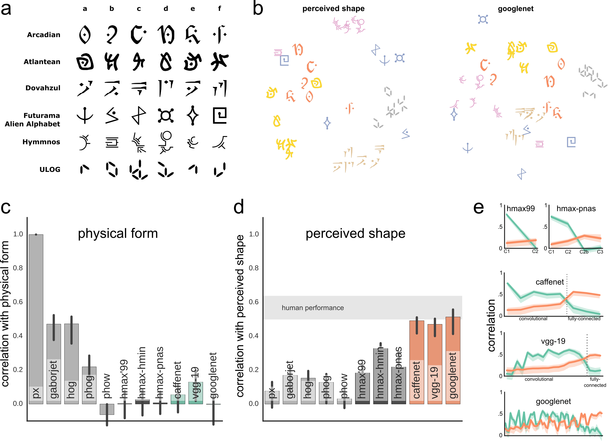]
.source[cc-by – [Kubilius et al. (PLoS Comp Biol, 2016)](http://dx.doi.org/10.1371/journal.pcbi.1004896)]

---
class: center, middle
count: false
## Exp. 3: Geons

.img80[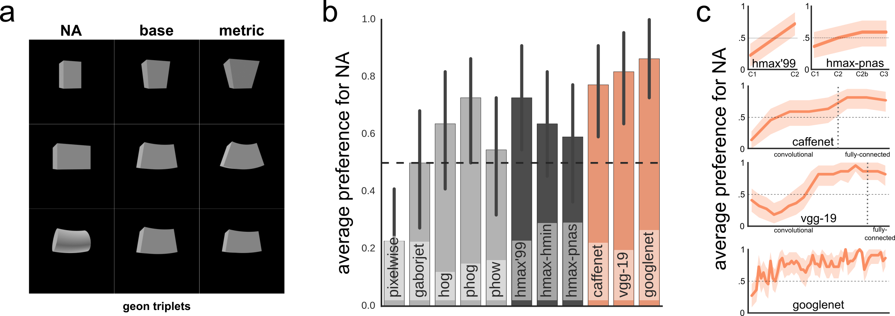]
.source[cc-by – [Kubilius et al. (PLoS Comp Biol, 2016)](http://dx.doi.org/10.1371/journal.pcbi.1004896)]

---
class: center, middle
count: false
## Exp. 4: Shape vs. semantic

.img80[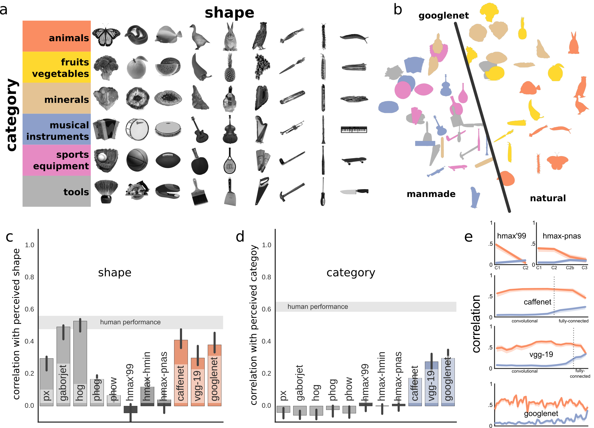]
.source[cc-by – [Kubilius et al. (PLoS Comp Biol, 2016)](http://dx.doi.org/10.1371/journal.pcbi.1004896)]