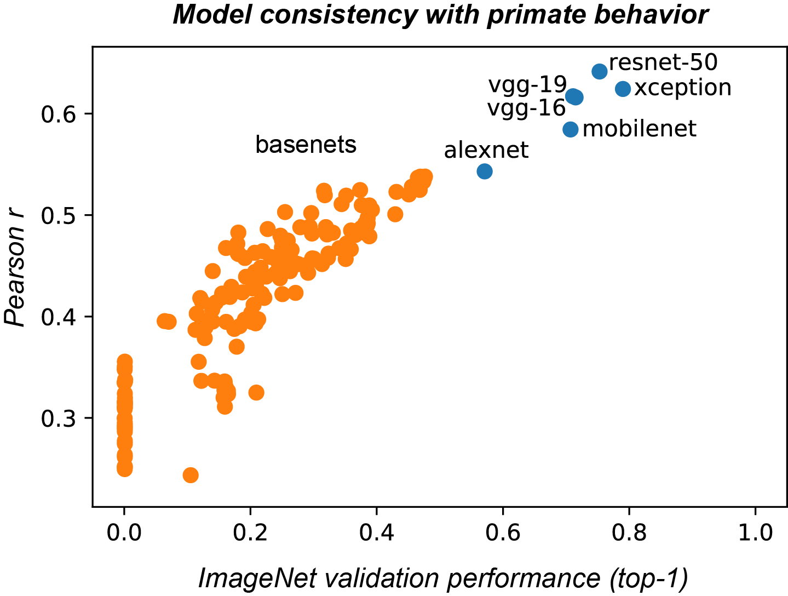

class: center, middle

# Building temporal convolutional neural networks

.subtitle[How predictability and parsimony can help each other]

***Jonas Kubilius***

McGovern Institute for Brain Research / MIT

Brain & Cognition / KU Leuven

ICON / 2017-08-08

.license[

.logo[]
.logo-name[[klab.lt](http://klab.lt)]
]
.aside[Content: Creative Commons Attribution 4.0 International License]
.aside[Images: Fair use unless stated otherwise]

???
In the recent years, feedforward deep neural networks have surpassed other classes of models in predicting neural responses in the primate inferior temporal (IT) cortex (Yamins et al., 2014) and in providing response patterns consistent with primate behavior in several object judgment tasks (e.g, Kubilius et al., 2016). However, despite a strong promise for bringing better predictive models for many phenomena in cognitive sciences, deep nets remain poorly adopted by cognitive researchers. A common argument against using them is that deep nets are too complex and do not provide an adequate understanding of the processes occurring in the system. In this talk, I will argue that predictability and understanding, or perhaps more concretely, the parsimony of the models that we build are not necessarily inconsistent goals and can in fact enhance each other. To illustrate this idea, I will describe how investigating the performance patterns of object identification in deep nets in our recent work lead to the predictions of response decoding latencies in the monkey IT cortex. Specifically, we observed that the images that deep nets found hard to identify lead to the longer response decoding latencies in the IT cortex, presumably reflecting the lack of recurrent connections in these feedforward architectures. Next, I will demonstrate how we used these empirical observations to inform and constrain new classes of models. I will discuss how we built a general-purpose temporal convolutional neural network architecture that can be defined for any network topology, including within-layer recurrence, feedback and bypass connections. Such a multi-pathway architecture and its time-varying outputs, while built out of the needs of a particular task, also provide a more plausible model of the visual system, opening a possibility for investigating dynamic processes in machines and primates using deep architectures.

---
class: center, middle

## Intro

.source[<a href="//commons.wikimedia.org/wiki/Neil_Armstrong" title="Neil Armstrong">Neil Armstrong</a> - NASA Apollo Archive. Prepared and restored by Kipp Teague. <a href="https://commons.wikimedia.org/w/index.php?curid=31907">Wikimedia Commons</a> (Public Domain)]

???
On July 20, 1969, man landed on the Moon. It was a colossal effort, requiring hundreds of researchers and engineers working together for nearly a decade to get from essentially nothing to a successful trip of three men from the Earth to the Moon and back again.

Now, was it the invention of a telescope and years of thorough documentation of lunar geography that enabled this mission? Or was it the three Newton's Laws of Mechanics? Or perhaps it was the understanding how to build rockets? While obviously all of these and many other contributions were important, at the end of the day it was the massive engineering effort that brought us to the Moon.

And that's how I tend to view research as well, for there is always a goal -- perhaps it is landing on the Moon, but perhaps, if we're in natural sciences, the goal is understanding a particular phehomenon of interest.

---
class: middle

## Goal-driven research

???
So in other words, we always have some experimental manipulation, some input stimuli that we provide to the target system, and then we observe the outcome, the phenomenon that interests us. The goal then is building a model that would produce the same outcome given the same inputs. Even if you send most of your time measuring outcomes, there is always some inference that we try to make about the underlying processes – which is precisely building a model, even if implicitly.

I'm calling this approach "goal-driven research".

--

**Questions to discuss:**
- Progress is objectively measurable (how close are you to the goal)
- What is "understanding"? (when do we claim a success?)

???
Now observe that if we adopt this approach, goal-driven research agenda, progress in research becomes so much more objective. Those who build better models win. Perhaps this engineering attitude sounds like all fun in doing research is lost, but let me remind you that the alternative though is running *fashion shows* where progress is measured in the current hotness of a topic, number of friends working in the same area, as well as impact factors, h-indices, stacks of Nature and Science papers, dollar amounts of grants, numbers of TED talks -- in other words anything that your friends and you choose to pronounce as great science but not what actually lands you on the moon.

I also actually think it brings more **purpose** to the work we do. If nothing else, at the end of the day you at least have a working model.

Now even if you subscribe to this goal-driven approach, you may still doubt if building better models amounts to better understanding of the phenomenon that you're interested in. But what is this understanding that we're after? If not formalized, it remains pretty elusive and subjective. Your understanding of a phenomenon might mean little to my understanding of it.

So I want to propose three criteria the I believe people have in mind when talking about understanding or good models -- for I believe understanding and models are the same thing, only the former is not well defined.

---
class: middle

## Criteria

### Predictability

How well does it predict unseen data?

### Compactness

How explained variance depends on the number of parameters?

### Computability

How possible is it to compute model’s outputs from the inputs?

???
*Main message of this talk: how to make progress in science*

---
class: center, middle

## Example goal: Object categorization

---
class: center, middle

## Predictability

???
Accuracy is a low bar. We need a more general principle.

A model is a replication of a system. A model might attempt to produce the same output given the same inputs (functional model) and/or match the details of the implementation (mechanistic model).

---
class: center, middle

## Object categorization

.img100[]

---
class: center, middle

## Predicting object categorization

.cols2[
  
  .source[[ImageNet](http://www.image-net.org/)]

  
  .source[[Rajalingham, Schmidt, DiCarlo (JNeuro, 2015)](https://doi.org/10.1523/JNEUROSCI.0573-15.2015)]
]

???
We claim a success!

So there is an art to choosing a **good** task

---
class: center, middle

## Predicting more

.img100[]

---
class: center, middle

## Predicting more

.img100[]

---
class: center, middle

## Predicting neurons

.img100[]
.source[
  [Yamins, Hong, Cadieu, Solomon, Seibert, DiCarlo (PNAS, 2014)](http://doi.org/10.1073/pnas.1403112111),
  [Yamins & DiCarlo (Nat Neurosci, 2016)](http://doi.org/10.1073/pnas.1403112111)
]

---
class: middle

## Perceived shape judgments

.cols2[
  
  
]
.source[cc-by – [Kubilius, Bracci, Op de Beeck (PLoS Comp Biol, 2016)](http://doi.org/10.1371/journal.pcbi.1004896)]

---
class: center, middle

## Latent variables

.source[[Hong, Yamins, Majaj, DiCarlo (Nat Neurosci, 2016)](http://doi.org/10.1038/nn.4247)]

---
class: center, middle

## Compactness

???
Predicting output is "easy"

---
class: center, middle

## Compactness

.source[<a href="//commons.wikimedia.org/wiki/Neil_Armstrong" title="Neil Armstrong">Neil Armstrong</a> - NASA Apollo Archive. Prepared and restored by Kipp Teague. <a href="https://commons.wikimedia.org/w/index.php?curid=31907">Wikimedia Commons</a> (Public Domain)]

???
- Why? Shutter speed was too fast for background objects to remain
- Conspiracy speaks to the fear of complexity
- There's is this one thing that explains it all

---
class: center, middle

## Computability

.img100[]

---
class: center, middle

## Computability

.img100[]

???
Perfect model: "act of God" (or insert your favorite word model here)

---
class: center, middle

## Computability

.img100[]

???
What we actually want: given *the same* inputs, produce the same outputs

---
class: center, middle

## Computability

.img100[]

---
class: center, middle

## Trade-off

---
class: middle

# How do we make progress?

---
class: middle

## Push your benchmarks

### Make your benchmarks harsher

Match object categorization on average -> Match object categorization *per image*

### Test against more benchmarks

Object recognition -> Object recognition AND neural responses at each layer

### Make training more biological

Gradient descent -> unsupervised, evolutionary or RL search

### Match known anatomical details

Number of layers, feedback connections

---
class: middle

# Architectural search

*with Pouya Bashivan*

---
class: center, middle

## AlexNet is not that great

---
class: center, middle

## Architectural search

.img100[]

---
class: center, middle

## Architectural search

.img100[]

---
class: center, bottom

## Architectural search

---
class: center, middle

## Architectural search

---
class: middle

# Time matters

*with Kohitij Kar*

---
class: center, bottom

## Let's push it even harder

.source[[Kar, Kubilius, Issa, Schmidt, DiCarlo. (Cosyne, 2017)](http://doi.org/10.1073/pnas.1403112111)]

---
class: center, bottom

## Let's push it even harder

.source[[Kar, Kubilius, Issa, Schmidt, DiCarlo. (Cosyne, 2017)](http://doi.org/10.1073/pnas.1403112111)]

---
class: center, bottom

## Let's push it even harder

.source[[Kar, Kubilius, Issa, Schmidt, DiCarlo. (Cosyne, 2017)](http://doi.org/10.1073/pnas.1403112111)]

---
class: center, bottom

## Let's push it even harder

.source[[Kar, Kubilius, Issa, Schmidt, DiCarlo. (Cosyne, 2017)](http://doi.org/10.1073/pnas.1403112111)]

---
class: center, bottom

## Let's push it even harder

.source[[Kar, Kubilius, Issa, Schmidt, DiCarlo. (Cosyne, 2017)](http://doi.org/10.1073/pnas.1403112111)]

---
class: center, bottom

## Let's push it even harder

.source[[Kar, Kubilius, Issa, Schmidt, DiCarlo. (Cosyne, 2017)](http://doi.org/10.1073/pnas.1403112111)]

---
class: center, bottom

## Let's push it even harder

.source[[Kar, Kubilius, Issa, Schmidt, DiCarlo. (Cosyne, 2017)](http://doi.org/10.1073/pnas.1403112111)]

---
class: center, bottom

## Let's push it even harder

.source[[Kar, Kubilius, Issa, Schmidt, DiCarlo. (Cosyne, 2017)](http://doi.org/10.1073/pnas.1403112111)]

---
class: center, bottom

## Let's push it even harder

.source[[Kar, Kubilius, Issa, Schmidt, DiCarlo. (Cosyne, 2017)](http://doi.org/10.1073/pnas.1403112111)]

---
class: center, middle

## Partial fix

.cols2[
  
]

---
class: center, middle

## Partial fix

.img100[]

---
class: center, middle

## Partial fix

---
class: center, middle

## Partial fix

---
class: middle

# Temporal models

*with Dan Yamins, Aran Nayebi, Maryann Rui, Harry Bleyan, Pouya Bashivan*

---
class: middle
## Deep feedforward model

---
class: middle
## Deep feedforward model

---
class: middle
## Deep feedforward model

---
class: middle
## Deep bypass model

---
class: middle
## Deep bypass model

---
class: middle
## Deep bypass model

---
class: middle
## Deep bypass model

---
class: middle
## Deep bypass model

---
class: middle
## Deep bypass model

---
class: middle
## Deep bypass model

---
class: middle
## Deep bypass model

---
class: middle
## Deep bypass model

---
class: middle
## Deep bypass model

---
class: middle
## Deep bypass model

---
class: middle
## Deep bypass model

---
class: middle
## Deep recurrent model

---
class: middle
## Deep recurrent model

---
class: middle
## Full model

???
Will be open-sourced soon

---
class: center, middle

## Faster convergence

---
class: center, middle

## Better neural RDMs

---
class: center, middle

## Fewer parameters

.source[[Zhuang, Kubilius, Hartmann, Yamins (arXiv, 2017)](https://arxiv.org/abs/1706.07555)]

---
class: middle
## Thank you!

.cols2[
  

  - Dan Yamins (Stanford)
  - Aran Nayebi (Stanford)
  - Maryann Rui (Berkeley / MIT)
  - Harry Bleyan (MIT / Google)
  - Pawan Gaire (Howard / MIT)
  - Hans Op de Beeck (KU Leuven)
  - Stefania Bracci (KU Leuven)
]

**Slides:** [klab.lt](https://klab.lt/publications/talks/2016-vss/slides.html)

**Funding:** European Union's Horizon 2020 research and innovation programme under grant agreement No 705498

**Discussion on modeling:** Look out for an opinion piece in NeuroImage by Kendrick Kay and Kevin Weiner

---

How can deep neural networks help us understand sensory processing in the human brain?

- What is a model?
A model is a replication of a system that produces the same outputs given the same inputs and matches the details of implementation of the given system
  - Falsifiable
  - Replicable
