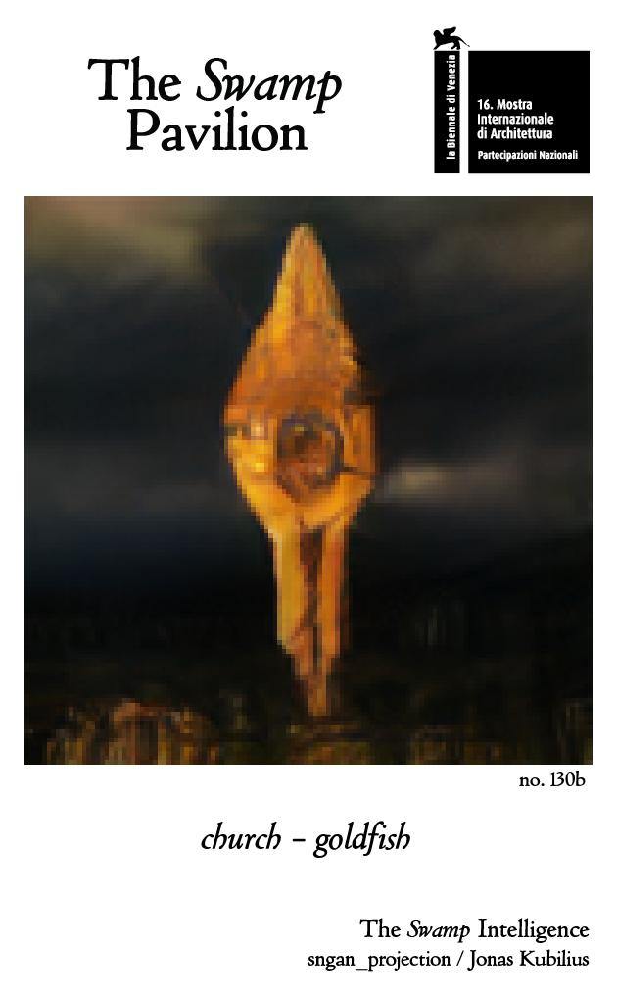

class: center

# Deep learning for understanding human vision

***Jonas Kubilius***

Brain & Cognition / KU Leuven  
McGovern Institute for Brain Research / MIT

*Data Analysis Methods for Software Systems / 2018-11-30*

.license[

.logo[]
.logo-name[[klab.lt](http://klab.lt)]
]
.aside[Content: Creative Commons Attribution 4.0 International License]
.aside[Images: Fair use unless stated otherwise]

---
class: center, middle

## Experience machine

---
class: center, middle

## Input-output mapping

.img100[]
.source[[Kubilius (figshare, 2017)](https://doi.org/10.6084/m9.figshare.106794.v3), [DiCarlo & Cox (TiCS, 2007)](http://dx.doi.org/10.1016/j.tics.2007.06.010)]

---
background-image: url(img/task.gif)
background-size: cover

---
class: left, middle

## Goal

Build a model that would predict human neural and behavioral responses in a Core Object Recognition task

???
OK, so how would we build such a model? In principle, the transformation from input to outputs is jsut some very complicated mathematical function, so any number of models could work. But we're going to make a specific choice to use **Artificial Neural Networks** because, well, the brain is a neural network too.

Also, not just any kind of a neural network but a **deep neural network**.

---
class: center, middle

## Ventral visual stream

.img100[]
.source[[Kubilius (figshare, 2017)](https://doi.org/10.6084/m9.figshare.106794.v3), [DiCarlo & Cox (TiCS, 2007)](http://dx.doi.org/10.1016/j.tics.2007.06.010)]

---
class: center, middle

## Deep learning

.img100[]

<a href="https://papers.nips.cc/paper/4824-imagenet-classification-with-deep-convolutional-neural-networks">Krizhevsky, Sutskever, Hinton (NIPS 2012)</a>
<a href="http://doi.org/10.1101/408385">Kubilius&ast;, Shrimpf&ast;, Nayebi, Bear, Yamins, DiCarlo. (biorxiv, 2018)</a>

---
class: center, middle

## Brain-Score

--

.img100[]

  <a href="https://doi.org/10.1101/407007">Shrimpf&ast;, Kubilius&ast;, Hong, Majaj, Rajalingham, Issa, Kar, Bashivan, Prescott-Roy, Schmidt, Yamins, DiCarlo. (biorxiv, 2018)</a>
   
  <a href="http://doi.org/10.1073/pnas.1403112111">Yamins, Hong, Cadieu, Solomon, Seibert, DiCarlo (PNAS, 2014)</a>

---
class: center, middle

## DenseNet-169

.img100[]
.source[Adapted from [Huang, Liu, van der Maaten, Weinberger (CVPR 2017)](https://arxiv.org/abs/1608.06993)]

--

.img100[]

*(approximate sizes)*

.source[[Netscope CNN Analyzer](https://dgschwend.github.io/netscope/quickstart.html)]

---
class: center, bottom

## Temporal responses

.source[[Kar, Kubilius, Schmidt, Issa, DiCarlo. (biorxiv, 2018)](https://doi.org/10.1101/354753)]

---
class: center, bottom

## Temporal responses

.source[[Kar, Kubilius, Schmidt, Issa, DiCarlo. (biorxiv, 2018)](https://doi.org/10.1101/354753)]

---
class: center, middle

## DenseNet-169

.img100[]
.source[Adapted from [Huang, Liu, van der Maaten, Weinberger (CVPR 2017)](https://arxiv.org/abs/1608.06993)]

---
class: center, middle

## Temporal neural networks

.img100[]
<a href="http://arxiv.org/abs/1807.00053">Nayebi&ast;, Bear&ast;, Kubilius&ast;, Kar, Ganguli, Sussillo, DiCarlo, Yamins. (NIPS, 2018)</a>

---
class: center, middle

## CORnet family of models

<a href="http://doi.org/10.1101/408385">Kubilius&ast;, Shrimpf&ast;, Nayebi, Bear, Yamins, DiCarlo. (biorxiv, 2018)</a>

???
Unifying family
Back to the basics

---
class: center, middle

## Brain-Score

.img100[]
<a href="https://doi.org/10.1101/407007">Shrimpf&ast;, Kubilius&ast;, Hong, Majaj, Rajalingham, Issa, Kar, Bashivan, Prescott-Roy, Schmidt, Yamins, DiCarlo. (biorxiv, 2018)</a>

---
class: center, middle

## Data is the new oil

<iframe width="560" height="315" src="https://www.youtube-nocookie.com/embed/WeVJIuyJq08" frameborder="0" allow="accelerometer; autoplay; encrypted-media; gyroscope; picture-in-picture" allowfullscreen></iframe>
source: Book of the Dead / Unity

Purpose:
- Self-supervised training
- From sensory cortex to cognitive tasks

???
All of these efforts require more and more computing power and also more and more data. Compute power is what it is but where can we get more data? Simulate the world.

---
class: center, middle
## What is it like to be an AI?

???
.source[[The Swamp Intelligence -- sngan_projection / Jonas Kubilius (16th International Architecture Exhibition---La Biennale di Venezia)](http://swamp.lt)]

My hope is that by allowing for people to look through the eyes of others -- in this case AI -- and by seeing their potential we will learn to appreciate the balanced and truly fragile coexsistance among species.

---
class: middle
## Thank you

.split-60[

.column[
**Collaborators at MIT**

**Collaborators at Stanford**  
.img30[  ]
]

.column[
**Art collaborators**

**Slides:** find them on [klab.lt](https://klab.lt/publications/talks/2018-damss/slides.html)

**Funding:** European Union's Horizon 2020 research and innovation programme under grant agreement No 705498  
.img30[]
]
]