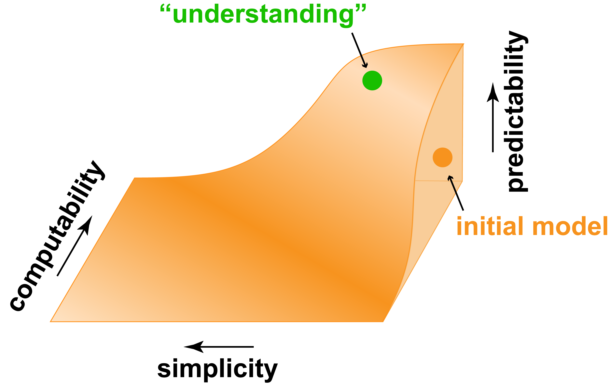

class: center

# Deep learning accelerating our understanding of human intelligence

***Jonas Kubilius***

McGovern Institute for Brain Research / MIT  
Brain & Cognition / KU Leuven

Vita Scientia / 2018-01-03

.license[

.logo[]
.logo-name[[klab.lt](http://klab.lt)]
]
.aside[Content: Creative Commons Attribution 4.0 International License]
.aside[Images: Fair use unless stated otherwise]

???
I will discuss how deep learning is accelerating our understanding of human intelligence. How can we use powerful machine learning techniques to investigate information processing mechanisms in the brain? And how neuroscience can meaningfully inform artificial intelligence research? Focusing on one aspect of perceptual intelligence – human object recognition – I will describe the history and our current efforts to build, evolve, and train brain-like models that account for human behavior in this task and capture neural responses in the primate visual cortex.

---
background-image: url(img/man-night-person-1473.jpg)
background-size: cover

???
- In those dark, long winter nights
- I look up the starry skies
- and I wonder
- where did we come from
- how did it all start?
- and how in that cosmic chatter
- a mind evolved
- a human mind?

Now, I don't think of us as any more special art than a incredibly complex information processing device that takes some inputs in, produces behaviors –

- millions of such devices, being born and dying
- wandering quite aimlessly in space and time
- generation upon generation building on the knowledge --

How do those behaviors arise? How are they shaped by the Universes in which we exist?

Let us start very humbly trying to describe how such an information processing device might function. I'm going to pick a very generic behavior – how we recognize objects in our everyday lives – and try to figure out just how this behavior could arise.

---
background-image: url(img/task.gif)
background-size: cover

???
Formalization

- **Question:** How can humans recognize objects form such brief presentations?
- **Formalization:** Core Object Recognition (the ability to discriminate a target object from all other possible objects without pre-cueing in <200 ms in 10 deg)
- **Task:** Match to sample
- **Understand:** A model that can predict + some simplicity + most computability
- *&uarr; This is how we will quantify our progress &uarr;*

---
background-image: url(img/early/cat_zoom.gif)
background-size: cover

---
background-image: url(img/early/cat_numbers.gif)
background-size: cover

---
class: middle

# Early days: Craftmanship

---
class: center, middle

## Ventral visual stream

---
class: center, middle

## Ventral visual stream

.img100[]

---
class: center, middle

## Retinal on-off cells

&nbsp;

---
class: center, middle

## Retinal on-off cells

**Building block #1:** Feature detectors

---
class: center, middle

## V1 simple cells

&nbsp;

---
class: center, middle

## V1 simple cells

**Building block #2:** Hierarchies

---
class: center, middle

## V1 complex cells

&nbsp;

---
class: center, middle

## V1 complex cells

**Building block #3:** Pooling

---
class: middle

## Building blocks

1. Feature detectors
2. Hierarchies
3. Pooling
4. Non-linearities (linear systems are one-layer only)
5. Learning mechanisms (backpropagation)

.split-30[
.column[

.source[[Fukushima (Biological Cybernetics, 1980)](https://doi.org/10.1007/BF00344251)]
]

.column[

.source[[LeCun, Bottou, Bengio, Haffner (Proc. of the IEEE, 1998)](https://doi.org/10.1109/5.726791)]
]
]

---
class: center, middle

## Do models explain behavior?

.source[[Rajalingham, Schmidt, DiCarlo (JNeuro, 2015)](https://doi.org/10.1523/JNEUROSCI.0573-15.2015)]

---
class: center, middle

## Do models explain behavior?

.source[[Rajalingham, Schmidt, DiCarlo (JNeuro, 2015)](https://doi.org/10.1523/JNEUROSCI.0573-15.2015)]

---
class: center, middle

## Do models explain behavior?

.source[[Rajalingham, Schmidt, DiCarlo (JNeuro, 2015)](https://doi.org/10.1523/JNEUROSCI.0573-15.2015)]

---
class: middle

# Modern days: Big data

---
class: middle

## Deep learning recipe

1. Compute power (fast, large memory GPUs)
2. Big data
3. A couple of engineering tricks
4. (A brave PhD student)

---
class: center, middle

## AlexNet

.img100[]

---
class: center, middle

## Do models explain behavior?

.source[[Rajalingham, Schmidt, DiCarlo (JNeuro, 2015)](https://doi.org/10.1523/JNEUROSCI.0573-15.2015)]

---
class: center, middle

## Do models explain behavior?

.source[[Rajalingham, Schmidt, DiCarlo (JNeuro, 2015)](https://doi.org/10.1523/JNEUROSCI.0573-15.2015)]

---
class: center, middle

## Perceived shape judgments

---
class: center, middle

## Perceived shape judgments

.img40[]

.img60[]
.source[cc-by – [Kubilius, Bracci, Op de Beeck (PLoS Comp Biol, 2016)](http://doi.org/10.1371/journal.pcbi.1004896)]

---
class: center, middle

## Predicting neurons

.split-30[
.column[]
.column[]
]

---
class: center, bottom

## Temporal responses

.source[[Kar, Kubilius, Issa, Schmidt, DiCarlo. (Cosyne, 2017)](http://doi.org/10.1073/pnas.1403112111)]

---
class: center, bottom

## Temporal responses

.source[[Kar, Kubilius, Issa, Schmidt, DiCarlo. (Cosyne, 2017)](http://doi.org/10.1073/pnas.1403112111)]

---
class: center, middle

## Predicting neurons

.split-30[
.column[]
.column[]
]

---
background-image: url(img/modern/raster_plot_im.png)
background-size: cover

---
class: center, middle

## Predicting neurons

.img100[]
.source[
  [Yamins, Hong, Cadieu, Solomon, Seibert, DiCarlo (PNAS, 2014)](http://doi.org/10.1073/pnas.1403112111)

  [Yamins & DiCarlo (Nat Neurosci, 2016)](http://doi.org/10.1073/pnas.1403112111)
]

---
class: center, bottom

## Are we done yet?

.source[[Kar, Kubilius, Issa, Schmidt, DiCarlo. (Cosyne, 2017)](http://doi.org/10.1073/pnas.1403112111)]

---
class: center, bottom

## Are we done yet?

.source[[Kar, Kubilius, Issa, Schmidt, DiCarlo. (Cosyne, 2017)](http://doi.org/10.1073/pnas.1403112111)]

---
class: center, bottom

## Temporal responses

.source[[Kar, Kubilius, Issa, Schmidt, DiCarlo. (Cosyne, 2017)](http://doi.org/10.1073/pnas.1403112111)]

---
class: center, bottom

## Temporal responses

.source[[Kar, Kubilius, Issa, Schmidt, DiCarlo. (Cosyne, 2017)](http://doi.org/10.1073/pnas.1403112111)]

---
class: center, bottom

## Temporal responses

.source[[Kar, Kubilius, Issa, Schmidt, DiCarlo. (Cosyne, 2017)](http://doi.org/10.1073/pnas.1403112111)]

---
class: center, bottom

## Temporal responses

.source[[Kar, Kubilius, Issa, Schmidt, DiCarlo. (Cosyne, 2017)](http://doi.org/10.1073/pnas.1403112111)]

---
class: center, middle

## Fix 1: Deeper models

.source[[Google Research Blog](https://research.googleblog.com/2016/08/improving-inception-and-image.html)]

---
class: center, middle

## Fix 1: Deeper models

---
class: center, middle

## Fix 2: Temporal neural networks

--

Nayebi&ast;, Kubilius&ast;, Bear, Ganguli, DiCarlo, Yamins (submitted)

---
class: middle

# Future: Simulated realities

---
class: center, middle

## Simulated senses

.source[[Zhuang, Kubilius, Hartmann, Yamins (NIPS oral, 2017)](https://arxiv.org/abs/1706.07555)]

???
We would like to simulate sensory modalities so that we don't have to think about them any longer and could concentrate on higher-level behaviors: decision making, problem solving

---
class: center, middle

## Search of canonical circuitries

.split-40[
.column[

.source[[xkcd](https://xkcd.com/1838/)]
]

.column[

Tensen&ast;, Kubilius&ast;, Bashivan&ast;, DiCarlo (ongoing)
]
]

---
class: center, bottom

## Search of canonical circuitries

.img40[]
.img60[]
Tensen&ast;, Kubilius&ast;, Bashivan&ast;, DiCarlo (ongoing)

???
So far, lot’s of manual work in finding a good network. Let’s automate it.

---
class: center, middle

## Simulated worlds

<!-- <video width="720" height="413" controls>
 <source src="img/TDW_Room_navigate_V3.mp4" type="video/mp4"></source>
</video> -->
<iframe width="560" height="315" src="https://www.youtube.com/embed/ZFDlvSLQ70I" frameborder="0" gesture="media" allow="encrypted-media" allowfullscreen></iframe>
source: Jeremy Schwartz / ThreeDWorld

???
All of these efforts require more and more computing power and also more and more data. Compute power is what it is but where can we get more data? Simulate the world.

---
class: middle

# Lessons

???
Things I learned that may be useful for you too

---
class: center, middle

## Lesson 1: Have a goal

Define what a success is

and a means to measure your progress

???

Have a tangible goal, one that is timeless, one that is important and meaningful to your no matter what – politics, current hypes and fashions

---
class: center, middle

## Lesson 2: Predict, then simplify

.source[[Kubilius (NeuroImage, in press)]()]

???
We're often looking for key factors, trying to reduce the system

What would Newton say?

Reducing all physical interactions to a couple of equations

vs

Absorbing all the data in equations with millions of parameters

---
class: center, middle

## Lesson 3: The new giants

Stand on the shoulders of giant models ––

Let the data and machines do the work for you.

???

In other words,

scientists need to spot patterns in data...

...machines are good at pattern processing

---
background-image: url(img/lessons/think.jpg)
background-size: cover

???
So where does that leave us then? In the world where machines are crunching numbers and spitting answers, perhaps for once we will be forced to focus on distinctly human issues –– how to lead a happy life.

---
class: middle
## Thank you!

.split-60[
.column[
**Collaborators at MIT:**

]

.column[
**Collaborators outside MIT:**
- Dan Yamins (Stanford)
- Aran Nayebi (Stanford)
- Dan Bear (Stanford)
- Maryann Rui (Berkeley / MIT)
- Harry Bleyan (MIT / Google)
- Pawan Gaire (Howard / MIT)
- Hans Op de Beeck (KU Leuven)
- Stefania Bracci (KU Leuven)
]
]

**Slides:** find them on [klab.lt](https://klab.lt/publications/talks/2018-vita-scientia/slides.html)

**Funding:** European Union's Horizon 2020 research and innovation programme under grant agreement No 705498